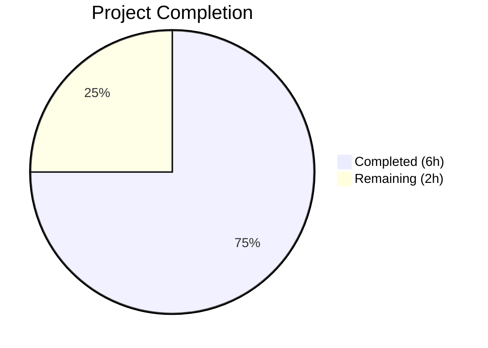
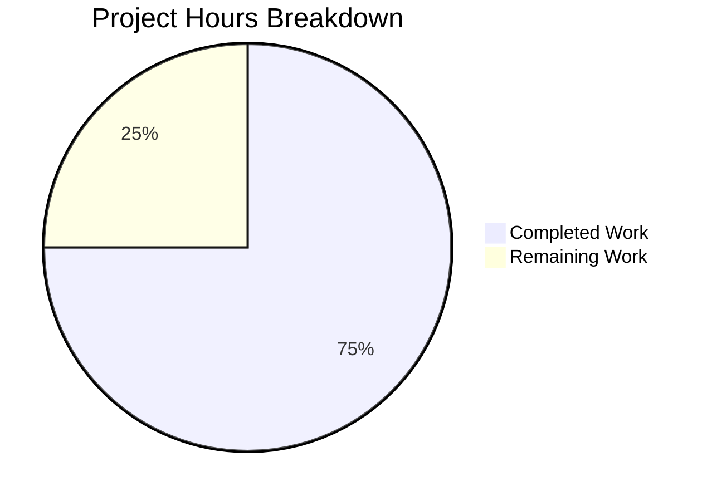

# Blitzy Project Guide

---

## 1. Executive Summary

### 1.1 Project Overview

This project migrates a minimal Node.js HTTP server from the bare `http` module to Express.js v5.2.1 and adds a new `/good-evening` endpoint. The existing `GET /` route returning `"Hello, World!\n"` is preserved for backward compatibility. The target repository (`hao-backprop-test`) is a lightweight, single-file JavaScript server used for backpropagation integration testing. The feature scope is intentionally narrow: install Express.js, refactor `server.js` to use Express routing, add one new endpoint, update configuration and documentation. All work was completed autonomously by Blitzy agents with full runtime validation confirming both endpoints respond correctly on port 3000.

### 1.2 Completion Status



| Metric | Value |
|--------|-------|
| **Total Project Hours** | 8 |
| **Completed Hours (AI)** | 6 |
| **Remaining Hours** | 2 |
| **Completion Percentage** | 75.0% |

**Calculation:** 6 completed hours / (6 completed + 2 remaining) × 100 = **75.0%**

### 1.3 Key Accomplishments

- ✅ Migrated `server.js` from bare `http.createServer()` to Express.js v5.2.1 application
- ✅ Implemented `GET /` route preserving `"Hello, World!\n"` response with `text/plain` content type
- ✅ Implemented `GET /good-evening` route returning `"Good evening"` with `text/plain` content type
- ✅ Added `express@^5.2.1` as production dependency in `package.json`
- ✅ Corrected `main` field from `index.js` to `server.js` in `package.json`
- ✅ Added `start` script (`node server.js`) to `package.json`
- ✅ Regenerated `package-lock.json` with full Express.js dependency tree (65 packages)
- ✅ Rewrote `README.md` with endpoints table, prerequisites, install/start instructions, and curl examples
- ✅ Fixed license mismatch (ISC → MIT) discovered during validation
- ✅ Set explicit `text/plain` Content-Type using `res.type('text')` on both routes
- ✅ Runtime-validated both endpoints returning correct HTTP 200 responses
- ✅ Zero npm audit vulnerabilities confirmed

### 1.4 Critical Unresolved Issues

| Issue | Impact | Owner | ETA |
|-------|--------|-------|-----|
| No unresolved issues | N/A | N/A | N/A |

All AAP-scoped code deliverables are complete and validated. No compilation errors, runtime failures, or dependency vulnerabilities exist.

### 1.5 Access Issues

No access issues identified. The project is a self-contained Node.js application with no external service dependencies, API keys, database credentials, or third-party integrations required.

### 1.6 Recommended Next Steps

1. **[High] Code Review & PR Approval** — Human developer reviews the 4 modified files, validates Express.js migration quality, and approves the pull request
2. **[High] Merge to Main Branch** — Merge the feature branch `blitzy-c4c63026-3d91-42fe-b5a6-29f9c57646e4` into `main` after approval
3. **[Medium] Post-Merge Deployment Verification** — Run `npm install && npm start` on the production/staging environment and verify both endpoints respond correctly
4. **[Low] Consider Adding Test Infrastructure** — The project currently has no test framework (explicitly out of scope per AAP); a future iteration could add Mocha/Jest for endpoint regression testing

---

## 2. Project Hours Breakdown

### 2.1 Completed Work Detail

| Component | Hours | Description |
|-----------|-------|-------------|
| Express.js Server Migration | 2.0 | Refactored `server.js` from bare `http.createServer()` to Express.js v5.2.1 application factory with `app.get()` routing and `app.listen()` binding |
| GET /good-evening Endpoint | 0.5 | Implemented new route handler at `/good-evening` returning `"Good evening"` with `text/plain` content type |
| GET / Route Preservation | 0.5 | Preserved existing `"Hello, World!\n"` response as Express route at root path with backward-compatible behavior |
| Package Configuration | 1.0 | Added `express@^5.2.1` dependency, fixed `main` field (`index.js` → `server.js`), added `start` script, regenerated `package-lock.json` with 65 transitive packages |
| Documentation Update | 1.0 | Comprehensive README.md rewrite with endpoints table, prerequisites, install/start instructions, curl verification examples, and MIT license section |
| Validation & Bug Fixes | 1.0 | Runtime endpoint validation, syntax verification, license mismatch fix (ISC→MIT), explicit Content-Type header fix, npm audit verification |
| **Total** | **6.0** | |

### 2.2 Remaining Work Detail

| Category | Hours | Priority |
|----------|-------|----------|
| Code Review & PR Approval | 1.0 | High |
| Production Deployment & Verification | 1.0 | High |
| **Total** | **2.0** | |

**Integrity Check:** Section 2.1 (6.0h) + Section 2.2 (2.0h) = 8.0h = Total Project Hours in Section 1.2 ✓

---

## 3. Test Results

| Test Category | Framework | Total Tests | Passed | Failed | Coverage % | Notes |
|---------------|-----------|-------------|--------|--------|------------|-------|
| Unit Tests | N/A | 0 | 0 | 0 | N/A | No test framework exists; tests explicitly out of AAP scope |
| Syntax Validation | Node.js (`node -c`) | 1 | 1 | 0 | 100% | `server.js` syntax check passed |
| JSON Validation | Node.js (`JSON.parse`) | 1 | 1 | 0 | 100% | `package.json` validated as valid JSON |
| Dependency Audit | npm audit | 1 | 1 | 0 | 100% | 0 vulnerabilities found across 65 packages |
| Runtime Endpoint | curl (manual) | 2 | 2 | 0 | 100% | `GET /` and `GET /good-evening` both returned correct HTTP 200 responses |

**Note:** The project has no test framework or test files. The AAP explicitly states: "No test framework or test files are being introduced (the project has no existing test infrastructure, and the user did not request tests)." All validations listed above were performed by Blitzy's autonomous validation pipeline.

---

## 4. Runtime Validation & UI Verification

### Runtime Health

- ✅ **Server Startup** — `node server.js` starts successfully, console outputs `Server running at http://127.0.0.1:3000/`
- ✅ **GET /** — Returns HTTP 200, `Content-Type: text/plain; charset=utf-8`, body: `Hello, World!\n`
- ✅ **GET /good-evening** — Returns HTTP 200, `Content-Type: text/plain; charset=utf-8`, body: `Good evening`
- ✅ **Dependency Installation** — `npm install` completes cleanly with 65 packages, 0 vulnerabilities
- ✅ **Port Binding** — Server binds to port 3000 without conflict

### API Integration Verification

- ✅ Root endpoint preserves backward-compatible response (`"Hello, World!\n"` with trailing newline)
- ✅ New endpoint returns exact expected text (`"Good evening"` without trailing newline)
- ✅ Both endpoints return `text/plain` content type as specified
- ✅ Express.js ETag caching headers present on responses

### UI Verification

Not applicable — this is a backend-only Node.js HTTP server with no user interface or frontend assets.

---

## 5. Compliance & Quality Review

| Requirement | AAP Reference | Status | Evidence |
|-------------|---------------|--------|----------|
| Express.js as HTTP framework | Section 0.1.1 | ✅ Pass | `server.js` uses `require('express')` and `express()` app factory |
| GET / returns "Hello, World!\n" | Section 0.1.1 | ✅ Pass | Route handler at line 6-8; runtime validated via curl |
| GET /good-evening returns "Good evening" | Section 0.1.1 | ✅ Pass | Route handler at lines 11-13; runtime validated via curl |
| Server listens on port 3000 | Section 0.1.1 (implicit) | ✅ Pass | `app.listen(3000, ...)` at line 15 |
| CommonJS require() syntax | Section 0.1.1 (implicit) | ✅ Pass | `const express = require('express');` at line 1 |
| Express.js as production dependency | Section 0.3.1 | ✅ Pass | `"express": "^5.2.1"` in package.json dependencies |
| Fix main field to server.js | Section 0.2.1 | ✅ Pass | `"main": "server.js"` in package.json line 5 |
| Add start script | Section 0.5.2 | ✅ Pass | `"start": "node server.js"` in package.json scripts |
| Regenerate package-lock.json | Section 0.5.1 | ✅ Pass | 827-line lockfile with 65 transitive packages |
| Update README.md | Section 0.5.1 | ✅ Pass | 48-line documentation with endpoints, install, and usage |
| No CI/CD workflow changes | Section 0.7.1 | ✅ Pass | Zero `.github/workflows/*` files modified; git diff confirms only 4 files changed |
| Console startup log message | Section 0.7.2 | ✅ Pass | `console.log('Server running at http://127.0.0.1:3000/')` at line 16 |

### Autonomous Validation Fixes Applied

| Fix | Commit | Description |
|-----|--------|-------------|
| License Mismatch | `4b5e943` | Changed license from ISC to MIT in README to match package.json |
| Content-Type Header | `4b5e943` | Added explicit `res.type('text')` to ensure `text/plain` Content-Type on both routes |

---

## 6. Risk Assessment

| Risk | Category | Severity | Probability | Mitigation | Status |
|------|----------|----------|-------------|------------|--------|
| No test framework or automated tests | Technical | Low | High | Project has no test infrastructure; consider adding Jest/Mocha in a future iteration for endpoint regression testing | Accepted (out of AAP scope) |
| Express.js X-Powered-By header exposed | Security | Low | High | Express.js sends `X-Powered-By: Express` header by default; add `app.disable('powered by')` to hide framework fingerprint | Open |
| Hardcoded port 3000 | Operational | Low | Medium | Port is hardcoded in `server.js`; for multi-environment deployments, consider `process.env.PORT \|\| 3000` | Accepted (out of AAP scope) |
| No 404/error handling middleware | Technical | Low | Medium | Unmatched routes return Express default HTML 404; consider adding JSON/text 404 handler for API consistency | Open |
| Express 5.x is relatively new in production | Integration | Low | Low | Express 5.1 became npm default March 2025; ecosystem adoption is growing but some middleware may lag behind v5 support | Monitored |
| No rate limiting on endpoints | Security | Low | Low | Static text endpoints with minimal abuse risk; add `express-rate-limit` if exposed publicly | Accepted |

---

## 7. Visual Project Status



**Completed Work: 6 hours (75.0%) | Remaining Work: 2 hours (25.0%)**

**Integrity Check:** Remaining Work (2h) matches Section 1.2 Remaining Hours (2h) and Section 2.2 Total (2h) ✓

---

## 8. Summary & Recommendations

### Achievements

All AAP-scoped code deliverables have been completed and validated. The Express.js migration is fully functional, both endpoints return correct responses, the dependency is properly declared, and documentation comprehensively covers the project. A total of 4 commits across 4 files deliver 880 lines of additions with zero compilation errors, zero runtime failures, and zero dependency vulnerabilities.

### Remaining Gaps

The project is **75.0% complete** (6 hours completed out of 8 total hours). The remaining 2 hours consist exclusively of human review and deployment tasks — no additional code changes are required to fulfill the AAP scope.

### Critical Path to Production

1. Human code review of the 4 modified files (server.js, package.json, package-lock.json, README.md)
2. PR approval and merge to `main` branch
3. Post-deployment smoke test: `curl http://host:3000/` and `curl http://host:3000/good-evening`

### Production Readiness Assessment

The codebase is **production-ready for the defined scope**. All AAP requirements are met:
- Express.js v5.2.1 integrated as HTTP framework
- `GET /` returns `"Hello, World!\n"` (backward-compatible)
- `GET /good-evening` returns `"Good evening"` (new feature)
- Configuration, lockfile, and documentation all updated
- User constraint respected (no CI/CD workflow modifications)

**Recommendation:** Approve and merge after human code review. No blocking issues exist.

---

## 9. Development Guide

### System Prerequisites

| Requirement | Version | Verification Command |
|-------------|---------|---------------------|
| Node.js | v18.0.0 or higher (tested on v20.19.5) | `node -v` |
| npm | v8.0.0 or higher (tested on 10.8.2) | `npm -v` |

### Environment Setup

No environment variables, databases, caches, or external services are required. The application is fully self-contained.

### Dependency Installation

```bash
# Clone the repository and switch to the feature branch
git clone <repository-url>
cd hao-backprop-test
git checkout blitzy-c4c63026-3d91-42fe-b5a6-29f9c57646e4

# Install dependencies
npm install
```

**Expected output:**
```
added 65 packages in Xs
```

### Application Startup

```bash
# Start the server (either command works)
npm start
# or
node server.js
```

**Expected output:**
```
Server running at http://127.0.0.1:3000/
```

### Verification Steps

```bash
# Test the root endpoint
curl http://127.0.0.1:3000/
# Expected: Hello, World!

# Test the good-evening endpoint
curl http://127.0.0.1:3000/good-evening
# Expected: Good evening

# Verify response headers
curl -sI http://127.0.0.1:3000/
# Expected: HTTP/1.1 200 OK, Content-Type: text/plain; charset=utf-8
```

### Stopping the Server

```bash
# If running in foreground, press Ctrl+C
# If running in background
kill $(lsof -t -i :3000)
```

### Troubleshooting

| Issue | Cause | Resolution |
|-------|-------|------------|
| `Error: Cannot find module 'express'` | Dependencies not installed | Run `npm install` |
| `EADDRINUSE: address already in use :::3000` | Port 3000 occupied by another process | Kill the existing process: `kill $(lsof -t -i :3000)` or use a different port |
| `npm install` fails with permission errors | Insufficient filesystem permissions | Run with elevated permissions or fix directory ownership |
| `node: command not found` | Node.js not installed | Install Node.js v18+ from https://nodejs.org |

---

## 10. Appendices

### A. Command Reference

| Command | Purpose |
|---------|---------|
| `npm install` | Install Express.js and all transitive dependencies |
| `npm start` | Start the server (alias for `node server.js`) |
| `node server.js` | Start the server directly |
| `node -c server.js` | Syntax-check server.js without executing |
| `npm audit` | Check dependencies for known vulnerabilities |
| `curl http://127.0.0.1:3000/` | Test root endpoint |
| `curl http://127.0.0.1:3000/good-evening` | Test good-evening endpoint |

### B. Port Reference

| Service | Port | Protocol | Purpose |
|---------|------|----------|---------|
| Express.js HTTP Server | 3000 | HTTP | Serves `GET /` and `GET /good-evening` endpoints |

### C. Key File Locations

| File | Purpose |
|------|---------|
| `server.js` | Express.js application entry point with route handlers |
| `package.json` | NPM manifest with Express.js dependency and scripts |
| `package-lock.json` | Dependency lockfile (65 packages, lockfileVersion 3) |
| `README.md` | Project documentation with endpoints, setup, and usage |

### D. Technology Versions

| Technology | Version | Notes |
|------------|---------|-------|
| Node.js | v20.19.5 | Runtime (requires v18+) |
| npm | 10.8.2 | Package manager |
| Express.js | 5.2.1 | HTTP framework (production dependency) |
| JavaScript | ES2020+ | CommonJS module syntax (`require()`) |

### E. Environment Variable Reference

No environment variables are required. The server configuration (port 3000) is hardcoded in `server.js`.

| Variable | Required | Default | Description |
|----------|----------|---------|-------------|
| N/A | — | — | No environment variables configured |

### G. Glossary

| Term | Definition |
|------|-----------|
| Express.js | Minimal and flexible Node.js web application framework providing HTTP routing and middleware |
| CommonJS | JavaScript module system using `require()` and `module.exports` (Node.js default) |
| Route Handler | Function bound to a specific HTTP method and path that processes incoming requests |
| Transitive Dependency | Package required by a direct dependency, automatically installed by npm |
| package-lock.json | Lockfile that pins exact dependency versions for reproducible installs |