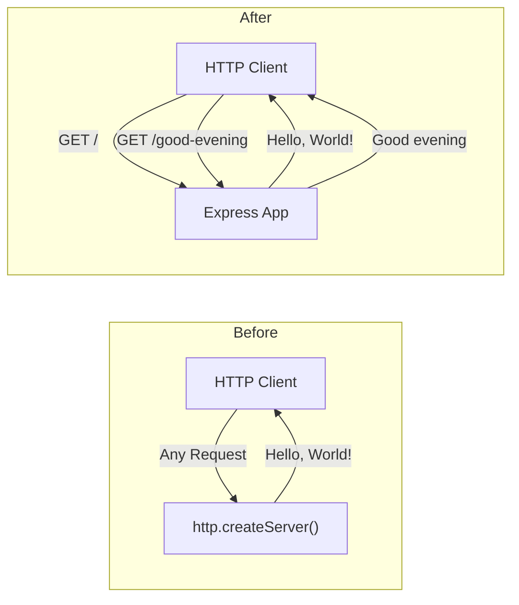

# Technical Specification

# 0. Agent Action Plan

## 0.1 Intent Clarification

### 0.1.1 Core Feature Objective

Based on the prompt, the Blitzy platform understands that the new feature requirement is to:

- **Integrate Express.js as the HTTP framework**: Replace the existing bare Node.js `http` module server implementation in `server.js` with an Express.js-based application. The current server uses `http.createServer()` to serve a single "Hello, World!" response for all incoming requests on `127.0.0.1:3000`. Express.js will be added as a project dependency to enable structured route-based request handling.

- **Add a new "/good-evening" endpoint**: Create an additional HTTP endpoint that returns the plain-text response `"Good evening"`. This endpoint will coexist alongside the existing "Hello world" response behavior, leveraging Express.js routing to serve different responses based on the request path.

- **Preserve existing "Hello world" functionality**: The current behavior of returning `"Hello, World!\n"` must be maintained as a route within the new Express.js application, ensuring backward compatibility for any existing consumers of the server.

**Implicit Requirements Detected:**

- The server must continue to listen on port `3000` to maintain consistency with the existing configuration
- The Express.js integration must use CommonJS (`require()`) module syntax to match the existing code style in `server.js`
- The `package.json` must be updated with Express.js as a production dependency
- The `package-lock.json` will be regenerated to reflect the new dependency tree
- The `main` field in `package.json` currently points to `index.js` but the actual entry point is `server.js` — this discrepancy should be addressed during the migration

### 0.1.2 Special Instructions and Constraints

- **User-Specified Rule — "exit code 137 test"**: The user has explicitly stated: *"Do not make any updates or changes in GitHub App to create or update a workflow."* This means all CI/CD workflow files (e.g., `.github/workflows/*`) are off-limits and must not be created or modified.
- **No Figma or UI design system involvement**: This is a backend-only Node.js server feature; no design system alignment is applicable.
- **No attachments were provided**: The implementation is based solely on the user's textual instructions and the existing codebase.

### 0.1.3 Technical Interpretation

These feature requirements translate to the following technical implementation strategy:

- To **integrate Express.js**, we will install the `express` npm package (version `5.2.1`, the latest stable release) as a production dependency and refactor `server.js` to use Express's `express()` application factory and its built-in routing API instead of the raw `http.createServer()` pattern.

- To **serve the existing "Hello world" response**, we will create an Express route handler bound to the root path (`GET /`) that returns the text `"Hello, World!\n"` with a `200` status code and `text/plain` content type, preserving the current behavior.

- To **add the "Good evening" endpoint**, we will create a new Express route handler bound to a dedicated path (e.g., `GET /good-evening`) that returns the text `"Good evening"` with a `200` status code and `text/plain` content type.

- To **maintain project integrity**, we will update `package.json` to declare Express.js as a dependency and correct the `main` entry point from `index.js` to `server.js`, and regenerate `package-lock.json` after installation.

## 0.2 Repository Scope Discovery

### 0.2.1 Comprehensive File Analysis

The repository is a flat, single-directory Node.js project containing exactly four files with no subdirectories. Every file in the repository is relevant to this feature addition.

**Existing Files Requiring Modification:**

| File Path | Current Purpose | Required Changes | Impact Level |
|-----------|----------------|------------------|--------------|
| `server.js` | Bare Node.js HTTP server using `http.createServer()` bound to `127.0.0.1:3000`, returning `"Hello, World!\n"` for all requests | Refactor entirely to use Express.js application with route-based handling; define `GET /` for "Hello, World!" and `GET /good-evening` for "Good evening" | **Critical** — Core feature file |
| `package.json` | NPM manifest with zero dependencies; `main` field incorrectly set to `index.js` | Add `express` as a production dependency; update `main` field from `index.js` to `server.js`; optionally add a `start` script | **Critical** — Dependency declaration |
| `package-lock.json` | Empty lockfile (lockfileVersion 3) with no external packages | Will be regenerated automatically by `npm install` to include the Express.js dependency tree | **Critical** — Auto-generated |
| `README.md` | Contains project title "hao-backprop-test" and one-line description | Update to document the new Express.js-based endpoints and usage instructions | **Low** — Documentation only |

**Integration Point Discovery:**

- **API Endpoints**: The current server has no route differentiation — all requests receive the same response. Express.js routing will introduce two distinct endpoints: `GET /` and `GET /good-evening`.
- **Server Initialization**: The `http.createServer()` call on line 6 of `server.js` and the `server.listen()` call on line 12 will be replaced by Express's `app.listen()` pattern.
- **Response Handling**: The manual `res.statusCode`, `res.setHeader()`, and `res.end()` calls (lines 7–9 of `server.js`) will be replaced by Express's `res.send()` method within route handlers.
- **No database, middleware, or service layers exist** — this is a greenfield integration into a minimal project.

### 0.2.2 Web Search Research Conducted

- **Express.js latest version**: Confirmed via npm registry that Express.js `5.2.1` is the current latest stable release. Express v5 requires Node.js 18+ and our environment runs Node.js v20.20.2, which is fully compatible.
- **Express v5 key changes**: Express 5 dropped support for Node.js versions before v18, updated path-to-regexp for ReDoS mitigation, added native promise support in middleware, and removed deprecated v3/v4 API methods.
- **Express.js routing patterns**: Standard Express route definition uses `app.get(path, handler)` with `res.send()` for response delivery — the established pattern for this feature.

### 0.2.3 New File Requirements

No new source files need to be created. The entire feature can be implemented by modifying the existing `server.js` file and updating the dependency manifest. The project's minimalist single-file architecture is preserved.

**Files modified (no new files created):**

- `server.js` — Refactored to Express.js application with two route handlers
- `package.json` — Updated with Express.js dependency and corrected `main` field
- `package-lock.json` — Regenerated automatically by npm
- `README.md` — Updated documentation

## 0.3 Dependency Inventory

### 0.3.1 Private and Public Packages

The following table documents all packages relevant to this feature addition. The project currently has zero external dependencies; Express.js will be the first and only addition.

| Package Registry | Package Name | Version | Purpose | Status |
|-----------------|-------------|---------|---------|--------|
| npm (public) | `express` | `5.2.1` | HTTP framework providing routing, middleware, and request/response utilities for the Node.js server | **To be added** |

**Version Verification:**
- Express `5.2.1` was confirmed as the latest stable version via `npm view express version` returning `5.2.1`.
- Express 5.x requires Node.js 18 or higher. The project environment runs Node.js `v20.20.2`, which satisfies this requirement.
- No user-specified version constraint was provided; the latest stable release is used.

**Transitive Dependencies:**
- Express.js `5.2.1` brings its own set of transitive dependencies (e.g., `body-parser`, `content-disposition`, `cookie`, `debug`, `send`, `serve-static`, etc.). These will be locked in the regenerated `package-lock.json` and require no manual management.

### 0.3.2 Dependency Updates

**Import Updates:**

The existing `server.js` uses a single import:
- Current: `const http = require('http');`
- New: `const express = require('express');`

The Node.js built-in `http` module import will be removed entirely, as Express.js handles HTTP server creation internally.

**External Reference Updates:**

| File | Update Type | Details |
|------|------------|---------|
| `package.json` | Add dependency | Add `"express": "^5.2.1"` to the `dependencies` object |
| `package.json` | Fix entry point | Change `"main": "index.js"` to `"main": "server.js"` |
| `package.json` | Add start script | Add `"start": "node server.js"` to the `scripts` object |
| `package-lock.json` | Full regeneration | Regenerated by `npm install` to include Express and its transitive dependencies |
| `README.md` | Documentation | Update to reflect Express.js usage and available endpoints |

## 0.4 Integration Analysis

### 0.4.1 Existing Code Touchpoints

**Direct Modifications Required:**

- **`server.js` (lines 1–14)**: The entire file content is replaced. The `http.createServer()` server factory (line 6), manual response header/status setting (lines 7–9), and `server.listen()` binding (lines 12–14) are removed. They are replaced with an Express application instance (`express()`), route definitions using `app.get()`, and `app.listen()` for server binding.

- **`package.json` (lines 1–11)**: The `dependencies` field is added to declare Express.js. The `main` field (line 5) is corrected from `"index.js"` to `"server.js"`. A `start` script is added to the `scripts` block for convenience.

- **`package-lock.json` (lines 1–13)**: Fully regenerated by npm to capture the Express.js dependency tree with exact version pinning.

- **`README.md` (lines 1–2)**: Updated to describe the Express.js-based server, its endpoints, and usage instructions.

**Integration Flow — Before and After:**



### 0.4.2 Dependency Injection and Wiring

This project does not use a dependency injection container, service registry, or module wiring pattern. Express.js is instantiated directly in `server.js` via `const app = express()` and route handlers are registered inline. No additional wiring or configuration files are needed.

### 0.4.3 Database and Schema Updates

No database, schema, or migration changes are required. The project is entirely stateless and does not persist data. Both the existing and new endpoints return static text responses.

## 0.5 Technical Implementation

### 0.5.1 File-by-File Execution Plan

Every file listed below MUST be modified as part of this feature addition. No new files are created; the project retains its flat single-directory structure.

**Group 1 — Core Feature File:**

- **MODIFY: `server.js`** — Replace the bare `http` module server with an Express.js application. Define two route handlers: `GET /` returning `"Hello, World!\n"` and `GET /good-evening` returning `"Good evening"`. Bind the app to port `3000`.

**Group 2 — Dependency and Configuration:**

- **MODIFY: `package.json`** — Add `express` version `^5.2.1` to the `dependencies` object. Update the `main` field from `"index.js"` to `"server.js"`. Add a `"start": "node server.js"` entry to the `scripts` block.
- **MODIFY: `package-lock.json`** — Regenerated automatically by running `npm install` after updating `package.json`. This locks Express.js and all transitive dependencies to exact versions.

**Group 3 — Documentation:**

- **MODIFY: `README.md`** — Update the documentation to describe the Express.js-based server, its two endpoints, and how to start the application.

### 0.5.2 Implementation Approach per File

**`server.js` — Express.js Migration and New Endpoint**

The implementation replaces the entire contents of `server.js`. The new structure follows standard Express.js patterns:

```js
const express = require('express');
const app = express();
```

- The `GET /` route handler calls `res.send('Hello, World!\n')` to preserve the existing response behavior
- The `GET /good-evening` route handler calls `res.send('Good evening')` to deliver the new endpoint response
- The `app.listen(3000, ...)` call binds the server to port `3000` and logs a startup confirmation message to the console

**`package.json` — Dependency Declaration**

The `dependencies` field is added with Express.js pinned to `^5.2.1`:

```json
"dependencies": { "express": "^5.2.1" }
```

The `main` field is corrected to `"server.js"` and a `start` script is added for convenient server launch.

**`package-lock.json` — Dependency Lock**

This file is regenerated automatically by `npm install`. No manual editing is required.

**`README.md` — Documentation Update**

The README is updated to describe the project as an Express.js server, list the two available endpoints (`GET /` and `GET /good-evening`), and provide startup instructions (`npm install` followed by `npm start` or `node server.js`).

### 0.5.3 User Interface Design

Not applicable. This feature is a backend-only Node.js HTTP server with no user interface, frontend assets, or visual components.

## 0.6 Scope Boundaries

### 0.6.1 Exhaustively In Scope

All files in the repository are in scope for this feature addition:

| Category | File Pattern | Specific Files | Purpose |
|----------|-------------|----------------|---------|
| Core server source | `server.js` | `server.js` | Express.js migration and new route handler |
| Dependency manifest | `package.json` | `package.json` | Add Express.js dependency, fix `main` field, add `start` script |
| Dependency lockfile | `package-lock.json` | `package-lock.json` | Regenerated by npm to lock Express.js and transitive dependencies |
| Documentation | `README.md` | `README.md` | Updated project description and endpoint documentation |

**In-Scope Changes Summary:**

- Installation of `express@^5.2.1` as a production dependency
- Refactoring `server.js` from bare `http` module to Express.js application
- Defining `GET /` route returning `"Hello, World!\n"`
- Defining `GET /good-evening` route returning `"Good evening"`
- Updating `package.json` metadata (`main`, `scripts`, `dependencies`)
- Regenerating `package-lock.json`
- Updating `README.md` with new usage instructions

### 0.6.2 Explicitly Out of Scope

- **CI/CD workflows**: No `.github/workflows/*` files will be created or modified, per the user's explicit rule ("Do not make any updates or changes in GitHub App to create or update a workflow")
- **Test files**: No test framework or test files are being introduced (the project has no existing test infrastructure, and the user did not request tests)
- **Middleware additions**: No additional Express middleware (e.g., `cors`, `helmet`, `body-parser`) beyond what Express.js bundles internally
- **Environment variable configuration**: No `.env` files or environment-based port/host configuration changes
- **Docker or containerization**: No `Dockerfile`, `docker-compose.yml`, or container-related changes
- **TypeScript migration**: The project remains in plain JavaScript with CommonJS modules
- **Performance optimizations**: No clustering, caching, or load balancing changes
- **Additional endpoints**: Only the two endpoints specified (`GET /` and `GET /good-evening`) are implemented
- **Unrelated features or modules**: No changes to features outside the Express.js integration and new endpoint

## 0.7 Rules for Feature Addition

### 0.7.1 User-Specified Rules

The following rule has been explicitly provided by the user and must be strictly observed throughout the implementation:

| Rule Name | Rule Content | Impact |
|-----------|-------------|--------|
| **exit code 137 test** | Do not make any updates or changes in GitHub App to create or update a workflow. | No `.github/workflows/*` files may be created, modified, or deleted. All CI/CD pipeline configuration is off-limits. |

### 0.7.2 Inferred Conventions

The following conventions are derived from the existing codebase and must be maintained:

- **CommonJS module syntax**: The project uses `require()` for module imports (as seen in `server.js` line 1). All new code must use CommonJS, not ES module `import` syntax.
- **Plain JavaScript**: The project contains no TypeScript configuration or type definitions. All code remains in `.js` files.
- **Minimal architecture**: The project follows a single-file server pattern. The Express.js integration should preserve this simplicity rather than introducing multi-file module structures.
- **Port 3000 binding**: The server binds to port `3000` (as seen in `server.js` line 4). This port must remain unchanged to preserve existing integration patterns.
- **Console logging on startup**: The current server logs a confirmation message when bound (line 13 of `server.js`). The Express.js version should maintain a similar startup log message.

## 0.8 References

### 0.8.1 Repository Files and Folders Searched

The following files and folders were inspected to derive the conclusions in this Agent Action Plan:

| Path | Type | Purpose of Inspection |
|------|------|----------------------|
| `` (root) | Folder | Discovered all four project files; confirmed flat single-directory structure with no subdirectories |
| `server.js` | File | Analyzed the existing bare `http` module server implementation (lines 1–14) to understand current request handling, port binding, and response behavior |
| `package.json` | File | Examined NPM manifest to identify zero dependencies, incorrect `main` field (`index.js`), missing `start` script, and project metadata |
| `package-lock.json` | File | Confirmed lockfileVersion 3 with zero external packages; verified no pre-existing dependency tree |
| `README.md` | File | Read project documentation; noted minimal content ("hao-backprop-test" title and one-line description) |

### 0.8.2 Technical Specification Sections Reviewed

| Section | Key Information Extracted |
|---------|-------------------------|
| 1.1 Executive Summary | Project purpose as a backpropagation integration test harness; MIT license; author "hxu" |
| 1.2 System Overview | Single-component monolithic architecture; localhost-only binding; stateless operation |
| 2.1 Feature Catalog | Four existing features (F-001 through F-004) covering HTTP server management, request processing, network access control, and zero-dependency architecture |
| 3.1 Programming Languages | JavaScript with CommonJS module system; Node.js 18+ compatibility matrix |
| 3.2 Frameworks & Libraries | Current zero-framework architecture using only built-in `http` module |
| 3.3 Open Source Dependencies | Confirmed zero external dependencies via package-lock.json analysis |
| 5.1 High-Level Architecture | Single-Component Monolithic Architecture; synchronous request-response pattern |
| 6.1 Core Services Architecture | Non-applicability of distributed services; single-process design rationale |

### 0.8.3 External Research Conducted

| Query | Source | Key Finding |
|-------|--------|-------------|
| Express.js latest stable version | npm registry (`npm view express version`) | Express.js `5.2.1` is the current latest stable release |
| Express.js latest stable version | expressjs.com release blog | Express 5.1.0 became the default on npm as of March 31, 2025 |
| Express.js latest stable version | GitHub releases (expressjs/express) | Express v5 requires Node.js 18+; supports promise-based middleware |
| Express.js latest stable version | npmjs.com/package/express | Confirmed `5.2.1` as latest published version |

### 0.8.4 Attachments

No attachments were provided for this project. No Figma URLs or external design files were referenced.

