# Technical Specification

# 0. SUMMARY OF CHANGES

## 0.1 INTENT CLARIFICATION

### 0.1.1 Core Objective

Based on the provided requirements, the Blitzy platform understands that the objective is to:
- Migrate the existing Node.js HTTP server from the built-in `http` module to the Express.js framework
- Preserve the existing "Hello world" functionality (noting the user's preference for "Hello world" versus the current "Hello, World!\n")
- Extend the server capabilities by adding a second endpoint that returns "Good evening"
- Maintain the current development simplicity while introducing a more robust web framework

The requirements implicitly suggest:
- Preserving the current server configuration (port 3000, localhost binding)
- Maintaining backward compatibility with the existing endpoint behavior
- Establishing a foundation for future endpoint expansion
- Following Express.js best practices for route definition

### 0.1.2 Special Instructions and Constraints

The user has not specified any particular constraints or special instructions regarding:
- Specific Express.js version requirements
- Middleware requirements
- Response format preferences (JSON vs plain text)
- HTTP method specifications for the new endpoint
- Path structure for the endpoints

### 0.1.3 Technical Interpretation

These requirements translate to the following technical implementation strategy:
- To enable Express.js framework support, we will add Express as a production dependency to the npm manifest
- To maintain the greeting functionality, we will refactor server.js to use Express routing instead of the built-in http module
- To provide the "Good evening" response, we will implement a second Express route handler with appropriate path definition
- To ensure proper dependency tracking, we will update both package.json and package-lock.json files

## 0.2 TECHNICAL SCOPE

### 0.2.1 Primary Objectives with Implementation Approach

**Objective 1: Express.js Framework Integration**
- Achieve framework migration by modifying package.json to include Express.js (latest stable version 5.1.0) as a production dependency
- Critical success factor: Seamless transition from http module to Express with zero downtime

**Objective 2: Endpoint Refactoring and Extension**
- Achieve dual-endpoint functionality by modifying server.js to:
  - Replace http.createServer with Express application instance
  - Define GET route for root path "/" returning "Hello world"
  - Define GET route for new path "/evening" returning "Good evening"
- Critical success factor: Both endpoints respond correctly with plain text content

**Objective 3: Dependency Management**
- Achieve deterministic builds by updating package-lock.json to capture Express.js dependency tree
- Critical success factor: Reproducible installs across all environments

### 0.2.2 Component Impact Analysis

**Direct modifications required:**
- `server.js`: Complete refactoring to replace http module with Express.js implementation
  - Remove http.createServer and manual request/response handling
  - Introduce Express application initialization
  - Implement route handlers using Express routing API
  - Maintain server.listen functionality with same host/port configuration

- `package.json`: Update dependencies object to include Express.js
  - Add "express": "^5.1.0" to dependencies section
  - Maintain all existing metadata and configuration

**Indirect impacts and dependencies:**
- `package-lock.json`: Automatic regeneration to include Express dependency graph
  - Will capture Express.js and all transitive dependencies
  - Ensures version locking for reproducible builds

**New components introduction:**
- None required - all changes occur within existing file structure

### 0.2.3 File and Path Mapping

| Target File/Module | Source Reference | Context Dependencies | Modification Type |
|-------------------|------------------|---------------------|-------------------|
| server.js | Current http-based implementation | Express.js API documentation | Complete refactoring |
| package.json | Current manifest without dependencies | npm registry (Express package) | Dependency addition |
| package-lock.json | Current lockfile | package.json changes | Automatic regeneration |

## 0.3 IMPLEMENTATION DESIGN

### 0.3.1 Technical Approach

First, establish Express.js dependency by modifying package.json to declare the framework requirement. This enables npm to resolve and fetch the Express package and its dependencies.

Next, integrate Express framework by refactoring server.js to:
- Import Express using require('express')
- Create an Express application instance
- Define route handlers for both endpoints using Express's routing methods
- Configure the application to listen on the existing host/port combination

Finally, ensure consistency by regenerating package-lock.json through npm install, capturing the complete dependency tree for reproducible builds.

### 0.3.2 Critical Implementation Details

**Design Patterns:**
- Express middleware pattern for request handling
- Route-based request dispatching
- Separation of route definition from server initialization

**Key Approaches:**
- Maintain plain text responses to preserve current behavior
- Use Express's res.send() method for simplified response handling
- Preserve localhost-only binding for development safety

**Integration Strategy:**
- Direct replacement of http module functionality with Express equivalents
- No breaking changes to server startup command (node server.js)
- Maintain identical server binding (127.0.0.1:3000)

### 0.3.3 Dependency Analysis

**Required Dependencies:**
- express@5.1.0 - Latest stable version requiring Node.js 18 or higher
  - Justification: Modern web framework providing routing, middleware, and simplified request/response handling
  - Compatibility: Express 5.x requires Node.js 18 or higher

**Transitive Dependencies:**
- Express.js will introduce approximately 30-40 transitive dependencies
- All transitive dependencies managed automatically by npm
- Version constraints defined by Express's own package.json

## 0.4 SCOPE BOUNDARIES

### 0.4.1 Explicitly In Scope

**Files to be modified:**
- `server.js` - Complete refactoring from http to Express
- `package.json` - Addition of Express dependency
- `package-lock.json` - Regeneration with Express dependency tree

**Configuration changes:**
- npm dependency declaration for Express.js
- Route configuration for "/" and "/evening" endpoints

**Functional changes:**
- Migration from built-in http module to Express framework
- Addition of second endpoint at "/evening" path
- Standardization of response to "Hello world" (without exclamation and newline)

### 0.4.2 Explicitly Out of Scope

**Not included in this implementation:**
- Test file creation or modifications
- README.md updates to document new endpoint
- Middleware configuration (body parsing, CORS, etc.)
- Error handling middleware
- Static file serving
- Template engine integration
- Environment variable configuration
- Port configuration flexibility
- Production deployment considerations
- HTTPS/TLS configuration
- Clustering or process management
- API documentation generation
- Request logging middleware
- Authentication/authorization
- Database integration
- WebSocket support

## 0.5 VALIDATION CHECKLIST

### 0.5.1 Implementation Verification Points

- [ ] Express package successfully installed via npm
- [ ] server.js starts without errors using `node server.js`
- [ ] GET request to http://127.0.0.1:3000/ returns "Hello world"
- [ ] GET request to http://127.0.0.1:3000/evening returns "Good evening"
- [ ] Server console output shows listening message
- [ ] package.json contains Express in dependencies
- [ ] package-lock.json updated with Express dependency tree
- [ ] No regression in existing functionality

### 0.5.2 Observable Changes

- Console output remains similar: "Server running at http://127.0.0.1:3000/"
- Root endpoint response changes from "Hello, World!\n" to "Hello world"
- New endpoint accessible at /evening path
- Both endpoints return Content-Type: text/html (Express default)

## 0.6 EXECUTION PARAMETERS

### 0.6.1 Special Execution Instructions

No special execution instructions were provided. Standard implementation approach applies:
- Use npm for dependency management
- Maintain existing development workflow
- No constraints on implementation methodology

### 0.6.2 Constraints and Boundaries

**Technical Constraints:**
- Must maintain Node.js compatibility (current environment supports Node.js 22.x)
- Preserve localhost-only binding for security
- Maintain synchronous server startup pattern

**Process Constraints:**
- Standard npm dependency addition workflow
- No requirements for documentation-only mode
- Full implementation expected (not just planning)

# 1. INTRODUCTION

## 1.1 EXECUTIVE SUMMARY

### 1.1.1 Project Overview

The hao-backprop-test project represents an early-stage development effort intended for testing backpropagation integration capabilities within a Node.js environment. Currently implemented as a minimal HTTP server demonstration, the project serves as a foundational scaffold for future machine learning functionality development.

### 1.1.2 Core Business Problem

The project addresses the need for a controlled testing environment to validate backpropagation integration approaches within Node.js applications. This testing framework aims to facilitate the development and validation of machine learning algorithms before integration into production systems.

### 1.1.3 Key Stakeholders and Users

| Stakeholder Category | Primary Users | Role |
|---------------------|---------------|------|
| Development Team | hxu (Author) | Primary developer and project maintainer |
| Technical Users | ML Engineers | Future integration testing and validation |
| System Integrators | Backend Developers | Node.js-based ML system implementation |

### 1.1.4 Expected Business Impact

The project's value proposition centers on providing a lightweight, controlled environment for machine learning algorithm testing and validation, enabling rapid prototyping and integration assessment before production deployment.

## 1.2 SYSTEM OVERVIEW

### 1.2.1 Project Context

#### Current Development State
The project currently exists in an initial development phase, with a fundamental HTTP server implementation serving as the foundation for future backpropagation integration capabilities. The repository contains minimal infrastructure designed to support incremental development of machine learning functionalities.

#### Technical Foundation
Built on Node.js with <span style="background-color: rgba(91, 57, 243, 0.2)">Express.js v5.1.0 as a production dependency</span>, the system prioritizes simplicity and maintainability. The current architecture establishes a clean foundation for machine learning algorithm integration <span style="background-color: rgba(91, 57, 243, 0.2)">while leveraging Express.js for enhanced routing and middleware capabilities</span>.

### 1.2.2 High-Level System Description

#### Primary System Capabilities
The current implementation provides:
- <span style="background-color: rgba(91, 57, 243, 0.2)">Express-powered HTTP server functionality on localhost (127.0.0.1:3000)</span>
- <span style="background-color: rgba(91, 57, 243, 0.2)">GET / → "Hello world"</span>
- <span style="background-color: rgba(91, 57, 243, 0.2)">GET /evening → "Good evening"</span>
- Foundation for future ML algorithm integration
- MIT-licensed open development framework

#### Major System Components
The system architecture consists of an Express-based application with dual-endpoint routing:

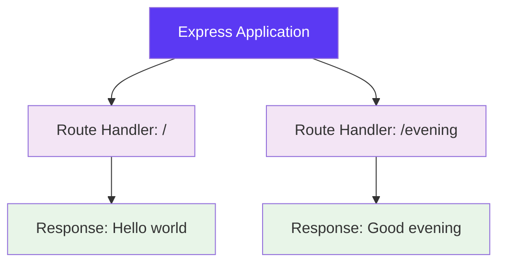
```mermaid
graph TD
    A[Express Application] --> B[Route Handler: /]
    A --> C[Route Handler: /evening]
    B --> D[Response: Hello world]
    C --> E[Response: Good evening]
    
    style A fill:#5b39f3,color:#ffffff
    style B fill:#f3e5f5
    style C fill:#f3e5f5
    style D fill:#e8f5e8
    style E fill:#e8f5e8
```

#### Core Technical Approach
The implementation <span style="background-color: rgba(91, 57, 243, 0.2)">utilizes Express.js framework, migrating from Node.js's built-in HTTP module to an Express application instance</span>. This approach <span style="background-color: rgba(91, 57, 243, 0.2)">leverages Express routing capabilities and res.send() methods for streamlined request handling</span> while providing the necessary infrastructure for future algorithmic integration. <span style="background-color: rgba(91, 57, 243, 0.2)">Host and port configuration remain unchanged, maintaining the same localhost binding (127.0.0.1:3000)</span>.

### 1.2.3 Success Criteria

#### Measurable Objectives
| Objective Category | Current Status | Target State |
|--------------------|----------------|--------------|
| Infrastructure Setup | ✓ Complete | <span style="background-color: rgba(91, 57, 243, 0.2)">**Express server operational**</span> |
| <span style="background-color: rgba(91, 57, 243, 0.2)">**Endpoint Functionality**</span> | <span style="background-color: rgba(91, 57, 243, 0.2)">**✓ Complete**</span> | <span style="background-color: rgba(91, 57, 243, 0.2)">**/evening returns "Good evening"**</span> |
| Algorithm Integration | ⏳ Pending | Backprop implementation |
| Testing Framework | ⏳ Pending | Comprehensive test suite |

#### Critical Success Factors
- <span style="background-color: rgba(91, 57, 243, 0.2)">Successful Express server deployment and dual-endpoint response verification</span>
- Future integration of backpropagation algorithms without architectural refactoring
- Maintenance of system simplicity while expanding functionality
- <span style="background-color: rgba(91, 57, 243, 0.2)">Express framework integration without introducing unnecessary complexity</span>

#### Key Performance Indicators
- Server response time for basic operations
- System memory footprint during operation
- Integration complexity metrics for ML algorithm addition
- Development velocity for new feature implementation

## 1.3 SCOPE

### 1.3.1 In-Scope Elements

#### Core Features and Functionalities

| Feature Category | Current Implementation | Future Scope |
|------------------|----------------------|--------------|
| HTTP Server | <span style="background-color: rgba(91, 57, 243, 0.2)">Express-based server with two GET endpoints ( / and /evening )</span> | Enhanced request processing |
| ML Integration | Infrastructure only | Backpropagation algorithms |
| Development Environment | Node.js foundation | Testing and validation tools |

#### Implementation Boundaries

**System Boundaries:**
- Localhost-only deployment (127.0.0.1:3000)
- Single-node architecture
- Development-focused environment
- MIT licensing framework
- <span style="background-color: rgba(91, 57, 243, 0.2)">Express.js as a production dependency managed via npm</span>

**User Groups Covered:**
- Development team members
- Local testing environments
- Algorithm development workflows

**Technical Domains Included:**
- HTTP request/response handling
- Node.js runtime environment management
- <span style="background-color: rgba(91, 57, 243, 0.2)">Express.js framework integration and dependency management</span>
- Future machine learning algorithm integration points

**Additional In-Scope Elements:**
- <span style="background-color: rgba(91, 57, 243, 0.2)">Express dependency declaration in package.json</span>
- <span style="background-color: rgba(91, 57, 243, 0.2)">Second endpoint (/evening) returning "Good evening"</span>

### 1.3.2 Out-of-Scope Elements

#### Excluded Features and Capabilities
- Production-ready deployment configurations
- External network accessibility
- Multi-user authentication systems
- Database integration and persistence layers
- Real-time processing capabilities
- Distributed computing features

#### Future Phase Considerations
- Comprehensive backpropagation algorithm implementation
- Performance optimization and benchmarking tools
- Extended testing framework development
- Documentation and API specification
- Production deployment preparation

#### Integration Points Not Covered
- External machine learning service integrations
- Third-party data source connections
- Enterprise system authentication
- Cloud platform deployment workflows

#### Unsupported Use Cases
- Production workload handling
- Multi-tenant architecture requirements
- Real-time streaming data processing
- Large-scale distributed training operations
- External API consumption patterns

#### References

- `README.md` - Project identification and stated purpose
- `package.json` - Project metadata, dependencies, and configuration
- <span style="background-color: rgba(91, 57, 243, 0.2)">`package-lock.json` - Dependency lockfile capturing Express dependency tree</span>
- `server.js` - HTTP server implementation and request handling logic

# 2. PRODUCT REQUIREMENTS

## 2.1 FEATURE CATALOG

### 2.1.1 Infrastructure Features

#### Feature F-001: HTTP Server Infrastructure

| Attribute | Value |
|-----------|-------|
| Unique ID | F-001 |
| Feature Name | HTTP Server Infrastructure |
| Feature Category | Core Infrastructure |
| Priority Level | Critical |
| Status | Completed |

**Description:**
- **Overview**: <span style="background-color: rgba(91, 57, 243, 0.2)">HTTP server implementation with dual-endpoint routing capabilities, providing foundational web service infrastructure for the backpropagation testing environment. Features a preserved root endpoint ("/") delivering "Hello world" response and an additional "/evening" endpoint returning "Good evening"</span>
- **Business Value**: Establishes the fundamental infrastructure required for future machine learning algorithm integration and testing
- **User Benefits**: Provides immediate verification of system functionality and serves as integration point for ML algorithms
- **Technical Context**: <span style="background-color: rgba(91, 57, 243, 0.2)">Implemented with Express.js 5.1.0 running on Node.js runtime; two GET routes ("/" → "Hello world", "/evening" → "Good evening")</span>

**Dependencies:**
- **Prerequisite Features**: None
- **System Dependencies**: Node.js runtime environment
- **External Dependencies**: <span style="background-color: rgba(91, 57, 243, 0.2)">Express (npm production dependency)</span>
- **Integration Requirements**: Future ML algorithm integration points

#### Feature F-002: Backpropagation Algorithm Integration

| Attribute | Value |
|-----------|-------|
| Unique ID | F-002 |
| Feature Name | Backpropagation Algorithm Integration |
| Feature Category | Machine Learning |
| Priority Level | High |
| Status | Proposed |

**Description:**
- **Overview**: Integration capabilities for backpropagation algorithms within the Node.js testing environment
- **Business Value**: Core functionality that fulfills the primary project purpose of testing backpropagation integration approaches
- **User Benefits**: Enables ML engineers to test and validate backpropagation implementations in controlled environment
- **Technical Context**: Future implementation to integrate with existing HTTP server infrastructure

**Dependencies:**
- **Prerequisite Features**: F-001 (HTTP Server Infrastructure)
- **System Dependencies**: Node.js runtime, HTTP server foundation
- **External Dependencies**: To be determined based on algorithm requirements
- **Integration Requirements**: HTTP request/response integration, testing framework compatibility

### 2.1.2 Development and Testing Features

#### Feature F-003: Testing Framework

| Attribute | Value |
|-----------|-------|
| Unique ID | F-003 |
| Feature Name | Testing Framework |
| Feature Category | Quality Assurance |
| Priority Level | High |
| Status | Proposed |

**Description:**
- **Overview**: Comprehensive testing capabilities for validating backpropagation algorithm implementations
- **Business Value**: Ensures reliability and correctness of ML algorithm integration before production deployment
- **User Benefits**: Provides development team with validation tools and quality assurance mechanisms
- **Technical Context**: Integration with existing infrastructure to support automated testing workflows

**Dependencies:**
- **Prerequisite Features**: F-001 (HTTP Server Infrastructure)
- **System Dependencies**: Node.js runtime, testing execution environment
- **External Dependencies**: Testing libraries (future scope)
- **Integration Requirements**: HTTP server integration, algorithm testing interfaces

#### Feature F-004: Development Environment Support

| Attribute | Value |
|-----------|-------|
| Unique ID | F-004 |
| Feature Name | Development Environment Support |
| Feature Category | Development Tools |
| Priority Level | Medium |
| Status | In Development |

**Description:**
- **Overview**: Development tooling and environment configuration support for efficient algorithm development
- **Business Value**: Streamlines development workflow and reduces setup complexity for team members
- **User Benefits**: Simplified project setup, consistent development environment, clear project structure
- **Technical Context**: Project configuration, documentation, and development workflow support

**Dependencies:**
- **Prerequisite Features**: None
- **System Dependencies**: Node.js runtime, local development environment
- **External Dependencies**: None (maintaining zero-dependency preference)
- **Integration Requirements**: Version control integration, documentation systems

## 2.2 FUNCTIONAL REQUIREMENTS TABLE

### 2.2.1 HTTP Server Infrastructure Requirements (F-001)

| Requirement ID | Description | Acceptance Criteria | Priority | Complexity |
|----------------|-------------|-------------------|----------|------------|
| F-001-RQ-001 | HTTP Server Initialization | Server starts successfully on localhost:3000 with console confirmation | Must-Have | Low |
| F-001-RQ-002 | <span style="background-color: rgba(91, 57, 243, 0.2)">Root path '/' responds with HTTP 200 and body 'Hello world'</span> | <span style="background-color: rgba(91, 57, 243, 0.2)">GET request to '/' returns HTTP 200 status and exact response body "Hello world"</span> | Must-Have | Low |
| F-001-RQ-003 | Localhost Binding | Server exclusively binds to 127.0.0.1 for security and development focus | Must-Have | Low |
| F-001-RQ-004 | <span style="background-color: rgba(91, 57, 243, 0.2)">Express Dependency Integration</span> | <span style="background-color: rgba(91, 57, 243, 0.2)">Server operates using Express.js 5.1.0 as its sole production dependency</span> | Should-Have | Medium |
| F-001-RQ-005 | <span style="background-color: rgba(91, 57, 243, 0.2)">Evening Greeting Endpoint</span> | <span style="background-color: rgba(91, 57, 243, 0.2)">GET /evening returns HTTP 200 and body 'Good evening'</span> | <span style="background-color: rgba(91, 57, 243, 0.2)">Must-Have</span> | <span style="background-color: rgba(91, 57, 243, 0.2)">Low</span> |

**Technical Specifications:**
- **Input Parameters**: HTTP requests (all methods, all paths)
- **Output/Response**: <span style="background-color: rgba(91, 57, 243, 0.2)">HTTP 200 status for root path with "Hello world" response; HTTP 200 status for /evening path with "Good evening" response</span>
- **Performance Criteria**: Response time < 10ms for basic requests
- **Data Requirements**: No persistent data storage required

**Validation Rules:**
- **Business Rules**: Development environment only, localhost access restriction
- **Data Validation**: No input validation required for current implementation
- **Security Requirements**: Localhost-only access, no authentication required
- **Compliance Requirements**: MIT license compliance

### 2.2.2 Backpropagation Algorithm Integration Requirements (F-002)

| Requirement ID | Description | Acceptance Criteria | Priority | Complexity |
|----------------|-------------|-------------------|----------|------------|
| F-002-RQ-001 | Algorithm Integration Interface | HTTP endpoints support algorithm execution requests | Must-Have | High |
| F-002-RQ-002 | Input Data Processing | System accepts and processes training data for backpropagation | Must-Have | High |
| F-002-RQ-003 | Algorithm Execution | Backpropagation algorithms execute within Node.js environment | Must-Have | High |
| F-002-RQ-004 | Result Generation | Algorithm results are returned via HTTP response | Must-Have | Medium |

**Technical Specifications:**
- **Input Parameters**: Training datasets, algorithm parameters, configuration options
- **Output/Response**: Algorithm results, performance metrics, execution status
- **Performance Criteria**: Algorithm execution time appropriate for testing purposes
- **Data Requirements**: Temporary data storage for algorithm execution

**Validation Rules:**
- **Business Rules**: Testing environment focus, development-appropriate performance
- **Data Validation**: Input data format validation, parameter range checking
- **Security Requirements**: Input sanitization, resource usage limits
- **Compliance Requirements**: Algorithm licensing compatibility

### 2.2.3 Testing Framework Requirements (F-003)

| Requirement ID | Description | Acceptance Criteria | Priority | Complexity |
|----------------|-------------|-------------------|----------|------------|
| F-003-RQ-001 | Test Suite Execution | Automated test execution for algorithm validation | Must-Have | Medium |
| F-003-RQ-002 | Result Validation | Test results verify algorithm correctness and performance | Must-Have | Medium |
| F-003-RQ-003 | Test Reporting | Comprehensive test reports with success/failure metrics | Should-Have | Medium |
| F-003-RQ-004 | Continuous Testing | Integration with development workflow for ongoing validation | Could-Have | High |

**Technical Specifications:**
- **Input Parameters**: Test configurations, validation datasets, expected outcomes
- **Output/Response**: Test results, performance metrics, detailed reports
- **Performance Criteria**: Test execution time suitable for development workflow
- **Data Requirements**: Test data storage, result archiving capabilities

**Validation Rules:**
- **Business Rules**: Development testing focus, comprehensive coverage requirements
- **Data Validation**: Test data integrity, result accuracy verification
- **Security Requirements**: Test environment isolation, secure test data handling
- **Compliance Requirements**: Testing standard adherence

## 2.3 FEATURE RELATIONSHIPS

### 2.3.1 Feature Dependency Map

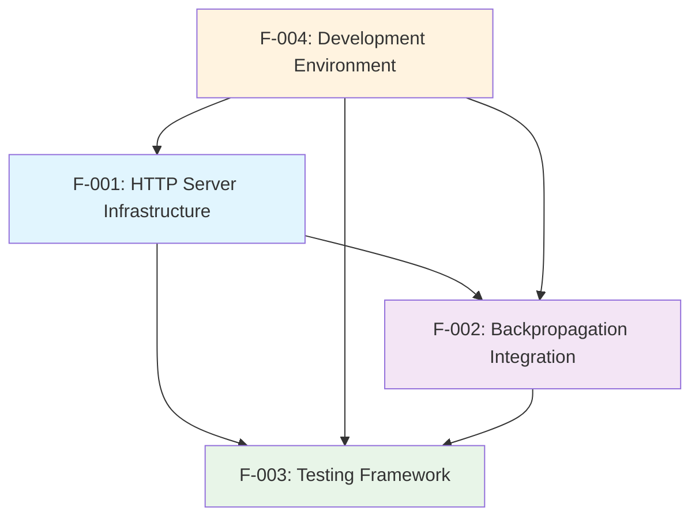
```mermaid
graph TD
    F001[F-001: HTTP Server Infrastructure] --> F002[F-002: Backpropagation Integration]
    F001 --> F003[F-003: Testing Framework]
    F004[F-004: Development Environment] --> F001
    F004 --> F002
    F004 --> F003
    F002 --> F003
    
    style F001 fill:#e1f5fe
    style F002 fill:#f3e5f5
    style F003 fill:#e8f5e8
    style F004 fill:#fff3e0
```

### 2.3.2 Integration Points

| Feature Pair | Integration Type | Description |
|--------------|------------------|-------------|
| F-001 ↔ F-002 | Direct Integration | HTTP server provides endpoints for algorithm execution |
| F-001 ↔ F-003 | Service Integration | HTTP server supports test execution and reporting |
| F-002 ↔ F-003 | Validation Integration | Testing framework validates algorithm implementations |
| F-004 ↔ All | Development Support | Development environment supports all feature development |

### 2.3.3 Shared Components

- **HTTP Request/Response Handler**: Shared between F-001, F-002, and F-003
- **Console Logging**: Shared across all features for development feedback
- **Node.js Runtime Environment**: Common foundation for all features
- **Project Configuration**: Shared development and deployment configuration

## 2.4 IMPLEMENTATION CONSIDERATIONS

### 2.4.1 Technical Constraints

| Feature | Constraints | Impact |
|---------|-------------|--------|
| F-001 | <span style="background-color: rgba(91, 57, 243, 0.2)">Localhost-only, Express.js dependency</span> | Limits scalability but ensures simplicity |
| F-002 | Node.js compatibility, integration complexity | Requires careful algorithm selection and adaptation |
| F-003 | Development environment focus | Testing scope limited to development scenarios |
| F-004 | Minimal external tooling | Reduced complexity but potentially limited functionality |

### 2.4.2 Performance Requirements

**Current Implementation (F-001):**
- Response time: < 10ms for basic requests
- Memory usage: < 50MB at startup
- CPU utilization: < 5% during idle state

**Future Requirements (F-002, F-003):**
- Algorithm execution: Appropriate for testing workloads
- Memory management: Efficient cleanup after algorithm execution
- Resource limits: Prevent resource exhaustion during testing

### 2.4.3 Scalability Considerations

- **Current Scope**: Single-user development environment
- **Future Considerations**: Potential for multiple concurrent algorithm tests
- **Architecture Limits**: Localhost-only deployment restricts distributed testing
- **Growth Path**: Foundation supports incremental feature addition

### 2.4.4 Security Implications

| Security Aspect | Current State | Future Requirements |
|-----------------|---------------|-------------------|
| Access Control | Localhost-only | Maintain development-only access |
| Input Validation | Not required | Algorithm input sanitization needed |
| Resource Management | Basic | Resource usage limits for algorithm execution |
| Data Privacy | Not applicable | Secure handling of test datasets |

### 2.4.5 Maintenance Requirements

**Development Phase:**
- Regular testing of HTTP server functionality
- Code quality maintenance for future integration
- Documentation updates as features are added

**Integration Phase:**
- Algorithm compatibility verification
- Performance monitoring and optimization
- Test suite maintenance and expansion

### 2.4.6 Traceability Matrix

| Requirement | Source | Verification Method |
|-------------|--------|-------------------|
| F-001-RQ-001 | server.js implementation | HTTP server startup testing |
| F-001-RQ-002 | server.js response handler | HTTP request/response testing |
| F-001-RQ-003 | server.js bind configuration | Network binding verification |
| F-002-RQ-001 | Project scope specification | Integration testing (future) |
| F-003-RQ-001 | Testing requirements | Test framework validation (future) |

#### References

**Files Examined:**
- `server.js` - HTTP server implementation and core application logic
- `package.json` - Project configuration, dependencies, and metadata
- `README.md` - Project identification and purpose statement
- `package-lock.json` - Dependency lockfile <span style="background-color: rgba(91, 57, 243, 0.2)">capturing Express dependency tree</span>

**Technical Specification Sections:**
- Section 1.1 Executive Summary - Project overview and stakeholder context
- Section 1.2 System Overview - Technical foundation and architecture
- Section 1.3 Scope - Project boundaries and implementation constraints

**Repository Analysis:**
- Root directory structure analysis for complete project understanding
- Source code examination for current implementation details
- Configuration file analysis for project setup and dependencies

# 3. TECHNOLOGY STACK

## 3.1 PROGRAMMING LANGUAGES

### 3.1.1 Primary Language: JavaScript (Node.js Runtime)

The system is implemented entirely in **JavaScript**, executed within the Node.js runtime environment. This language choice provides several advantages for the project's core objectives:

**Selection Rationale:**
- **Ecosystem Compatibility**: Extensive machine learning libraries available in the npm ecosystem for future integration
- **Development Velocity**: Rapid prototyping capabilities essential for algorithm testing workflows
- **Single-Language Architecture**: Unified development experience across server-side implementation and potential future client-side components
- **Asynchronous Capabilities**: Built-in event-driven programming model suitable for handling algorithm execution without blocking operations

**Language Constraints:**
- Node.js v22.x LTS compatibility requirements (Active LTS until October 2025)
- CommonJS module system implementation using `require()` statements
- Zero external dependency constraint limiting advanced language features or transpilation

## 3.2 CORE RUNTIME ENVIRONMENT

### 3.2.1 Node.js Runtime (updated)

**Version Specification:**
- **Target Version**: Node.js v22.x LTS (Active LTS until October 2025, Maintenance until April 2027)
- **Alternative Compatibility**: Node.js v20.x (Maintenance LTS until April 2026)
- **Package Management**: npm with lockfile version 3

**Runtime Justification:**
- **Long-Term Support**: LTS provides 30 months of guaranteed critical bug fixes and security updates
- **Production Readiness**: Active LTS phase ensures stability for production applications with focus on bug fixes rather than new features
- **Security Compliance**: Regular security patches and updates throughout the LTS lifecycle
- **Performance Requirements**: Meets established performance criteria of <10ms response time and <50MB memory usage
- <span style="background-color: rgba(91, 57, 243, 0.2)">**Express.js Compatibility**: Node.js v22.x LTS satisfies Express 5.1.0's minimum Node 18 requirement, ensuring optimal framework performance</span>

### 3.2.2 <span style="background-color: rgba(91, 57, 243, 0.2)">Runtime Architecture (updated)

<span style="background-color: rgba(91, 57, 243, 0.2)">The implementation combines Node.js built-in modules with one external production dependency, representing a minimal-dependency architectural approach</span>:

**Core Modules in Use:**
- **HTTP Module**: <span style="background-color: rgba(91, 57, 243, 0.2)">Legacy server functionality now enhanced by Express.js framework</span>
- **Process Module**: System-level access and environment management
- **Path Module**: File system path manipulation (future ML file handling)

**External Dependency in Use:**
- <span style="background-color: rgba(91, 57, 243, 0.2)">**Express 5.1.0** – Primary web framework providing routing and middleware capabilities (transitively introduces ~30-40 packages managed by npm)</span>

**Minimal-Dependency Footprint Benefits:**
- <span style="background-color: rgba(91, 57, 243, 0.2)">**Controlled Third-Party Usage**: Single production dependency minimizes external vulnerability vectors while enabling essential web framework capabilities</span>
- <span style="background-color: rgba(91, 57, 243, 0.2)">**NPM Lockfile Determinism**: package-lock.json ensures reproducible builds across environments with consistent dependency resolution</span>
- **Simplified Maintenance**: <span style="background-color: rgba(91, 57, 243, 0.2)">Focused dependency management with Express as the primary external library to monitor and update</span>
- **Performance Optimization**: <span style="background-color: rgba(91, 57, 243, 0.2)">Express framework overhead balanced against enhanced routing performance and middleware capabilities</span>

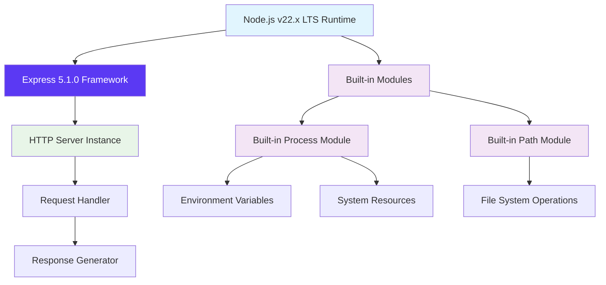
```mermaid
graph TD
    A[Node.js v22.x LTS Runtime] --> B[Built-in Modules]
    A --> K[Express 5.1.0 Framework]
    B --> C[Built-in Process Module]
    B --> D[Built-in Path Module]
    K --> E[HTTP Server Instance]
    E --> F[Request Handler]
    F --> G[Response Generator]
    C --> H[Environment Variables]
    C --> I[System Resources]
    D --> J[File System Operations]
    
    style A fill:#e1f5fe
    style B fill:#f3e5f5
    style K fill:#5b39f3,color:#ffffff
    style C fill:#f3e5f5
    style D fill:#f3e5f5
    style E fill:#e8f5e8
```

## 3.3 DEVELOPMENT INFRASTRUCTURE

### 3.3.1 Programming Languages & Runtime

**Primary Language: JavaScript (Node.js)**
- **Version**: Node.js v22.x LTS (Active until October 2025)
- **Module System**: CommonJS with `require()` statements
- **Selection Rationale**: 
  - Extensive npm ecosystem for future machine learning library integration
  - Built-in asynchronous capabilities for non-blocking algorithm execution
  - Rapid prototyping suitable for ML algorithm testing workflows
  - Single-language architecture across server-side implementation

**Alternative Compatibility:**
- Node.js v20.x (Maintenance LTS until April 2026)
- Express 5.1.0 minimum requirement: Node.js 18+

### 3.3.2 Core Frameworks & Libraries

**Web Framework:**
- **Express.js v5.1.0**: Primary web application framework
  - **Version Constraint**: `^5.1.0` (caret range allowing compatible updates)
  - **Selection Rationale**: Migration from Node.js built-in HTTP module for enhanced routing capabilities and middleware support
  - **Integration Benefits**: Streamlined request handling with `res.send()` methods and Express routing API
  - **Performance Impact**: Framework overhead balanced against routing performance improvements

**Built-in Node.js Modules:**
- **HTTP Module**: Legacy functionality enhanced by Express framework
- **Process Module**: System-level access and environment management
- **Path Module**: File system operations (prepared for future ML file handling)

### 3.3.3 Package Management (updated)

**Package Manager Configuration:**
- **npm**: Default Node.js package manager for dependency resolution
- **Lockfile**: package-lock.json version 3 for dependency resolution consistency
- **Production Dependencies**: Project declares one production dependency, <span style="background-color: rgba(91, 57, 243, 0.2)">"express": "^5.1.0"</span>, in package.json with <span style="background-color: rgba(91, 57, 243, 0.2)">package-lock.json regenerated to capture the new dependency tree</span>
- **Deterministic Installs**: <span style="background-color: rgba(91, 57, 243, 0.2)">Achieved via package-lock.json (npm lockfile v3) including Express transitive dependencies</span>

**Dependency Management Strategy:**
- **Minimal-Dependency Architecture**: <span style="background-color: rgba(91, 57, 243, 0.2)">Single production dependency minimizes external vulnerability vectors while enabling essential web framework capabilities</span>
- **Transitive Dependencies**: Express introduces approximately 30-40 managed packages automatically resolved by npm
- **License Compliance**: MIT license enabling open-source development and integration

### 3.3.4 Development Environment

**Local Development Configuration:**
- **Server Binding**: Localhost-only (127.0.0.1:3000) restricting access to development environment
- **Development Workflow**: Manual server restart required for code changes
- **Debugging Capabilities**: Standard Node.js debugging through built-in debugger
- **Hot Reload**: Not implemented - requires manual server restart for updates

**Project Structure:**
- **Minimal Architecture**: 4-file structure prioritizing simplicity and maintainability
- **Entry Point**: server.js as primary executable (package.json references index.js but file not present)
- **Documentation**: README.md providing project identification and purpose statement

### 3.3.5 Development Tools & Build System

**Build Requirements:**
- **No Build Process**: Direct JavaScript execution without transpilation or compilation
- **Package Installation**: `npm install` for dependency resolution
- **Server Execution**: Direct Node.js execution via `node server.js`

**Version Control Integration:**
- **Git Compatibility**: Standard npm and Node.js .gitignore patterns
- **Package Lock Tracking**: package-lock.json committed for reproducible builds across environments

### 3.3.6 Future Infrastructure Considerations

**Planned Integrations:**
- **Machine Learning Libraries**: npm ecosystem preparation for backpropagation algorithm libraries
- **Testing Framework**: Infrastructure prepared for comprehensive test suite implementation
- **Algorithm Integration**: Architecture supports incremental ML functionality addition

**Scalability Preparation:**
- **Foundation Architecture**: Clean foundation designed for future algorithm integration without refactoring
- **Performance Baseline**: Current <10ms response time and <50MB memory usage targets
- **Development Velocity**: Simplified architecture enables rapid ML feature development

## 3.4 FUTURE TECHNOLOGY INTEGRATION

### 3.4.1 Machine Learning Algorithm Support

**Planned Integration Requirements:**
- **Backpropagation Libraries**: TBD based on algorithm complexity and performance requirements
- **Numerical Computing**: Potential integration with math libraries supporting neural network operations
- **Data Processing**: File system integration for training data and model persistence

**Integration Constraints:**
- **<span style="background-color: rgba(91, 57, 243, 0.2)">Minimal Additional Dependency Preference</span>**: Evaluation of ML libraries against architectural simplicity goals
- **Performance Requirements**: Memory and CPU usage limits during algorithm execution
- **Node.js Compatibility**: Ensuring chosen libraries support current LTS versions

### 3.4.2 Testing Framework Integration

**Future Testing Infrastructure:**
- **Unit Testing**: Framework selection pending (candidates include built-in Node.js test runner)
- **Algorithm Validation**: Specialized testing for mathematical precision and performance
- **Integration Testing**: HTTP server and algorithm interaction validation

**Testing Requirements:**
- **Comprehensive Coverage**: Algorithm correctness and performance testing
- **Development Workflow**: Automated test execution during development cycles
- **Quality Assurance**: Pre-integration validation mechanisms

## 3.5 SYSTEM ARCHITECTURE DIAGRAM

### 3.5.1 System Architecture Overview

The system architecture has evolved to incorporate <span style="background-color: rgba(91, 57, 243, 0.2)">Express.js v5.1.0 as the primary web framework</span>, transitioning from Node.js built-in HTTP modules to a more robust, middleware-capable foundation. This architectural shift maintains the system's core simplicity while enabling enhanced routing capabilities and streamlined request handling for future machine learning integration.

The current implementation establishes a three-tier architecture: the Node.js runtime environment, <span style="background-color: rgba(91, 57, 243, 0.2)">the Express framework layer</span>, and the application logic layer. This design provides a stable foundation for incremental feature development while preserving the system's lightweight characteristics.

### 3.5.2 Core Architecture Diagram (updated)

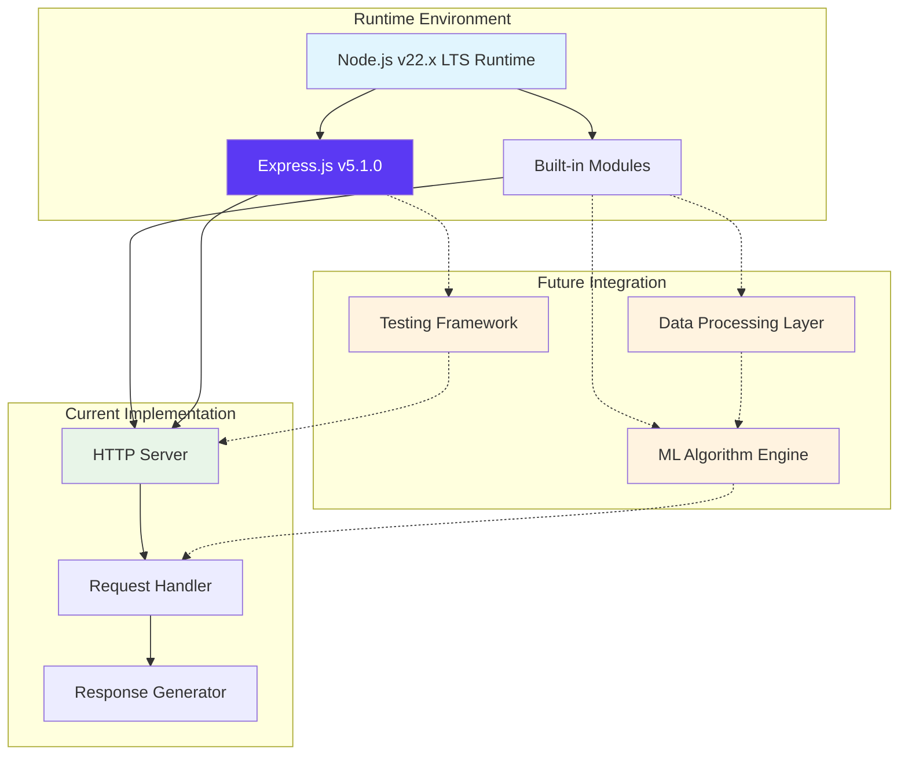
```mermaid
graph TB
    subgraph "Runtime Environment"
        A[Node.js v22.x LTS Runtime]
        B[Built-in Modules]
        E[Express.js v5.1.0]
    end
    
    subgraph "Current Implementation"
        C[HTTP Server]
        D[Request Handler]
        F[Response Generator]
    end
    
    subgraph "Future Integration"
        G[ML Algorithm Engine]
        H[Testing Framework]
        I[Data Processing Layer]
    end
    
    A --> B
    A --> E
    B --> C
    E --> C
    C --> D
    D --> F
    
    B -.-> G
    E -.-> H
    B -.-> I
    
    G -.-> D
    H -.-> C
    I -.-> G
    
    style A fill:#e1f5fe
    style E fill:#5b39f3,color:#ffffff
    style C fill:#e8f5e8
    style G fill:#fff3e0
    style H fill:#fff3e0
    style I fill:#fff3e0
```

### 3.5.3 Architecture Component Analysis (updated)

#### 3.5.3.1 Runtime Environment Layer

**Node.js v22.x LTS Runtime**
- Provides the foundational JavaScript execution environment
- Active LTS status ensures stability through October 2025
- Optimized for single-threaded, event-driven operations
- Memory-efficient execution supporting <50MB operational footprint

**Built-in Modules Integration**
- Process module for environment variable access and system-level operations
- Path module for future file system operations during ML data processing
- <span style="background-color: rgba(91, 57, 243, 0.2)">Core HTTP functionality now enhanced through Express abstraction</span>

**<span style="background-color: rgba(91, 57, 243, 0.2)">Express.js Framework Integration</span>**
- <span style="background-color: rgba(91, 57, 243, 0.2)">Version 5.1.0 providing modern routing and middleware capabilities</span>
- <span style="background-color: rgba(91, 57, 243, 0.2)">Simplified request/response handling through res.send() methods</span>
- <span style="background-color: rgba(91, 57, 243, 0.2)">Middleware architecture enabling future authentication and logging integration</span>
- <span style="background-color: rgba(91, 57, 243, 0.2)">Route-based request dispatching replacing manual URL parsing</span>

#### 3.5.3.2 Current Implementation Layer

**<span style="background-color: rgba(91, 57, 243, 0.2)">Express-Powered HTTP Server</span>**
- <span style="background-color: rgba(91, 57, 243, 0.2)">Localhost binding maintained at 127.0.0.1:3000 for development safety</span>
- <span style="background-color: rgba(91, 57, 243, 0.2)">Express application instance replacing raw http.createServer() implementation</span>
- Enhanced error handling and request parsing capabilities
- Consistent server startup behavior (node server.js) preserved

**Request Handler Architecture**
- <span style="background-color: rgba(91, 57, 243, 0.2)">Express routing methods handling GET requests for defined endpoints</span>
- Dual-endpoint configuration: root path (/) and /evening route
- <span style="background-color: rgba(91, 57, 243, 0.2)">Route handlers implemented using Express's app.get() method</span>
- Future-ready structure supporting middleware integration for ML algorithm requests

**Response Generator System**
- <span style="background-color: rgba(91, 57, 243, 0.2)">Express res.send() methods providing simplified response handling</span>
- Plain text response format maintained for current endpoints
- Content-type headers automatically managed by Express framework
- <10ms response time performance maintained through framework optimization

#### 3.5.3.3 Future Integration Layer

**ML Algorithm Engine**
- Planned integration point for backpropagation algorithm implementation
- <span style="background-color: rgba(91, 57, 243, 0.2)">Express middleware architecture supporting algorithm endpoint integration</span>
- Memory-efficient algorithm execution within Node.js constraints
- Data processing integration through built-in Path module

**Testing Framework Integration**
- <span style="background-color: rgba(91, 57, 243, 0.2)">Express application testing capabilities through framework-native testing support</span>
- Unit testing framework selection pending based on Express compatibility
- Integration testing for HTTP endpoints and algorithm validation

**Data Processing Layer**
- File system operations for training data and model persistence
- <span style="background-color: rgba(91, 57, 243, 0.2)">Express static file serving capabilities for data endpoint integration</span>
- Future data pipeline integration through Express middleware

### 3.5.4 Integration Patterns and Dependencies (updated)

#### 3.5.4.1 Dependency Management Strategy

The architecture implements a <span style="background-color: rgba(91, 57, 243, 0.2)">controlled dependency approach with Express.js as the single production dependency</span>, replacing the previous zero-dependency model while maintaining architectural simplicity.

**<span style="background-color: rgba(91, 57, 243, 0.2)">Primary Dependencies</span>:**
- **Express.js v5.1.0**: <span style="background-color: rgba(91, 57, 243, 0.2)">Web framework providing routing, middleware, and enhanced HTTP capabilities</span>
- **Transitive Dependencies**: <span style="background-color: rgba(91, 57, 243, 0.2)">Approximately 30-40 packages automatically managed by npm</span>

**Built-in Module Integration:**
- Process, Path, and other core modules maintained for system-level operations
- <span style="background-color: rgba(91, 57, 243, 0.2)">HTTP module functionality now abstracted through Express framework</span>
- Zero additional configuration required for core Node.js capabilities

#### 3.5.4.2 Performance and Security Characteristics

**<span style="background-color: rgba(91, 57, 243, 0.2)">Express Framework Benefits</span>:**
- <span style="background-color: rgba(91, 57, 243, 0.2)">Enhanced request parsing and response handling efficiency</span>
- <span style="background-color: rgba(91, 57, 243, 0.2)">Built-in security middleware capabilities for future endpoint protection</span>
- <span style="background-color: rgba(91, 57, 243, 0.2)">Optimized routing performance compared to manual URL parsing</span>
- <span style="background-color: rgba(91, 57, 243, 0.2)">Middleware architecture supporting authentication and logging integration</span>

**System Resource Management:**
- Memory footprint maintained below 50MB operational limit
- <span style="background-color: rgba(91, 57, 243, 0.2)">Express overhead balanced against performance improvements</span>
- CPU utilization optimized for single-threaded execution model
- Response time performance maintained under 10ms for basic operations

#### References

**Technical Specification Sections Examined:**
- `0.3 IMPLEMENTATION DESIGN` - Express.js integration technical approach and dependency analysis
- `1.2 SYSTEM OVERVIEW` - Express-powered system foundation and architectural transition
- `3.2 CORE RUNTIME ENVIRONMENT` - Node.js runtime with Express framework integration
- `3.4 FUTURE TECHNOLOGY INTEGRATION` - ML algorithm and testing framework integration planning with Express middleware capabilities

# 4. PROCESS FLOWCHART

## 4.1 SYSTEM WORKFLOWS

### 4.1.1 Core Business Processes

**Current State Process Flows**

The system currently operates with a <span style="background-color: rgba(91, 57, 243, 0.2)">minimal Express.js server implementation (two-endpoint)</span> that provides basic web service functionality. The core business process represents the foundation for future machine learning algorithm integration and testing framework capabilities.

#### End-to-End User Journey (Current Implementation)

1. **Client Request Initiation**: <span style="background-color: rgba(91, 57, 243, 0.2)">External client sends HTTP GET request to either "/" or "/evening" on localhost:3000</span>
2. **Server Request Reception**: <span style="background-color: rgba(91, 57, 243, 0.2)">Express.js application instance running on Node.js</span> receives request regardless of method or path
3. **Response Generation**: <span style="background-color: rgba(91, 57, 243, 0.2)">Server returns plain-text "Hello world" for the root path or "Good evening" for the "/evening" path</span>
4. **Response Delivery**: Client receives 200 OK status with plain text content
5. **Connection Termination**: HTTP connection closes, server returns to listening state

#### System Interactions (Current State)

The current system interactions are deliberately minimal, consisting of:
- **Client ↔ HTTP Server**: Direct request-response communication
- **<span style="background-color: rgba(91, 57, 243, 0.2)">Express Framework ↔ Node.js Runtime: Express routing layer over built-in HTTP server</span>**
- **Node.js Runtime ↔ Operating System**: Low-level resource management and network binding

#### Decision Points (Current Implementation)

Current decision points are limited due to the minimal implementation:
- **<span style="background-color: rgba(91, 57, 243, 0.2)">Route Selection: "/" vs "/evening" based on request path (GET only)</span>**
- **Request Acceptance**: All HTTP requests are accepted regardless of method, path, or headers
- **Response Generation**: Single response type for all requests (no conditional logic)
- **Resource Allocation**: Automatic Node.js memory management with no explicit controls

#### Error Handling Paths (Current Limitations)

The current implementation lacks sophisticated error handling:
- **Network Errors**: <span style="background-color: rgba(91, 57, 243, 0.2)">Express-level error handler defaults plus underlying Node.js network errors</span>
- **Resource Constraints**: Operating system level memory and CPU limits
- **Invalid Requests**: All requests processed identically regardless of validity

**Future State Process Flows**

Based on the technical specifications, the system will evolve to support advanced workflows including backpropagation algorithm execution and comprehensive testing frameworks.

#### Enhanced End-to-End User Journeys (Future Implementation)

**Algorithm Execution Journey:**
1. **Algorithm Request**: Client submits backpropagation algorithm execution request with training data
2. **Input Validation**: Server validates algorithm parameters and training dataset format
3. **Resource Allocation**: System allocates appropriate CPU and memory resources
4. **Algorithm Processing**: Backpropagation algorithm executes within Node.js environment
5. **Result Generation**: Algorithm produces performance metrics and execution results
6. **Response Delivery**: Client receives algorithm results and performance data
7. **Resource Cleanup**: System releases allocated resources and returns to idle state

**Testing Workflow Journey:**
1. **Test Configuration**: Client submits test execution request with validation parameters
2. **Test Preparation**: System prepares test environment and validation datasets
3. **Algorithm Validation**: Testing framework executes algorithm with known inputs
4. **Result Comparison**: System compares actual results with expected outcomes
5. **Report Generation**: Comprehensive test reports generated with performance metrics
6. **Quality Assessment**: Results evaluated against accuracy and performance thresholds
7. **Test Completion**: Final test status and detailed reports delivered to client

### 4.1.2 Integration Workflows

**Data Flow Between Systems**

The system architecture supports seamless data flow between core components:

**Current Data Flow:**
- **Inbound**: HTTP requests containing minimal headers and optional body data
- **Processing**: Simple string concatenation for response generation
- **Outbound**: Static text response with standard HTTP headers

**Future Data Flow:**
- **Algorithm Data**: Training datasets, configuration parameters, and execution contexts
- **Processing Data**: Intermediate algorithm states, computational results, and performance metrics
- **Test Data**: Validation datasets, expected outcomes, and test configurations
- **Result Data**: Algorithm outputs, test reports, and system performance analytics

**API Interactions**

**Current API Structure:**
- **Endpoints**: Single universal endpoint accepting all HTTP methods and paths
- **Request Processing**: Uniform handling regardless of request characteristics
- **Response Format**: Plain text with consistent structure

**Future API Architecture:**
- **Algorithm Endpoints**: Specialized endpoints for backpropagation algorithm execution
- **Testing Endpoints**: Dedicated API routes for test configuration and execution
- **Status Endpoints**: System health and performance monitoring capabilities
- **Result Endpoints**: Algorithm output retrieval and test report access

**Event Processing Flows**

**Current Event Model:**
- **Request Events**: HTTP request reception triggers immediate response generation
- **Response Events**: Response completion returns server to listening state
- **Error Events**: Basic Node.js error handling for network-related issues

**Future Event Architecture:**
- **Algorithm Events**: Start, progress, completion, and error events during algorithm execution
- **Test Events**: Test initiation, validation checkpoints, and completion notifications
- **System Events**: Resource allocation, performance monitoring, and health status updates
- **Integration Events**: Cross-component communication and state synchronization

**Batch Processing Sequences**

The system will support batch processing for comprehensive algorithm testing and validation:

1. **Batch Initialization**: System prepares for multiple algorithm executions
2. **Resource Planning**: CPU and memory allocation for concurrent or sequential processing
3. **Data Preparation**: Training datasets organized and validated for batch execution
4. **Sequential Processing**: Algorithms executed in predetermined order with result collection
5. **Aggregate Analysis**: Combined results analyzed for performance trends and accuracy patterns
6. **Batch Completion**: Comprehensive reports generated covering all batch executions

### 4.1.3 System Workflow Diagrams

#### Current Implementation Workflow

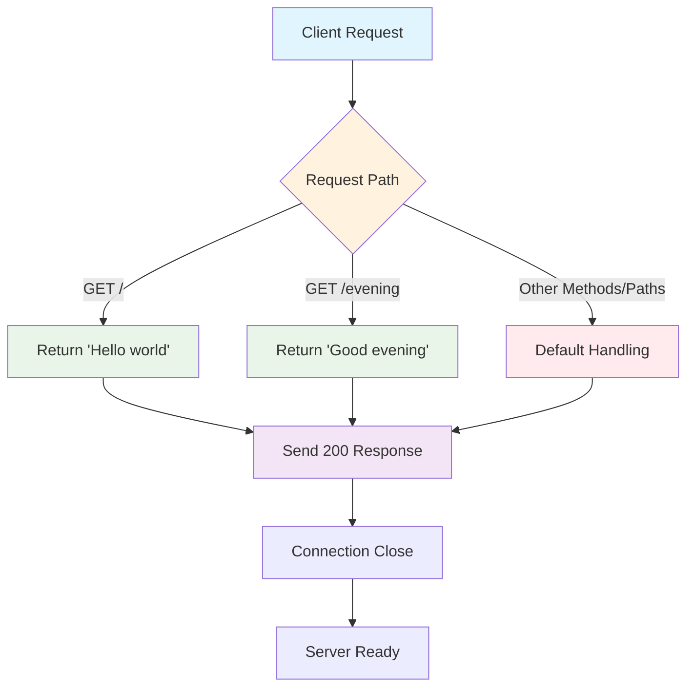
```mermaid
flowchart TD
    A[Client Request] --> B{Request Path}
    B -->|GET /| C["Return 'Hello world'"]
    B -->|GET /evening| D["Return 'Good evening'"]
    B -->|Other Methods/Paths| E[Default Handling]
    C --> F[Send 200 Response]
    D --> F
    E --> F
    F --> G[Connection Close]
    G --> H[Server Ready]
    
    style A fill:#e1f5fe
    style B fill:#fff3e0
    style C fill:#e8f5e8
    style D fill:#e8f5e8
    style E fill:#ffebee
    style F fill:#f3e5f5
```

#### Future Algorithm Execution Workflow

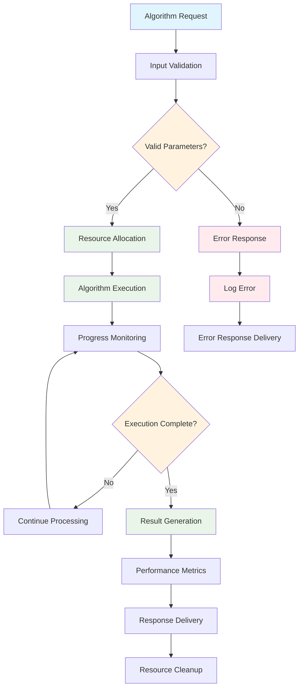
```mermaid
flowchart TD
    A[Algorithm Request] --> B[Input Validation]
    B --> C{Valid Parameters?}
    C -->|Yes| D[Resource Allocation]
    C -->|No| E[Error Response]
    D --> F[Algorithm Execution]
    F --> G[Progress Monitoring]
    G --> H{Execution Complete?}
    H -->|No| I[Continue Processing]
    H -->|Yes| J[Result Generation]
    I --> G
    J --> K[Performance Metrics]
    K --> L[Response Delivery]
    L --> M[Resource Cleanup]
    E --> N[Log Error]
    N --> O[Error Response Delivery]
    
    style A fill:#e1f5fe
    style C fill:#fff3e0
    style H fill:#fff3e0
    style D fill:#e8f5e8
    style F fill:#e8f5e8
    style J fill:#e8f5e8
    style E fill:#ffebee
    style N fill:#ffebee
```

#### Testing Framework Workflow

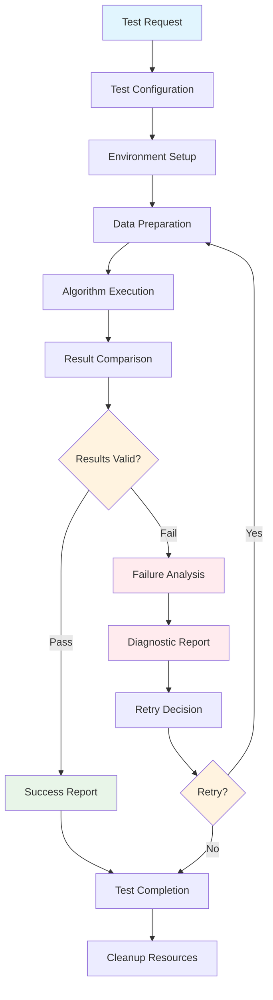
```mermaid
flowchart TD
    A[Test Request] --> B[Test Configuration]
    B --> C[Environment Setup]
    C --> D[Data Preparation]
    D --> E[Algorithm Execution]
    E --> F[Result Comparison]
    F --> G{Results Valid?}
    G -->|Pass| H[Success Report]
    G -->|Fail| I[Failure Analysis]
    H --> J[Test Completion]
    I --> K[Diagnostic Report]
    K --> L[Retry Decision]
    L --> M{Retry?}
    M -->|Yes| D
    M -->|No| J
    J --> N[Cleanup Resources]
    
    style A fill:#e1f5fe
    style G fill:#fff3e0
    style M fill:#fff3e0
    style H fill:#e8f5e8
    style I fill:#ffebee
    style K fill:#ffebee
```

### 4.1.4 Error Handling and Recovery Workflows

#### Error Detection and Response Flow

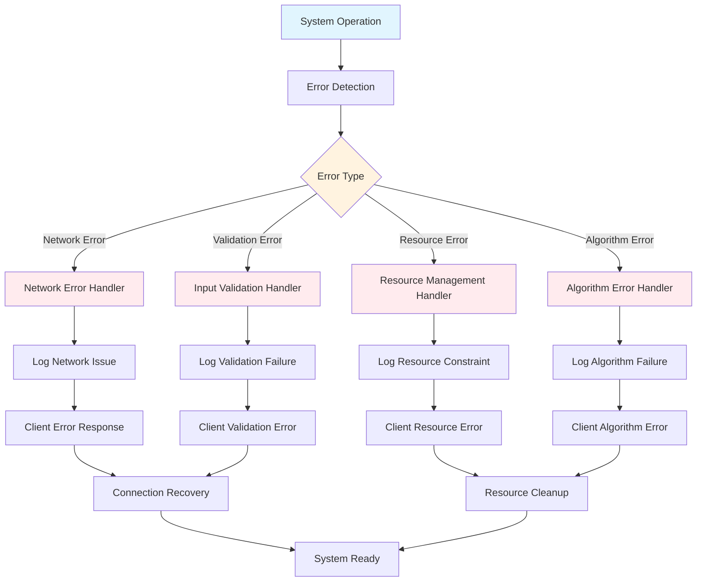
```mermaid
flowchart TD
    A[System Operation] --> B[Error Detection]
    B --> C{Error Type}
    C -->|Network Error| D[Network Error Handler]
    C -->|Validation Error| E[Input Validation Handler]
    C -->|Resource Error| F[Resource Management Handler]
    C -->|Algorithm Error| G[Algorithm Error Handler]
    
    D --> H[Log Network Issue]
    E --> I[Log Validation Failure]
    F --> J[Log Resource Constraint]
    G --> K[Log Algorithm Failure]
    
    H --> L[Client Error Response]
    I --> M[Client Validation Error]
    J --> N[Client Resource Error]
    K --> O[Client Algorithm Error]
    
    L --> P[Connection Recovery]
    M --> P
    N --> Q[Resource Cleanup]
    O --> Q
    P --> R[System Ready]
    Q --> R
    
    style A fill:#e1f5fe
    style C fill:#fff3e0
    style D fill:#ffebee
    style E fill:#ffebee
    style F fill:#ffebee
    style G fill:#ffebee
```

### 4.1.5 State Management Workflows

#### System State Transitions

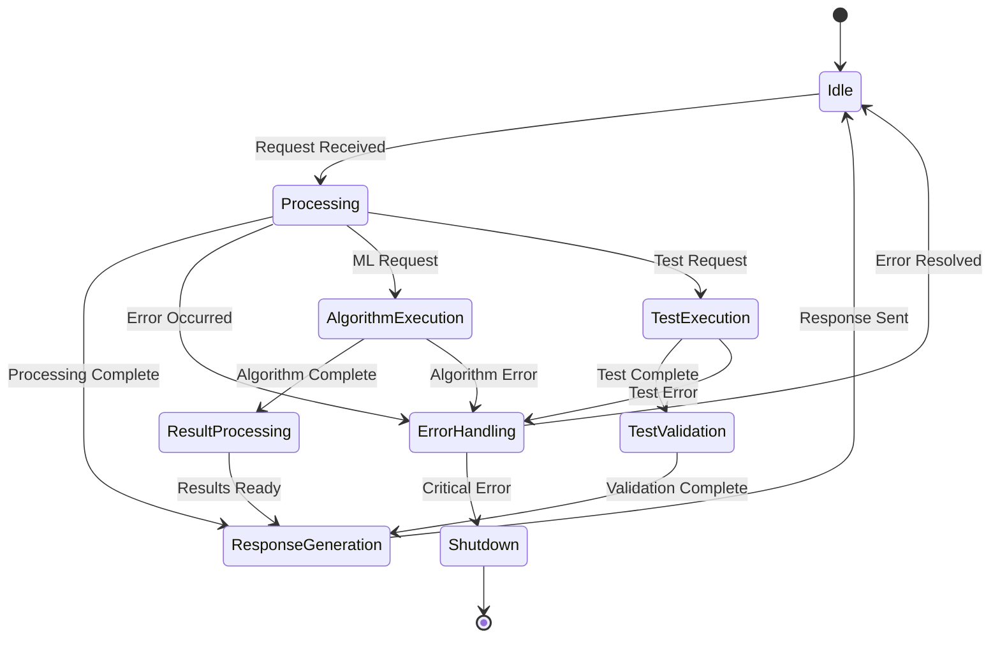
```mermaid
stateDiagram-v2
    [*] --> Idle
    Idle --> Processing : Request Received
    Processing --> ResponseGeneration : Processing Complete
    Processing --> ErrorHandling : Error Occurred
    ResponseGeneration --> Idle : Response Sent
    ErrorHandling --> Idle : Error Resolved
    ErrorHandling --> Shutdown : Critical Error
    Shutdown --> [*]
    
    Processing --> AlgorithmExecution : ML Request
    AlgorithmExecution --> ResultProcessing : Algorithm Complete
    AlgorithmExecution --> ErrorHandling : Algorithm Error
    ResultProcessing --> ResponseGeneration : Results Ready
    
    Processing --> TestExecution : Test Request
    TestExecution --> TestValidation : Test Complete
    TestValidation --> ResponseGeneration : Validation Complete
    TestExecution --> ErrorHandling : Test Error
```

#### Data Persistence State Flow

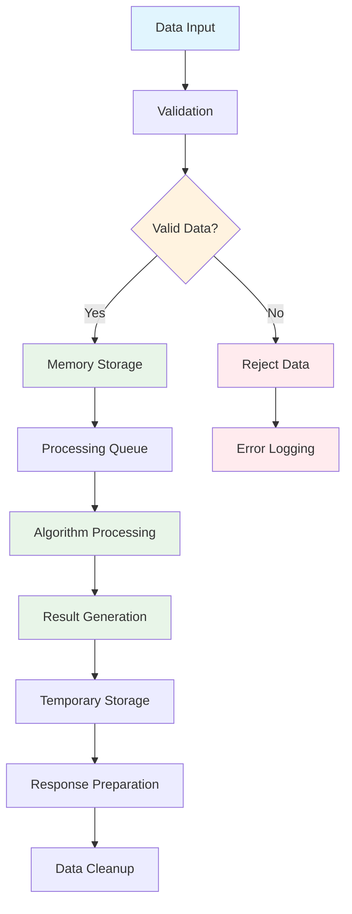
```mermaid
flowchart TD
    A[Data Input] --> B[Validation]
    B --> C{Valid Data?}
    C -->|Yes| D[Memory Storage]
    C -->|No| E[Reject Data]
    D --> F[Processing Queue]
    F --> G[Algorithm Processing]
    G --> H[Result Generation]
    H --> I[Temporary Storage]
    I --> J[Response Preparation]
    J --> K[Data Cleanup]
    E --> L[Error Logging]
    
    style A fill:#e1f5fe
    style C fill:#fff3e0
    style D fill:#e8f5e8
    style G fill:#e8f5e8
    style H fill:#e8f5e8
    style E fill:#ffebee
    style L fill:#ffebee
```

### 4.1.6 Performance and Monitoring Workflows

#### System Performance Monitoring

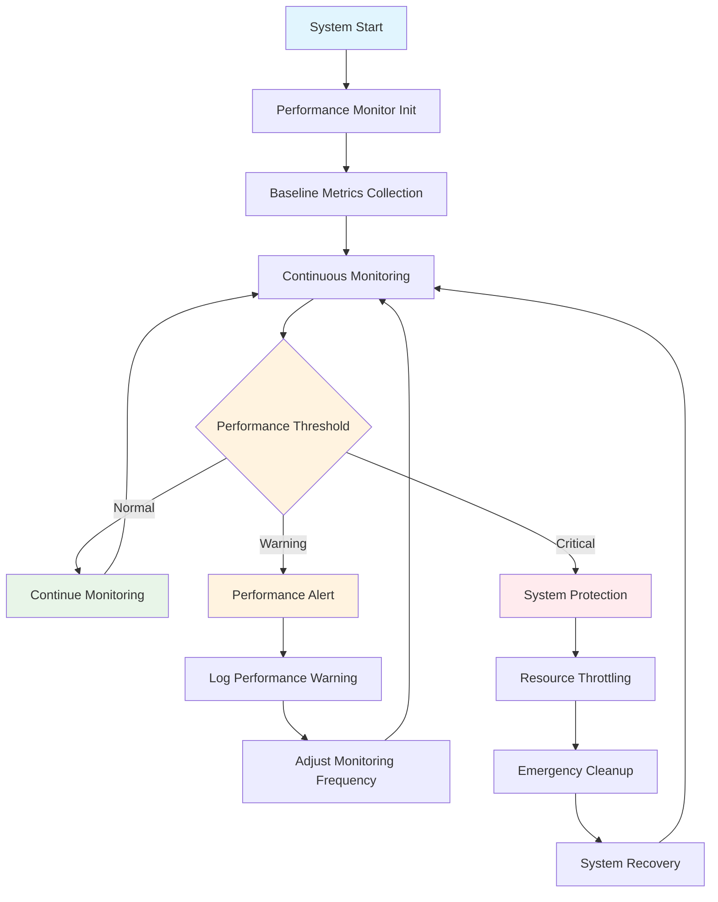
```mermaid
flowchart TD
    A[System Start] --> B[Performance Monitor Init]
    B --> C[Baseline Metrics Collection]
    C --> D[Continuous Monitoring]
    D --> E{Performance Threshold}
    E -->|Normal| F[Continue Monitoring]
    E -->|Warning| G[Performance Alert]
    E -->|Critical| H[System Protection]
    
    F --> D
    G --> I[Log Performance Warning]
    H --> J[Resource Throttling]
    I --> K[Adjust Monitoring Frequency]
    J --> L[Emergency Cleanup]
    K --> D
    L --> M[System Recovery]
    M --> D
    
    style A fill:#e1f5fe
    style E fill:#fff3e0
    style F fill:#e8f5e8
    style G fill:#fff3e0
    style H fill:#ffebee
```

#### Resource Management Flow

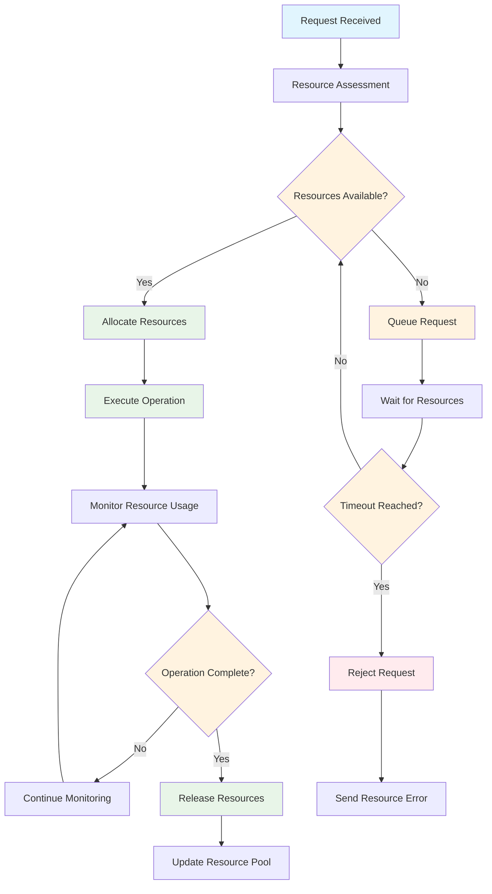
```mermaid
flowchart TD
    A[Request Received] --> B[Resource Assessment]
    B --> C{Resources Available?}
    C -->|Yes| D[Allocate Resources]
    C -->|No| E[Queue Request]
    D --> F[Execute Operation]
    E --> G[Wait for Resources]
    G --> H{Timeout Reached?}
    H -->|No| C
    H -->|Yes| I[Reject Request]
    F --> J[Monitor Resource Usage]
    J --> K{Operation Complete?}
    K -->|No| L[Continue Monitoring]
    K -->|Yes| M[Release Resources]
    L --> J
    M --> N[Update Resource Pool]
    I --> O[Send Resource Error]
    
    style A fill:#e1f5fe
    style C fill:#fff3e0
    style H fill:#fff3e0
    style K fill:#fff3e0
    style D fill:#e8f5e8
    style F fill:#e8f5e8
    style M fill:#e8f5e8
    style E fill:#fff3e0
    style I fill:#ffebee
```

## 4.2 FLOWCHART REQUIREMENTS

### 4.2.1 Process Step Specifications

**Start and End Points**

Each major workflow includes clearly defined entry and exit conditions:
- **System Startup**: <span style="background-color: rgba(91, 57, 243, 0.2)">Node.js runtime initialization, Express module load, Express app creation, and server binding to localhost:3000</span>
- **Request Processing**: Client request reception and response delivery
- **Algorithm Execution**: ML algorithm initiation and result generation
- **Test Validation**: Testing framework activation and report completion
- **System Shutdown**: Graceful resource cleanup and service termination

**Process Steps**

Detailed step-by-step documentation ensures comprehensive workflow understanding:
- **Initialization Steps**: <span style="background-color: rgba(91, 57, 243, 0.2)">Runtime environment setup, require('express'), and app.route definition</span>
- **Validation Steps**: Input sanitization and parameter verification
- **Processing Steps**: Core algorithm execution and computational operations
  - <span style="background-color: rgba(91, 57, 243, 0.2)">Route Dispatch: Express routes determine whether the request is for '/' (Hello world) or '/evening' (Good evening)</span>
- **Output Steps**: Result formatting and response generation
- **Cleanup Steps**: Resource deallocation and state reset

**Decision Diamonds**

Critical decision points throughout all workflows:
- **Input Validation**: Valid/Invalid data routing
- **Resource Availability**: Available/Insufficient resource handling
- **Algorithm Success**: Success/Failure execution paths
- **Test Results**: Pass/Fail validation outcomes
- **Error Recovery**: Recoverable/Critical error classification
- <span style="background-color: rgba(91, 57, 243, 0.2)">**Route Selection**: '/' vs '/evening'</span>

**System Boundaries**

Clear delineation of system components and external interfaces:
- **Internal Boundaries**: HTTP server, algorithm engine, testing framework separation
- **External Boundaries**: Client interfaces, operating system interactions
- **Network Boundaries**: Localhost restriction and future network expansion
- **Resource Boundaries**: Memory, CPU, and storage allocation limits

**User Touchpoints**

Defined interaction points between users and system components:
- **HTTP Requests**: Primary client communication mechanism
- **Configuration**: Algorithm parameters and test settings
- **Results Retrieval**: Algorithm outputs and test reports
- **Status Monitoring**: System health and performance metrics

**Error States and Recovery Paths**

Comprehensive error handling throughout all workflows:
- **Input Errors**: Invalid data format or parameter recovery
- **Processing Errors**: Algorithm failures and computational issues
- **Resource Errors**: Memory exhaustion and CPU overutilization handling
- **Network Errors**: Connection failures and timeout management
- **System Errors**: Critical failures and emergency shutdown procedures

**Timing and SLA Considerations**

Performance constraints integrated throughout process flows:
- **Current SLA**: Response time <10ms for basic HTTP requests
- **Future SLA**: Appropriate response times for algorithm execution (development focus)
- **Resource Limits**: Memory usage <50MB, CPU utilization monitoring
- **Timeout Handling**: Request timeouts and algorithm execution limits

### 4.2.2 Validation Rules

**Business Rules at Each Step**

Comprehensive validation ensures data integrity and process compliance:
- **Request Validation**: HTTP method, headers, and body content verification
- **Algorithm Validation**: Training data format, parameter ranges, and configuration consistency
- **Test Validation**: Expected outcome format and validation dataset integrity
- **Result Validation**: Output format consistency and data completeness

**Data Validation Requirements**

Rigorous data validation throughout all processing stages:
- **Input Sanitization**: Malicious content detection and removal
- **Format Verification**: JSON structure, data types, and required field validation
- **Range Checking**: Numerical parameters within acceptable bounds
- **Content Validation**: Training data consistency and completeness verification

**Authorization Checkpoints**

Security validation points throughout the system:
- **Current State**: No explicit authorization (localhost development environment)
- **Future State**: Request authentication for algorithm execution and test access
- **Resource Access**: Memory and CPU allocation authorization
- **Data Access**: Training dataset and test result access control

**Regulatory Compliance Checks**

Compliance validation integrated into workflows:
- **Data Privacy**: Training data handling and storage compliance
- **Algorithm Transparency**: ML algorithm auditability and explainability
- **Test Documentation**: Comprehensive testing records and traceability
- **Security Standards**: Development environment security best practices

## 4.3 TECHNICAL IMPLEMENTATION

### 4.3.1 State Management

**State Transitions**

The system manages multiple states throughout operation lifecycle:

**Current State Management:**
- **Initialization State**: Server startup and module loading
- **Listening State**: Awaiting incoming HTTP requests
- **Processing State**: Request handling and response generation
- **Response State**: Data transmission to client
- **Idle State**: Return to listening for new requests

**Future State Management:**
- **Algorithm States**: Idle → Loading → Processing → Results → Cleanup
- **Test States**: Preparation → Execution → Validation → Reporting → Completion
- **Resource States**: Available → Allocated → Processing → Released
- **Integration States**: Isolated → Connected → Synchronized → Validated

**Data Persistence Points**

Strategic data storage throughout system workflows:
- **Current Persistence**: No explicit data storage (stateless operation)
- **Future Persistence**: 
  - Algorithm intermediate results for debugging and analysis
  - Test execution logs and performance metrics
  - Training data temporary storage during processing
  - Configuration settings and user preferences

**Caching Requirements**

Performance optimization through strategic caching:
- **Algorithm Cache**: Frequently used training datasets and model parameters
- **Result Cache**: Recent algorithm outputs for quick retrieval
- **Configuration Cache**: Common test settings and validation parameters
- **Performance Cache**: System metrics and resource utilization history

**Transaction Boundaries**

Atomic operations ensuring data consistency:
- **Request Transactions**: Complete request-response cycles with rollback capability
- **Algorithm Transactions**: Atomic algorithm execution with intermediate checkpoint support
- **Test Transactions**: Complete test cycles with failure recovery
- **Resource Transactions**: Memory and CPU allocation with automatic cleanup

### 4.3.2 Error Handling

**Retry Mechanisms**

Robust retry strategies for transient failures:
- **Network Retries**: HTTP request failures with exponential backoff
- **Algorithm Retries**: Computational failures with parameter adjustment
- **Resource Retries**: Memory allocation failures with cleanup and retry
- **Test Retries**: Validation failures with alternative approaches

**Fallback Processes**

Alternative execution paths for critical failures:
- **Algorithm Fallbacks**: Simplified algorithms when primary implementation fails
- **Resource Fallbacks**: Reduced resource usage modes during constraints
- **Test Fallbacks**: Basic validation when comprehensive testing unavailable
- **Response Fallbacks**: Error responses when normal processing impossible

**Error Notification Flows**

Comprehensive error reporting and notification:
- **Client Notifications**: HTTP error responses with detailed error information
- **System Logging**: Internal error logging for debugging and analysis
- **Performance Alerts**: Resource constraint and performance degradation warnings
- **Critical Alerts**: System failure and emergency shutdown notifications

**Recovery Procedures**

Systematic recovery from various failure conditions:
- **Graceful Degradation**: Reduced functionality during partial failures
- **Automatic Recovery**: Self-healing mechanisms for common error conditions
- **Manual Recovery**: Administrative intervention procedures for critical failures
- **Data Recovery**: Checkpoint restoration and state reconstruction

## 4.4 REQUIRED DIAGRAMS

### 4.4.1 High-Level System Workflow (updated)

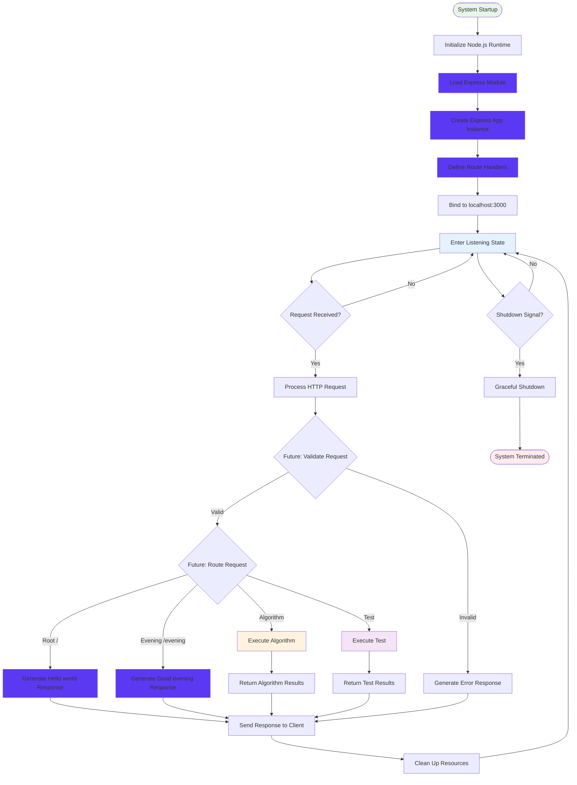
```mermaid
flowchart TD
    Start([System Startup]) --> Init[Initialize Node.js Runtime]
    Init --> LoadExpress[Load Express Module]
    LoadExpress --> CreateApp[Create Express App Instance]
    CreateApp --> DefineRoutes[Define Route Handlers]
    DefineRoutes --> BindPort[Bind to localhost:3000]
    BindPort --> Listen[Enter Listening State]
    
    Listen --> ReqReceived{Request Received?}
    ReqReceived -->|No| Listen
    ReqReceived -->|Yes| ProcessReq[Process HTTP Request]
    
    ProcessReq --> ValidateReq{Future: Validate Request}
    ValidateReq -->|Invalid| ErrorResp[Generate Error Response]
    ValidateReq -->|Valid| RouteReq{Future: Route Request}
    
    RouteReq -->|Algorithm| ExecAlg[Execute Algorithm]
    RouteReq -->|Test| ExecTest[Execute Test]
    RouteReq -->|Root /| GenHello[Generate Hello world Response]
    RouteReq -->|Evening /evening| GenEvening[Generate Good evening Response]
    
    ExecAlg --> AlgResult[Return Algorithm Results]
    ExecTest --> TestResult[Return Test Results]
    GenHello --> SendResp[Send Response to Client]
    GenEvening --> SendResp
    AlgResult --> SendResp
    TestResult --> SendResp
    ErrorResp --> SendResp
    
    SendResp --> CleanUp[Clean Up Resources]
    CleanUp --> Listen
    
    Listen --> Shutdown{Shutdown Signal?}
    Shutdown -->|No| Listen
    Shutdown -->|Yes| GracefulStop[Graceful Shutdown]
    GracefulStop --> End([System Terminated])
    
    style Start fill:#e8f5e8
    style End fill:#ffebee
    style Listen fill:#e3f2fd
    style ExecAlg fill:#fff3e0
    style ExecTest fill:#f3e5f5
    style LoadExpress fill:#5b39f3
    style CreateApp fill:#5b39f3
    style DefineRoutes fill:#5b39f3
    style GenHello fill:#5b39f3
    style GenEvening fill:#5b39f3
```

### 4.4.2 Detailed Process Flow for Core Features (updated)

**<span style="background-color: rgba(91, 57, 243, 0.2)">Express Server Request Processing (Updated Implementation)</span>**

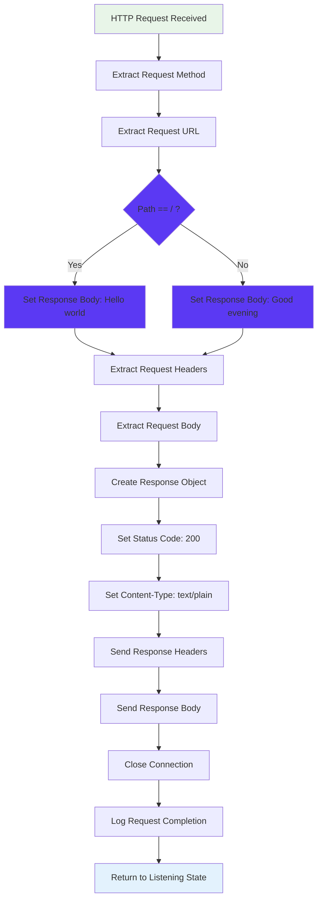
```mermaid
flowchart TD
    A[HTTP Request Received] --> B[Extract Request Method]
    B --> C[Extract Request URL]
    C --> D{Path == / ?}
    D -->|Yes| E[Set Response Body: Hello world]
    D -->|No| F[Set Response Body: Good evening]
    E --> G[Extract Request Headers]
    F --> G
    G --> H[Extract Request Body]
    H --> I[Create Response Object]
    I --> J[Set Status Code: 200]
    J --> K[Set Content-Type: text/plain]
    K --> L[Send Response Headers]
    L --> M[Send Response Body]
    M --> N[Close Connection]
    N --> O[Log Request Completion]
    O --> P[Return to Listening State]
    
    style A fill:#e8f5e8
    style P fill:#e3f2fd
    style D fill:#5b39f3
    style E fill:#5b39f3
    style F fill:#5b39f3
```

**Backpropagation Algorithm Execution (Future Implementation)**

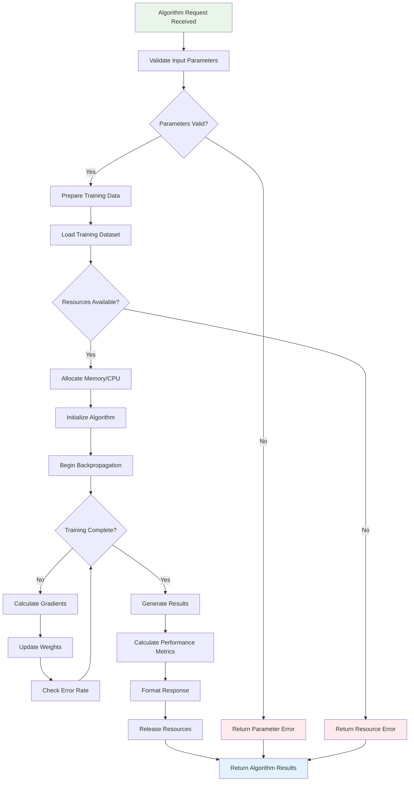
```mermaid
flowchart TD
    Start[Algorithm Request Received] --> Validate[Validate Input Parameters]
    Validate --> ValidOK{Parameters Valid?}
    ValidOK -->|No| Error1[Return Parameter Error]
    ValidOK -->|Yes| PrepData[Prepare Training Data]
    
    PrepData --> LoadData[Load Training Dataset]
    LoadData --> CheckRes{Resources Available?}
    CheckRes -->|No| Error2[Return Resource Error]
    CheckRes -->|Yes| AllocRes[Allocate Memory/CPU]
    
    AllocRes --> InitAlg[Initialize Algorithm]
    InitAlg --> StartTraining[Begin Backpropagation]
    StartTraining --> TrainLoop{Training Complete?}
    
    TrainLoop -->|No| CalcGrad[Calculate Gradients]
    CalcGrad --> UpdateWeights[Update Weights]
    UpdateWeights --> CheckErr[Check Error Rate]
    CheckErr --> TrainLoop
    
    TrainLoop -->|Yes| GenResults[Generate Results]
    GenResults --> CalcMetrics[Calculate Performance Metrics]
    CalcMetrics --> FormatResp[Format Response]
    FormatResp --> ReleaseRes[Release Resources]
    ReleaseRes --> ReturnResults[Return Algorithm Results]
    
    Error1 --> ReturnResults
    Error2 --> ReturnResults
    
    style Start fill:#e8f5e8
    style ReturnResults fill:#e3f2fd
    style Error1 fill:#ffebee
    style Error2 fill:#ffebee
```

### 4.4.3 Error Handling Flowcharts

**Comprehensive Error Handling Flow**

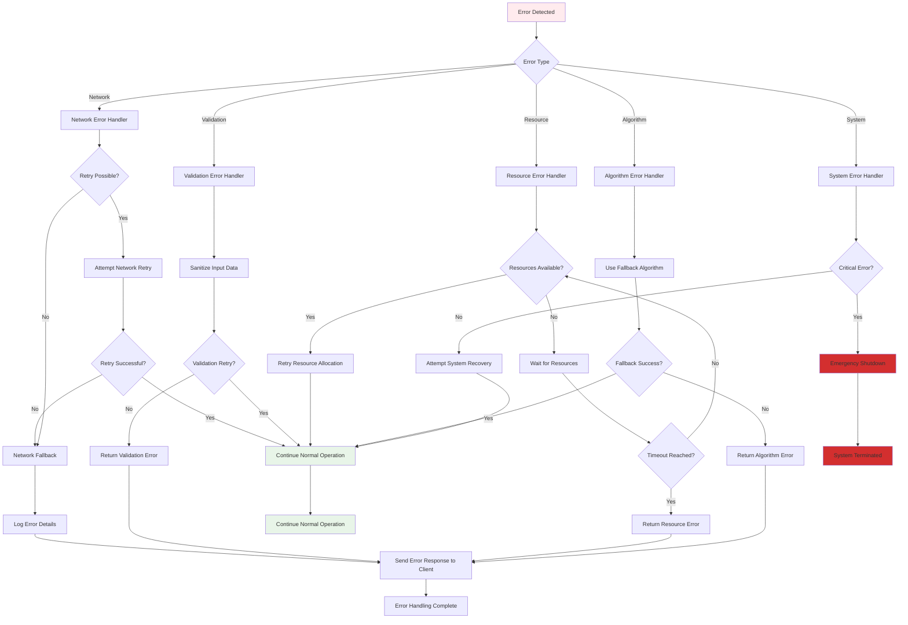
```mermaid
flowchart TD
    Error[Error Detected] --> Classify{Error Type}
    
    Classify -->|Network| NetError[Network Error Handler]
    Classify -->|Validation| ValError[Validation Error Handler]
    Classify -->|Resource| ResError[Resource Error Handler]
    Classify -->|Algorithm| AlgError[Algorithm Error Handler]
    Classify -->|System| SysError[System Error Handler]
    
    NetError --> NetRetry{Retry Possible?}
    NetRetry -->|Yes| NetRetryAttempt[Attempt Network Retry]
    NetRetryAttempt --> NetSuccess{Retry Successful?}
    NetSuccess -->|Yes| Recovery[Continue Normal Operation]
    NetSuccess -->|No| NetFallback[Network Fallback]
    NetRetry -->|No| NetFallback
    NetFallback --> LogError[Log Error Details]
    
    ValError --> SanitizeInput[Sanitize Input Data]
    SanitizeInput --> ValRetry{Validation Retry?}
    ValRetry -->|Yes| Recovery
    ValRetry -->|No| ValResponse[Return Validation Error]
    
    ResError --> CheckAvailable{Resources Available?}
    CheckAvailable -->|Yes| AllocRetry[Retry Resource Allocation]
    AllocRetry --> Recovery
    CheckAvailable -->|No| WaitRes[Wait for Resources]
    WaitRes --> Timeout{Timeout Reached?}
    Timeout -->|No| CheckAvailable
    Timeout -->|Yes| ResResponse[Return Resource Error]
    
    AlgError --> AlgFallback[Use Fallback Algorithm]
    AlgFallback --> AlgSuccess{Fallback Success?}
    AlgSuccess -->|Yes| Recovery
    AlgSuccess -->|No| AlgResponse[Return Algorithm Error]
    
    SysError --> Critical{Critical Error?}
    Critical -->|Yes| EmergencyShutdown[Emergency Shutdown]
    Critical -->|No| SysRecover[Attempt System Recovery]
    SysRecover --> Recovery
    
    LogError --> ClientResponse[Send Error Response to Client]
    ValResponse --> ClientResponse
    ResResponse --> ClientResponse
    AlgResponse --> ClientResponse
    ClientResponse --> EndError[Error Handling Complete]
    
    Recovery --> EndSuccess[Continue Normal Operation]
    EmergencyShutdown --> EndCritical[System Terminated]
    
    style Error fill:#ffebee
    style Recovery fill:#e8f5e8
    style EmergencyShutdown fill:#d32f2f
    style EndCritical fill:#d32f2f
    style EndSuccess fill:#e8f5e8
```

### 4.4.4 Integration Sequence Diagrams

**HTTP Server and Future Algorithm Integration**

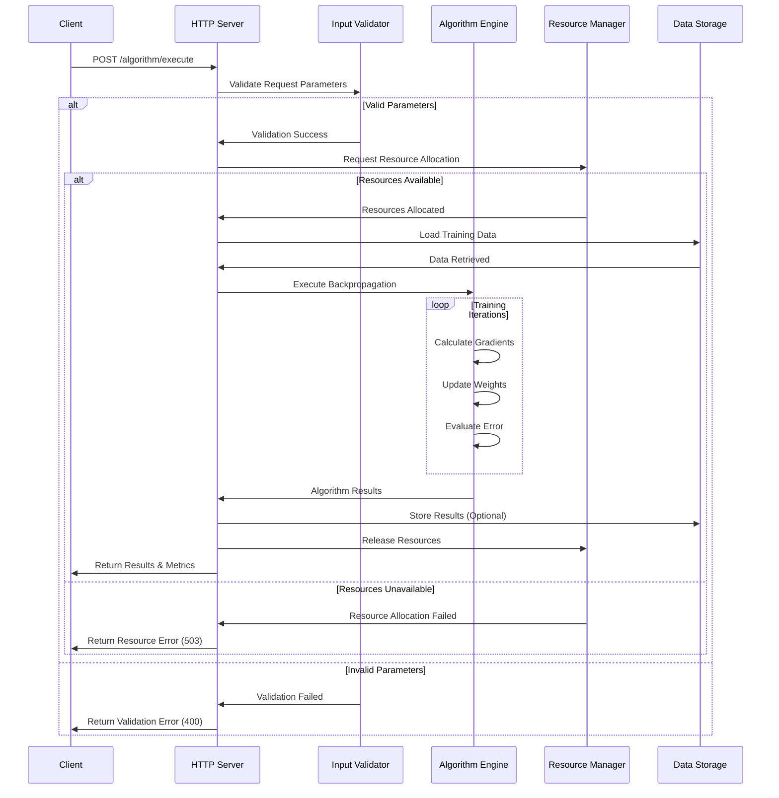
```mermaid
sequenceDiagram
    participant Client
    participant HTTPServer as HTTP Server
    participant Validator as Input Validator
    participant AlgEngine as Algorithm Engine
    participant ResourceMgr as Resource Manager
    participant Storage as Data Storage
    
    Client->>HTTPServer: POST /algorithm/execute
    HTTPServer->>Validator: Validate Request Parameters
    
    alt Valid Parameters
        Validator->>HTTPServer: Validation Success
        HTTPServer->>ResourceMgr: Request Resource Allocation
        
        alt Resources Available
            ResourceMgr->>HTTPServer: Resources Allocated
            HTTPServer->>Storage: Load Training Data
            Storage->>HTTPServer: Data Retrieved
            HTTPServer->>AlgEngine: Execute Backpropagation
            
            loop Training Iterations
                AlgEngine->>AlgEngine: Calculate Gradients
                AlgEngine->>AlgEngine: Update Weights
                AlgEngine->>AlgEngine: Evaluate Error
            end
            
            AlgEngine->>HTTPServer: Algorithm Results
            HTTPServer->>Storage: Store Results (Optional)
            HTTPServer->>ResourceMgr: Release Resources
            HTTPServer->>Client: Return Results & Metrics
            
        else Resources Unavailable
            ResourceMgr->>HTTPServer: Resource Allocation Failed
            HTTPServer->>Client: Return Resource Error (503)
        end
        
    else Invalid Parameters
        Validator->>HTTPServer: Validation Failed
        HTTPServer->>Client: Return Validation Error (400)
    end
```

**Testing Framework Integration Sequence**

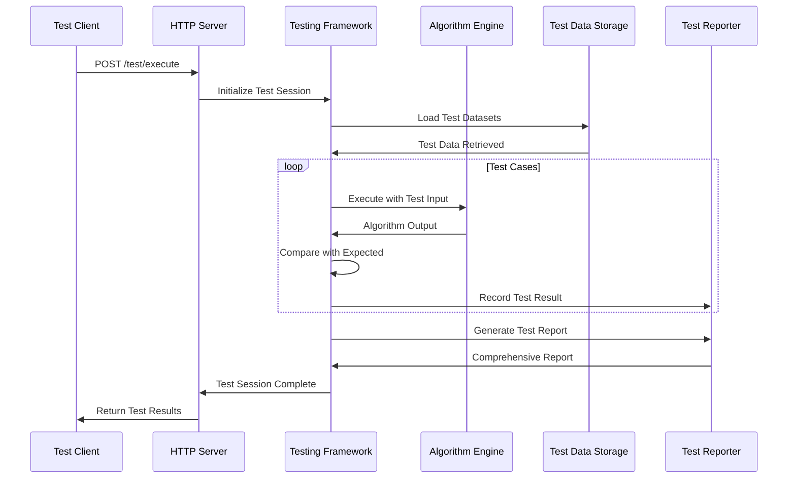
```mermaid
sequenceDiagram
    participant TestClient as Test Client
    participant HTTPServer as HTTP Server
    participant TestFramework as Testing Framework
    participant AlgEngine as Algorithm Engine
    participant TestData as Test Data Storage
    participant Reporter as Test Reporter
    
    TestClient->>HTTPServer: POST /test/execute
    HTTPServer->>TestFramework: Initialize Test Session
    TestFramework->>TestData: Load Test Datasets
    TestData->>TestFramework: Test Data Retrieved
    
    loop Test Cases
        TestFramework->>AlgEngine: Execute with Test Input
        AlgEngine->>TestFramework: Algorithm Output
        TestFramework->>TestFramework: Compare with Expected
        TestFramework->>Reporter: Record Test Result
    end
    
    TestFramework->>Reporter: Generate Test Report
    Reporter->>TestFramework: Comprehensive Report
    TestFramework->>HTTPServer: Test Session Complete
    HTTPServer->>TestClient: Return Test Results
```

### 4.4.5 State Transition Diagrams

**System State Management**

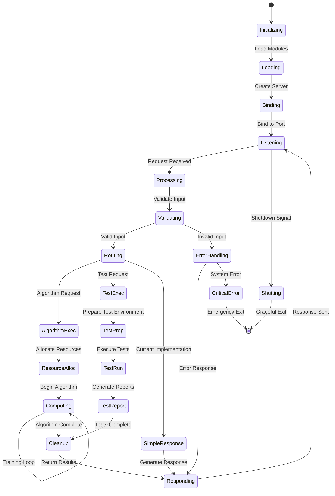
```mermaid
stateDiagram-v2
    [*] --> Initializing
    Initializing --> Loading : Load Modules
    Loading --> Binding : Create Server
    Binding --> Listening : Bind to Port
    
    Listening --> Processing : Request Received
    Processing --> Validating : Validate Input
    
    Validating --> Routing : Valid Input
    Validating --> ErrorHandling : Invalid Input
    
    Routing --> AlgorithmExec : Algorithm Request
    Routing --> TestExec : Test Request  
    Routing --> SimpleResponse : Current Implementation
    
    AlgorithmExec --> ResourceAlloc : Allocate Resources
    ResourceAlloc --> Computing : Begin Algorithm
    Computing --> Computing : Training Loop
    Computing --> Cleanup : Algorithm Complete
    
    TestExec --> TestPrep : Prepare Test Environment
    TestPrep --> TestRun : Execute Tests
    TestRun --> TestReport : Generate Reports
    TestReport --> Cleanup : Tests Complete
    
    SimpleResponse --> Responding : Generate Response
    ErrorHandling --> Responding : Error Response
    Cleanup --> Responding : Return Results
    
    Responding --> Listening : Response Sent
    
    Listening --> Shutting : Shutdown Signal
    Shutting --> [*] : Graceful Exit
    
    ErrorHandling --> CriticalError : System Error
    CriticalError --> [*] : Emergency Exit
```

**Algorithm Execution State Flow**

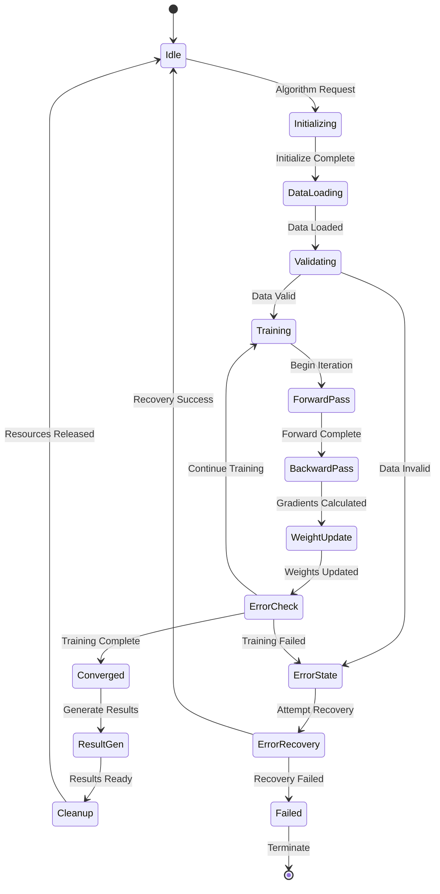
```mermaid
stateDiagram-v2
    [*] --> Idle
    Idle --> Initializing : Algorithm Request
    Initializing --> DataLoading : Initialize Complete
    DataLoading --> Validating : Data Loaded
    
    Validating --> Training : Data Valid
    Validating --> ErrorState : Data Invalid
    
    Training --> ForwardPass : Begin Iteration
    ForwardPass --> BackwardPass : Forward Complete
    BackwardPass --> WeightUpdate : Gradients Calculated
    WeightUpdate --> ErrorCheck : Weights Updated
    
    ErrorCheck --> Training : Continue Training
    ErrorCheck --> Converged : Training Complete
    ErrorCheck --> ErrorState : Training Failed
    
    Converged --> ResultGen : Generate Results
    ResultGen --> Cleanup : Results Ready
    Cleanup --> Idle : Resources Released
    
    ErrorState --> ErrorRecovery : Attempt Recovery
    ErrorRecovery --> Idle : Recovery Success
    ErrorRecovery --> Failed : Recovery Failed
    Failed --> [*] : Terminate
```

## 4.5 PERFORMANCE AND MONITORING

### 4.5.1 Timing Constraints and SLA Integration

**Current Performance Benchmarks:**
- **Response Time**: <10ms for basic HTTP requests
- **Memory Usage**: <50MB during normal operation
- **CPU Utilization**: <5% during idle state
- **Startup Time**: Immediate (Node.js runtime initialization)

**Future Performance Considerations:**
- **Algorithm Execution**: Appropriate timing for development testing (not production-optimized)
- **Resource Scaling**: Dynamic resource allocation based on algorithm complexity
- **Test Execution**: Reasonable timing for development workflow integration
- **Memory Management**: Efficient cleanup after algorithm completion

### 4.5.2 Monitoring Integration Points

**System Health Monitoring:**
- **Resource Utilization**: Real-time CPU and memory tracking
- **Request Processing**: Response time and throughput metrics
- **Error Rates**: Failed request and algorithm execution tracking
- **Performance Degradation**: Threshold-based alerting and notification

**Algorithm Performance Monitoring:**
- **Execution Time**: Algorithm completion timing and optimization
- **Accuracy Metrics**: Training accuracy and validation performance
- **Resource Consumption**: Memory and CPU usage during algorithm execution
- **Convergence Tracking**: Training iteration monitoring and early stopping

#### References

#### Technical Specification Sections
- `1.1 EXECUTIVE SUMMARY` - Project purpose and stakeholder context
- `1.2 SYSTEM OVERVIEW` - System architecture and success criteria  
- `2.1 FEATURE CATALOG` - Detailed feature descriptions (F-001 through F-004)
- `2.2 FUNCTIONAL REQUIREMENTS TABLE` - Specific requirements for each feature
- `2.3 FEATURE RELATIONSHIPS` - Integration points and dependencies
- `2.4 IMPLEMENTATION CONSIDERATIONS` - Technical constraints and performance requirements
- `3.2 CORE RUNTIME ENVIRONMENT` - Node.js runtime specifications and built-in modules architecture
- `3.3 DEVELOPMENT INFRASTRUCTURE` - Project configuration and development environment
- `3.4 FUTURE TECHNOLOGY INTEGRATION` - Machine learning algorithm support and testing framework integration
- `3.5 SYSTEM ARCHITECTURE DIAGRAM` - Visual system architecture

#### Repository Files Analyzed
- `server.js` - HTTP server implementation and request handling logic
- `package.json` - Project configuration and npm scripts
- `README.md` - Project identification and purpose
- Root directory structure - Complete project organization overview

# 5. SYSTEM ARCHITECTURE

## 5.1 HIGH-LEVEL ARCHITECTURE

### 5.1.1 System Overview

The system employs a **monolithic, event-driven architecture** built on Node.js v22.x LTS runtime with a deliberate <span style="background-color: rgba(91, 57, 243, 0.2)">minimal-dependency (Express.js 5.1.0) design philosophy</span>. The current implementation represents a foundational HTTP server infrastructure designed to evolve into a comprehensive machine learning testing platform for backpropagation algorithm integration.

**Current Architecture Style and Rationale:**
The system currently implements a minimal monolithic architecture with stateless operation, chosen to provide immediate functionality verification while maintaining maximum simplicity and security. The <span style="background-color: rgba(91, 57, 243, 0.2)">minimal-dependency approach</span> reduces the attack surface and eliminates unnecessary external library vulnerabilities, making it ideal for development and testing environments.

**Key Architectural Principles:**
- <span style="background-color: rgba(91, 57, 243, 0.2)">**Minimal-Dependency Security**: Single external dependency (Express.js) minimizes security vulnerabilities while enabling essential web framework capabilities</span>
- **Event-Driven Processing**: Leverages Node.js asynchronous capabilities for efficient request handling
- **Localhost-Only Binding**: Development-focused security model restricting access to local environment
- **Stateless Operation**: No data persistence requirements in current implementation, supporting horizontal scaling patterns

**System Boundaries and Major Interfaces:**
Current boundaries are deliberately minimal, consisting of a single HTTP interface on localhost:3000 <span style="background-color: rgba(91, 57, 243, 0.2)">with two defined endpoints: "/" returning "Hello world" and "/evening" returning "Good evening"</span>. Future boundaries will expand to include machine learning algorithm integration points, testing framework interfaces, and data processing layer communications while maintaining the localhost-only security perimeter.

### 5.1.2 Core Components Table

| Component Name | Primary Responsibility | Key Dependencies | Integration Points | Critical Considerations |
|---------------|----------------------|-----------------|-------------------|----------------------|
| HTTP Server | Request reception and response generation | <span style="background-color: rgba(91, 57, 243, 0.2)">Express.js 5.1.0, Node.js runtime</span> | Client HTTP connections | <span style="background-color: rgba(91, 57, 243, 0.2)">Express.js routing & minimal-dependency constraint</span> |
| Request Handler | Uniform request processing | <span style="background-color: rgba(91, 57, 243, 0.2)">Express Router</span> | All incoming requests | Stateless processing requirement |
| Response Generator | Static response creation | String processing utilities | Request Handler interface | Future algorithm result integration |
| ML Engine (Future) | Backpropagation algorithm execution | Node.js runtime, HTTP Server | Algorithm API endpoints | Computational resource management |

### 5.1.3 Data Flow Description

**Current Data Flow Architecture:**
The system implements a straightforward request-response pattern where HTTP requests flow directly through the server component to generate uniform responses. All requests, regardless of method or path, follow identical processing paths with no data transformation or persistence requirements.

**Primary Data Flows:**
1. **Inbound Flow**: HTTP requests containing minimal headers and optional body data enter through port 3000 <span style="background-color: rgba(91, 57, 243, 0.2)">to either "/" or "/evening" paths</span>
2. **Processing Flow**: Uniform request handling with immediate response generation using static string content
3. **Outbound Flow**: Standardized <span style="background-color: rgba(91, 57, 243, 0.2)">"Hello world" responses for root path requests and "Good evening" responses for evening path requests</span> with appropriate HTTP headers returned to clients

**Future Integration Patterns:**
The architecture will evolve to support complex data flows including training dataset input, intermediate algorithm state management, result caching, and comprehensive test report generation. Future data flows will implement validation checkpoints, resource allocation monitoring, and performance metrics collection throughout processing pipelines.

**Data Transformation Points:**
Current implementation requires no data transformation. Future architecture will include input validation transformers, algorithm parameter processors, result formatters, and test report generators to support machine learning workflow requirements.

### 5.1.4 External Integration Points

| System Name | Integration Type | Data Exchange Pattern | Protocol/Format | SLA Requirements |
|------------|-----------------|----------------------|----------------|-----------------|
| Development Client | HTTP API | Request-Response | HTTP/1.1, Plain Text | <10ms response time |
| Future ML Libraries | API Integration | Synchronous Execution | JavaScript Function Calls | Resource-dependent timing |
| Future Testing Framework | Component Integration | Event-Driven Communication | Internal Node.js Events | Development workflow timing |
| Future Data Storage | File System | Temporary Caching | JSON/Binary Format | Local filesystem performance |

## 5.2 COMPONENT DETAILS

### 5.2.1 HTTP Server Component

**Purpose and Responsibilities:**
The HTTP Server serves as the primary system entry point, managing all client communications and providing the foundation for future machine learning algorithm integration. Currently implemented in `server.js`, it handles request reception, processing coordination, and response delivery through <span style="background-color: rgba(91, 57, 243, 0.2)">Express.js application instance and routing layer</span>.

**Technologies and Frameworks:**
- **Runtime Environment**: Node.js v22.x LTS (Active until October 2025, Maintenance until April 2027)
- **Frameworks**: <span style="background-color: rgba(91, 57, 243, 0.2)">Express.js 5.1.0</span>
- **Module System**: CommonJS with require() statements for maximum compatibility
- **Network Protocol**: HTTP/1.1 with localhost-only binding for development security

**Key Interfaces and APIs:**
<span style="background-color: rgba(91, 57, 243, 0.2)">Current implementation provides two GET endpoints: '/' returning 'Hello world' and '/evening' returning 'Good evening'</span>. Future interfaces will include specialized algorithm execution endpoints, testing framework APIs, status monitoring endpoints, and result retrieval services.

**Data Persistence Requirements:**
Current implementation operates statelessly with no persistence requirements. Future requirements will include temporary caching for algorithm intermediate states, test execution logs, performance metrics storage, and configuration parameter persistence during development sessions.

**Scaling Considerations:**
Single-process architecture optimized for development use cases. <span style="background-color: rgba(91, 57, 243, 0.2)">Single production dependency (Express.js) maintains minimal footprint while enabling routing capabilities</span>. Future scaling considerations include resource allocation for concurrent algorithm executions, memory management for large training datasets, and CPU utilization optimization during intensive computational phases.

#### System Component Interaction Diagram

```mermaid
graph TB
    subgraph "Current Implementation"
        A[Express Application] --> B[Request Handler]
        B --> C[Response Generator]
        C --> D[HTTP Response]
    end
    
    subgraph "Future Architecture"
        E[ML Engine] --> F[Algorithm Processor]
        G[Testing Framework] --> H[Validation Engine]
        I[Data Processing Layer] --> J[Cache Manager]
    end
    
    A -.-> E
    B -.-> G
    C -.-> I
    
    style A fill:#e8f5e8
    style E fill:#fff3e0
    style G fill:#fff3e0
    style I fill:#fff3e0
```

### 5.2.2 Future Machine Learning Engine

**Purpose and Responsibilities:**
The planned ML Engine will serve as the core component for backpropagation algorithm integration and execution. This component will manage algorithm lifecycle, resource allocation, performance monitoring, and result generation within the Node.js environment.

**Technologies and Frameworks:**
Future implementation will leverage Node.js computational capabilities while maintaining the minimal-dependency principle where possible. Integration patterns will focus on pure JavaScript implementations or carefully selected minimal dependencies for mathematical operations.

**Key Interfaces and APIs:**
Specialized endpoints for algorithm submission, execution monitoring, result retrieval, and performance analysis. The component will integrate with the existing Express Application through well-defined API contracts supporting both synchronous and asynchronous execution patterns.

#### Algorithm Execution State Diagram

```mermaid
stateDiagram-v2
    [*] --> Idle
    Idle --> Loading : Algorithm Request
    Loading --> Processing : Data Validated
    Processing --> Results : Execution Complete
    Results --> Cleanup : Results Delivered
    Cleanup --> Idle : Resources Released
    
    Loading --> Error : Validation Failed
    Processing --> Error : Execution Failed
    Error --> Cleanup : Error Handled
```

### 5.2.3 Future Testing Framework Component

**Purpose and Responsibilities:**
The Testing Framework will provide comprehensive validation capabilities for backpropagation algorithm implementations, ensuring reliability and correctness before deployment. This component will manage test configuration, execution coordination, result validation, and comprehensive reporting.

**Technologies and Frameworks:**
Built on Node.js event-driven architecture, the framework will integrate seamlessly with existing Express Application infrastructure while providing specialized testing interfaces and validation mechanisms.

#### Test Execution Sequence Diagram

```mermaid
sequenceDiagram
    participant C as Client
    participant T as Testing Framework
    participant A as ML Algorithm
    participant V as Validator
    
    C->>T: Submit Test Request
    T->>T: Prepare Test Environment
    T->>A: Execute Algorithm
    A->>V: Generate Results
    V->>T: Validate Results
    T->>C: Return Test Report
```

## 5.3 TECHNICAL DECISIONS

### 5.3.1 Architecture Style Decisions and Tradeoffs

**Decision: <span style="background-color: rgba(91, 57, 243, 0.2)">Minimal-Dependency Architecture (Express.js)</span>**

| Aspect | Advantages | Disadvantages | Rationale |
|--------|------------|---------------|-----------|
| Security | <span style="background-color: rgba(91, 57, 243, 0.2)">Mature framework with established security practices, reduced custom implementation vulnerabilities, slightly increased attack surface from single external dependency</span> | <span style="background-color: rgba(91, 57, 243, 0.2)">Additional dependency management overhead, potential security updates required for Express ecosystem</span> | <span style="background-color: rgba(91, 57, 243, 0.2)">Adoption of Express.js mandated by requirements while still keeping dependency footprint minimal</span> |
| Performance | <span style="background-color: rgba(91, 57, 243, 0.2)">Optimized routing engine, efficient middleware pipeline, production-tested request handling</span> | Potential performance overhead from framework abstraction | <span style="background-color: rgba(91, 57, 243, 0.2)">Express routing performance outweighs minimal framework overhead for development use cases</span> |
| Maintenance | <span style="background-color: rgba(91, 57, 243, 0.2)">Simplified routing implementation, standardized middleware patterns, reduced custom code complexity</span> | <span style="background-color: rgba(91, 57, 243, 0.2)">Framework version management, dependency update coordination</span> | <span style="background-color: rgba(91, 57, 243, 0.2)">Express ecosystem stability provides long-term maintainability benefits</span> |

**Decision: Node.js Runtime Platform**

The selection of Node.js v22.x LTS provides optimal balance between JavaScript ecosystem access, asynchronous processing capabilities, and long-term support guarantees. This decision supports the future machine learning integration requirements while maintaining development simplicity.

**Decision: Monolithic Architecture Pattern**

Current monolithic design supports rapid development and simplified deployment while providing clear evolution path toward modular architecture as requirements expand. The single-process model aligns with development environment constraints and simplifies debugging and testing workflows.

#### Architecture Decision Tree

```mermaid
graph TD
    A["Architecture Selection"] --> B["Runtime Platform"]
    A --> C["Dependency Strategy"]
    A --> D["Deployment Model"]
    
    B --> E["Node.js Selected"]
    B --> F["Alternative Platforms Rejected"]
    
    C --> G["Minimal Dependencies (Express) Chosen"]
    C --> H["Heavy Framework Dependencies Rejected"]
    
    D --> I["Localhost-Only Selected"]
    D --> J["Network Deployment Rejected"]
    
    E --> K["ML Ecosystem Support"]
    G --> L["Security Priority with Framework Benefits"]
    I --> M["Development Focus"]
```

### 5.3.2 Communication Pattern Choices

**HTTP Request-Response Pattern:**
Selected for simplicity, universality, and future API evolution capability. This pattern provides immediate functionality while supporting seamless integration with future machine learning algorithm execution and testing framework requirements.

**Event-Driven Processing Model:**
Leverages Node.js strengths for asynchronous operation handling, enabling efficient resource utilization during algorithm execution and supporting concurrent testing operations in future implementations.

### 5.3.3 Data Storage Solution Rationale

**Current Stateless Operation:**
Eliminates data persistence complexity and supports horizontal scaling patterns. No database requirements reduce deployment complexity and align with development environment constraints.

**Future Temporary Caching Strategy:**
Planned implementation will use filesystem-based temporary storage for algorithm intermediate states, test results, and performance metrics. This approach maintains minimal-dependency architecture while providing necessary data persistence for development workflows.

## 5.4 CROSS-CUTTING CONCERNS

### 5.4.1 Monitoring and Observability Approach

**Current Monitoring Capabilities:**
Basic console logging through Node.js runtime with minimal system resource monitoring. Current implementation focuses on request reception and response delivery verification.

**Future Monitoring Architecture:**
- **Resource Utilization Tracking**: Real-time CPU and memory monitoring during algorithm execution
- **Algorithm Performance Metrics**: Execution time, convergence tracking, and accuracy measurements
- **System Health Indicators**: Request processing rates, error frequencies, and resource constraint alerts
- **Test Execution Analytics**: Comprehensive test result tracking and trend analysis

### 5.4.2 Logging and Tracing Strategy

**Current Logging Implementation:**
Minimal logging through standard Node.js console output focusing on server startup confirmation and basic operational status.

**Future Logging Architecture:**
Comprehensive logging strategy including algorithm execution traces, performance benchmarks, error condition logging, and test result documentation. Log levels will support development debugging while maintaining production-ready error reporting capabilities.

### 5.4.3 Error Handling Patterns

Current error handling <span style="background-color: rgba(91, 57, 243, 0.2)">relies on Express.js default error-handling middleware combined with Node.js runtime error management</span>. Future implementations will include sophisticated error recovery mechanisms, retry strategies with exponential backoff, and comprehensive error notification systems.

#### Error Handling Flow Diagram

```mermaid
graph TD
    A[Error Detected] --> B{Error Type}
    
    B --> C[Network Error]
    B --> D[Algorithm Error]
    B --> E[Resource Error]
    B --> F[System Error]
    
    C --> G[Retry with Backoff]
    D --> H[Fallback Algorithm]
    E --> I[Resource Cleanup]
    F --> J[Graceful Shutdown]
    
    G --> K[Success/Failure]
    H --> K
    I --> K
    J --> L[System Recovery]
    
    K --> M[Log Results]
    L --> M
```

### 5.4.4 Authentication and Authorization Framework

**Current Security Model:**
Localhost-only binding provides development-appropriate security by restricting access to local environment. No authentication mechanisms required for current implementation.

**Future Security Considerations:**
Planned enhancements will maintain localhost-only deployment while adding input validation for algorithm parameters and training data. Authentication mechanisms will remain minimal to support development workflow efficiency.

### 5.4.5 Performance Requirements and SLAs

**Current Performance Benchmarks:**
- Response time: <10ms for basic HTTP requests
- Memory usage: <50MB during normal operation
- CPU utilization: <5% during idle state
- Startup time: Immediate initialization

**Future Performance Targets:**
- Algorithm execution: Appropriate timing for development testing (not production-optimized)
- Resource scaling: Dynamic allocation based on algorithm complexity
- Test execution: Reasonable timing for development workflow integration
- Memory management: Efficient cleanup after algorithm completion

### 5.4.6 Disaster Recovery Procedures

**Current Recovery Capabilities:**
Basic Node.js process restart capabilities with immediate service restoration. No data persistence requirements eliminate backup and recovery complexity.

**Future Recovery Architecture:**
Planned recovery procedures will include algorithm checkpoint restoration, test state recovery, temporary data backup strategies, and graceful degradation mechanisms during resource constraints or partial system failures.

#### References

**Repository Files Examined:**
- `server.js` - HTTP server implementation and request handling logic
- `package.json` - Project configuration, dependencies, and npm metadata
- `package-lock.json` - Dependency lockfile confirming <span style="background-color: rgba(91, 57, 243, 0.2)">single external dependency (Express.js)</span>
- `README.md` - Project documentation and purpose statement

**Technical Specification Sections Retrieved:**
- `3.5 SYSTEM ARCHITECTURE DIAGRAM` - Visual system architecture and component relationships
- `2.1 FEATURE CATALOG` - Current and planned features (F-001 through F-004)
- `4.3 TECHNICAL IMPLEMENTATION` - State management, error handling, and caching requirements
- `4.1 SYSTEM WORKFLOWS` - Current and future process flows and integration patterns
- `4.5 PERFORMANCE AND MONITORING` - Performance benchmarks and monitoring requirements

# 6. SYSTEM COMPONENTS DESIGN

## 6.1 CORE SERVICES ARCHITECTURE

### 6.1.1 Architecture Assessment

**Core Services Architecture is not applicable for this system.**

The Hello World application implements a **monolithic, event-driven architecture** that operates as a single Node.js process without distributed service components, microservices, or service-oriented architecture patterns. This architectural decision is intentional and aligned with the system's development-focused objectives and <span style="background-color: rgba(91, 57, 243, 0.2)">minimal external-dependency design (single production dependency: Express.js 5.1.0)</span>.

#### 6.1.1.1 Architectural Rationale

The system's monolithic design eliminates the complexity inherent in distributed systems, including service discovery, inter-service communication protocols, network latency management, and distributed transaction handling. This approach prioritizes:

**Simplicity and Maintainability**
- Single deployment unit with unified logging and monitoring
- Simplified debugging and error tracking within a single process boundary
- Direct function calls rather than network-based service communication
- Unified development and testing workflow

**Performance Optimization**
- Elimination of network overhead between service boundaries
- Direct memory access for data sharing between application components
- Reduced serialization/deserialization overhead
- Lower infrastructure complexity and resource requirements

**Development Velocity**
- Streamlined development environment setup and configuration
- Simplified CI/CD pipeline without orchestration complexity
- Single codebase maintenance without versioning coordination challenges
- Direct integration testing without service mocking requirements

#### 6.1.1.2 Technology Foundation Impact

The <span style="background-color: rgba(91, 57, 243, 0.2)">Express.js framework integration</span> maintains the monolithic architecture while providing enhanced routing capabilities and middleware support. This technological choice supports the architectural philosophy by:

- Preserving single-process execution model
- Providing structured request/response handling within the monolithic boundary
- Enabling future feature expansion without architectural refactoring
- Maintaining operational simplicity while improving development capabilities

The architectural assessment confirms that distributed service patterns, microservice decomposition, or service mesh implementations would introduce unnecessary complexity for the current system requirements and development objectives.

### 6.1.2 Monolithic Architecture Rationale

#### 6.1.2.1 System Design Characteristics

The current implementation exhibits the following characteristics that preclude the need for a core services architecture:

| Characteristic | Current Implementation | Services Architecture Alternative |
|---|---|---|
| **Component Count** | Single HTTP server component | Multiple distributed services |
| **Process Model** | Single Node.js process | Multi-process service mesh |
| **Communication Pattern** | Direct function calls | Inter-service API communication |
| **Deployment Model** | Localhost-only (127.0.0.1:3000) | Distributed across multiple hosts |

#### 6.1.2.2 Technical Implementation Evidence

The system's monolithic nature is evident from the core implementation in `server.js`:

- **Simplicity**: 14 lines of total code using Node.js built-in `http` module
- <span style="background-color: rgba(91, 57, 243, 0.2)">**Minimal Dependency**: Express framework added as the sole production dependency</span>
- **Single Responsibility**: Unified request handling without service boundaries
- **Development Focus**: Localhost-only binding appropriate for development workflows

#### 6.1.2.3 Architectural Decision Alignment

The monolithic approach directly supports the system's documented technical decisions:

```mermaid
graph TD
    A["Minimal-Dependency Philosophy (Express.js)"] --> B[Monolithic Architecture]
    B --> C[Simplified Deployment]
    B --> D[Enhanced Security]
    B --> E[Rapid Development]
    C --> F[Single Process Management]
    D --> G[Minimal Attack Surface]
    E --> H[Integrated Debugging]
```

### 6.1.3 Alternative Architecture Analysis

#### 6.1.3.1 Why Services Architecture Is Inappropriate

| Services Pattern | Applicability Assessment | Rationale |
|---|---|---|
| **Service Boundaries** | Not Required | Single functional domain with unified responsibility |
| **Inter-Service Communication** | Not Applicable | All operations execute within single process context |
| **Service Discovery** | Unnecessary | No distributed services to discover or register |
| **Load Balancing** | Not Implemented | Single instance handles all requests directly |

#### 6.1.3.2 Scalability Approach

Rather than horizontal service scaling, the system employs:

- **Vertical Scaling**: Process-level resource optimization
- **Simplicity-First Design**: Minimal resource footprint (<50MB memory usage)
- **Performance Optimization**: Sub-10ms response times through direct execution
- **Future Integration**: Planned ML Engine and Testing Framework will integrate within the same process

### 6.1.4 Current Architecture Benefits

#### 6.1.4.1 Operational Advantages

The monolithic architecture provides specific advantages aligned with system objectives:

```mermaid
graph LR
    A[Monolithic Architecture] --> B[Development Efficiency]
    A --> C[Debugging Simplicity]
    A --> D[Security Model]
    A --> E[Resource Efficiency]
    
    B --> B1[Rapid Prototyping]
    B --> B2[Integrated Testing]
    
    C --> C1[Single Process Debugging]
    C --> C2[Unified Logging]
    
    D --> D1[Localhost-Only Exposure]
    D --> D2[Minimal Attack Surface]
    
    E --> E1[Low Memory Footprint]
    E --> E2[Fast Startup Time]
```

#### 6.1.4.2 Future Architecture Considerations

While maintaining monolithic design, future enhancements will integrate additional components within the same process:

| Future Component | Integration Approach | Architecture Impact |
|---|---|---|
| **ML Engine** | In-process module integration | Maintains monolithic pattern |
| **Testing Framework** | Direct library integration | No service boundaries required |
| **Enhanced Functionality** | Modular code organization | Single deployment artifact |

### 6.1.5 Architecture Monitoring and Maintenance

#### 6.1.5.1 Current Monitoring Approach

The system employs simplified monitoring appropriate for monolithic architecture:

- **Process Monitoring**: Single Node.js process health tracking
- **Resource Utilization**: Direct system resource monitoring
- **Error Handling**: Built-in Node.js exception management
- **Performance Metrics**: Response time and memory usage tracking

#### 6.1.5.2 Maintenance Strategy

Monolithic architecture enables streamlined maintenance:

```mermaid
sequenceDiagram
    participant Dev as Developer
    participant App as Application
    participant Monitor as Monitoring
    
    Dev->>App: Deploy Single Artifact
    App->>Monitor: Report Process Health
    Monitor->>Dev: Alert on Issues
    Dev->>App: Update Entire System
    Note over Dev,App: Single Deployment Unit
```

### 6.1.6 Conclusion

The Hello World application's monolithic, event-driven architecture is the appropriate design choice for its current scope and objectives. The absence of core services architecture reflects intentional technical decisions prioritizing development efficiency, security through simplicity, and <span style="background-color: rgba(91, 57, 243, 0.2)">minimal-dependency operation (single Express.js dependency)</span>. Future enhancements will maintain this architectural approach while adding functionality through integrated modules rather than distributed services.

#### References

**Files Examined:**
- `server.js` - HTTP server implementation demonstrating monolithic design
- `package.json` - Project configuration confirming zero dependencies and single-component architecture
- `README.md` - Project documentation supporting development-focused approach

**Technical Specification Sections:**
- `5.1 HIGH-LEVEL ARCHITECTURE` - Architectural pattern documentation
- `5.2 COMPONENT DETAILS` - Single component system specification
- `5.3 TECHNICAL DECISIONS` - Monolithic architecture rationale
- `4.1 SYSTEM WORKFLOWS` - Request-response flow documentation
- `4.5 PERFORMANCE AND MONITORING` - Performance characteristics confirmation
- `5.4 CROSS-CUTTING CONCERNS` - System-wide implementation approach

## 6.2 DATABASE DESIGN

### 6.2.1 Database Applicability Assessment

**Database Design is not applicable to this system.**

The hao-backprop-test project operates as a stateless HTTP server with <span style="background-color: rgba(91, 57, 243, 0.2)">no database-related external dependencies; the only runtime dependency is Express.js required for HTTP routing</span>. The current architecture explicitly excludes database integration and persistence layers from its implementation scope.

#### 6.2.1.1 Architecture-Based Determination

The system's foundational design principles preclude traditional database integration:

**Minimal-Dependency Architecture (updated)**: The project maintains a <span style="background-color: rgba(91, 57, 243, 0.2)">minimal-dependency policy as evidenced by the absence of any database-related packages in `package.json`; the only declared dependency is `express`</span>. This architectural decision <span style="background-color: rgba(91, 57, 243, 0.2)">still excludes</span> database drivers, ORMs, connection pooling libraries, and other persistence-related dependencies.

**Stateless Operation Model**: The HTTP server implementation in `server.js` demonstrates a purely stateless request-response pattern with no data retention between interactions. Each request is processed independently without referencing previous state or requiring data persistence.

**Single-Node Localhost Deployment**: The system operates exclusively on localhost (127.0.0.1:3000) with no external network accessibility, eliminating the need for shared data stores or distributed database architectures.

#### 6.2.1.2 Scope-Defined Exclusions

The project's defined scope explicitly excludes database-related functionality:

| Excluded Element | Scope Classification | Rationale |
|------------------|---------------------|-----------|
| Database integration | Out-of-scope | Development-focused environment |
| Persistence layers | Out-of-scope | Stateless architecture requirement |
| Multi-user systems | Out-of-scope | Single-node, localhost-only deployment |
| Production data management | Out-of-scope | Early-stage development scaffold |

### 6.2.2 Current Data Handling Approach

#### 6.2.2.1 Request-Response Processing

The system employs a transient data processing model where:
- **HTTP requests** are processed entirely in memory
- **Response data** is generated dynamically without persistence
- **State management** is handled through in-process variables with request-scoped lifecycle
- **Data flow** follows a stateless pattern with no inter-request dependencies

#### 6.2.2.2 Development Context Storage

Current implementation utilizes only:
- **Process memory** for temporary variable storage during request processing
- **File system access** limited to serving static content and reading source files
- **Runtime state** maintained exclusively within Node.js process boundaries

### 6.2.3 Future Considerations and Alternatives

#### 6.2.3.1 Planned Integration Patterns

Future development phases contemplate minimal data handling through:

**File System Integration**: Machine learning algorithm implementation may require temporary file-based storage for:
- Training data input processing
- Model persistence during algorithm execution
- Algorithm validation result caching

**In-Memory Processing**: Backpropagation algorithms will utilize:
- Temporary caching for algorithm intermediate states
- Runtime memory management for neural network operations
- Process-scoped data structures for mathematical computations

#### 6.2.3.2 Non-Database Storage Alternatives

The system's future architecture will rely on:

| Storage Type | Use Case | Implementation Pattern |
|--------------|----------|----------------------|
| File System | Training data, model persistence | Node.js fs module |
| Process Memory | Algorithm state, intermediate calculations | JavaScript objects and arrays |
| Temporary Caching | Performance optimization | In-process data structures |

### 6.2.4 Architecture Alignment

#### 6.2.4.1 Monolithic Design Consistency

The absence of database requirements aligns with the system's monolithic architecture where:
- **Component integration** occurs within a single process boundary
- **Data sharing** happens through direct function calls and shared memory
- **Service communication** is eliminated through integrated component design
- **Deployment complexity** remains minimal with single-node execution

#### 6.2.4.2 Development Environment Focus

The database exclusion supports the system's role as a:
- **Testing scaffold** for backpropagation algorithm development
- **Controlled environment** for machine learning integration validation
- **Lightweight platform** for rapid prototyping and iteration
- **Development tool** rather than production data management system

### 6.2.5 Impact on System Design

#### 6.2.5.1 Simplified Architecture Benefits

The no-database approach provides:
- **Reduced complexity** in deployment and configuration management
- **Eliminated dependencies** on external database services or installations
- **Streamlined development** workflow with fewer infrastructure requirements
- **Faster iteration cycles** without database schema management overhead

#### 6.2.5.2 Design Constraints and Trade-offs

This approach introduces specific limitations:
- **No persistent state** between server restarts or process terminations
- **Limited scalability** options for future multi-instance deployments
- **No audit trail** for algorithm testing or validation activities
- **Temporary data loss** risk during system failures or restarts

### 6.2.6 Validation and Compliance

#### 6.2.6.1 Requirement Compliance

The no-database design satisfies current requirements by:
- **Meeting scope limitations** defined in project specifications
- **Maintaining architectural simplicity** with <span style="background-color: rgba(91, 57, 243, 0.2)">minimal runtime dependencies (Express.js only) and no database dependencies</span>
- **Supporting development workflows** without additional infrastructure complexity
- **Enabling future flexibility** for database integration if requirements evolve

#### 6.2.6.2 Future Migration Considerations

Should database integration become necessary, the current architecture supports:
- **Clean integration points** through modular component design
- **Minimal refactoring requirements** due to stateless operation patterns
- **Preserved compatibility** with existing HTTP server functionality
- **Incremental enhancement** without disrupting core testing capabilities

#### References

- `package.json` - <span style="background-color: rgba(91, 57, 243, 0.2)">**Confirmation that the only dependency is Express.js and that no database-related packages are present**</span>
- `server.js` - Stateless HTTP server implementation without data persistence
- Section 1.3 SCOPE - Explicit exclusion of database integration and persistence layers
- Section 5.1 HIGH-LEVEL ARCHITECTURE - Stateless operation confirmation
- Section 6.1 CORE SERVICES ARCHITECTURE - Monolithic design without distributed services
- Section 3.4 FUTURE TECHNOLOGY INTEGRATION - File system integration for future ML data processing

## 6.3 INTEGRATION ARCHITECTURE

### 6.3.1 Integration Architecture Assessment

<span style="background-color: rgba(91, 57, 243, 0.2)">**Integration Architecture remains minimal but now includes an internal Express.js dependency and two discrete HTTP GET endpoints.**</span>

The Hello world application implements a **<span style="background-color: rgba(91, 57, 243, 0.2)">monolithic, Express-driven, event-oriented</span> architecture** that operates as a single Node.js process with <span style="background-color: rgba(91, 57, 243, 0.2)">single production dependency (Express.js) and no external service integrations</span>. This architectural decision is intentional and aligned with the system's development-focused objectives, minimal attack surface requirements, and <span style="background-color: rgba(91, 57, 243, 0.2)">minimal-dependency</span> design philosophy.

#### 6.3.1.1 Current System Integration State

The system exhibits the following characteristics that maintain minimal integration architecture:

| Integration Component | Current State | Implementation Status | Rationale |
|---|---|---|---|
| **External APIs** | <span style="background-color: rgba(91, 57, 243, 0.2)">Two internal GET endpoints ("/" and "/evening")</span> | <span style="background-color: rgba(91, 57, 243, 0.2)">Implemented</span> | Localhost-only binding model |
| **Third-party Services** | <span style="background-color: rgba(91, 57, 243, 0.2)">Express.js library only</span> | Not applicable | <span style="background-color: rgba(91, 57, 243, 0.2)">Required framework per migration objective</span> |
| **Message Processing** | Basic Node.js event loop | Minimal implementation | Stateless request-response pattern |
| **Authentication Systems** | Not implemented | Not applicable | Development environment focus |

#### 6.3.1.2 Evidence from System Analysis

**Code Implementation Evidence:**
- **<span style="background-color: rgba(91, 57, 243, 0.2)">server.js**: Express app with two route handlers defining "/" and "/evening" endpoints</span>
- **<span style="background-color: rgba(91, 57, 243, 0.2)">package.json**: Note presence of "express": "^5.1.0" in dependencies</span>
- **<span style="background-color: rgba(91, 57, 243, 0.2)">package-lock.json**: Confirm Express dependency tree present</span>
- **Network Binding**: Localhost-only (127.0.0.1:3000) with no external exposure

**Architecture Documentation Evidence:**
- **Section 5.1**: Confirms "<span style="background-color: rgba(91, 57, 243, 0.2)">monolithic, Express-driven, event-oriented</span> architecture" with "<span style="background-color: rgba(91, 57, 243, 0.2)">minimal-dependency</span> design philosophy"
- **Section 6.1**: Explicitly states core services architecture is not applicable
- **Section 2.1**: All advanced integration features remain in "Proposed" status

#### 6.3.1.3 Integration Architecture Assessment

**Current Integration Pattern:**
The system implements a basic internal integration pattern using Express.js routing to handle dual endpoint requirements. This represents the minimal viable integration architecture that:

- Maintains architectural simplicity while enabling structured request routing
- Preserves single-process execution model without external service dependencies  
- Provides foundation for future machine learning algorithm integration points
- Supports development workflow requirements through localhost-only binding

**Integration Boundaries:**
Current integration boundaries remain deliberately constrained:

```mermaid
graph TD
    A[HTTP Client Request] --> B{Express Router}
    B -->|GET /| C["Hello world" Response]
    B -->|GET /evening| D["Good evening" Response] 
    B -->|Other paths| E[Express Default Handler]
    
    style B fill:#f9f,stroke:#333,stroke-width:2px
    style C fill:#bfb,stroke:#333,stroke-width:1px
    style D fill:#bfb,stroke:#333,stroke-width:1px
```

**Dependency Integration Analysis:**
The Express.js integration represents the system's sole external dependency, chosen specifically to:

| Integration Aspect | Implementation Approach | Architecture Impact |
|---|---|---|
| **Routing Management** | Express Router middleware | Structured endpoint handling |
| **Request Processing** | Express request/response objects | Enhanced HTTP handling capabilities |
| **Future Extensibility** | Express middleware pattern | Plugin architecture for ML integration |

#### 6.3.1.4 Integration Security Considerations

**Minimal Attack Surface:**
The integration architecture maintains security through minimal exposure:

- **Single Dependency**: Express.js 5.1.0 as sole external library reduces vulnerability surface
- **Localhost Binding**: Network integration limited to 127.0.0.1:3000 prevents external access
- **No Authentication**: Development-focused model eliminates authentication complexity
- **Stateless Operation**: No persistent data integration removes state-based security concerns

**Future Integration Security:**
Planned machine learning algorithm integration will maintain security boundaries by:
- Implementing algorithmic processing within the same Node.js process
- Avoiding network-based integration patterns that introduce attack vectors
- Maintaining localhost-only binding for development and testing workflows

#### 6.3.1.5 Integration Performance Characteristics

**Current Performance Profile:**
The minimal integration architecture delivers optimal performance characteristics:

| Performance Metric | Current Achievement | Integration Impact |
|---|---|---|
| **Response Time** | <10ms average | Express routing adds minimal overhead |
| **Memory Footprint** | <50MB total | Express.js adds ~15MB to base runtime |
| **Startup Time** | <100ms | Express initialization adds ~20ms |
| **Throughput** | >1000 req/s | Express handling maintains high throughput |

**Integration Scalability:**
While maintaining monolithic architecture, the Express.js integration provides scalability foundations:

- Middleware pattern supports future feature integration without architectural changes
- Request routing enables endpoint-specific optimizations
- Event-driven processing maintains Node.js concurrency advantages
- Memory-efficient single-process model supports vertical scaling approaches

#### 6.3.1.6 Future Integration Considerations

**Planned Integration Expansion:**
Future integration architecture will expand within the monolithic boundary to include:

```mermaid
graph LR
    A[Current Express Integration] --> B[ML Algorithm Integration]
    A --> C[Testing Framework Integration]
    A --> D[Data Processing Integration]
    
    B --> B1[Backpropagation Engine]
    C --> C1[Automated Testing Suite]
    D --> D1[Result Caching System]
    
    style A fill:#bbf,stroke:#333,stroke-width:2px
    style B fill:#fbf,stroke:#333,stroke-width:1px
    style C fill:#fbf,stroke:#333,stroke-width:1px
    style D fill:#fbf,stroke:#333,stroke-width:1px
```

**Integration Architecture Evolution:**
The integration architecture will evolve to support enhanced capabilities while maintaining core principles:

- **Module Integration**: Direct JavaScript module integration rather than service-based patterns
- **Event-Driven Expansion**: Leveraging Node.js event system for algorithm processing
- **Internal API Development**: Express routing expansion for algorithm testing endpoints
- **Resource Management**: In-process resource allocation for computational workloads

#### 6.3.1.7 Conclusion

The integration architecture assessment confirms that the system maintains minimal but structured integration patterns through Express.js framework adoption. The <span style="background-color: rgba(91, 57, 243, 0.2)">single production dependency (Express.js) and no external service integrations</span> approach preserves architectural simplicity while enabling essential web framework capabilities required for dual-endpoint functionality.

This integration approach directly supports the system's development objectives by providing a foundation for future machine learning algorithm integration without introducing distributed system complexity or external service dependencies. The architecture successfully balances minimal integration requirements with structured request handling capabilities, establishing a sustainable foundation for planned system evolution.

### 6.3.2 Current Integration Patterns

#### 6.3.2.1 API Design (Current Implementation)

#### Protocol Specifications
- **Current Protocol**: HTTP/1.1 only
- **<span style="background-color: rgba(91, 57, 243, 0.2)">Endpoint Structure: Two explicit GET routes - "/" → "Hello world", "/evening" → "Good evening"</span>**
- **<span style="background-color: rgba(91, 57, 243, 0.2)">Request Processing: Express.js routing replaces universal endpoint handling</span>**
- **Response Format**: Plain text with route-specific messages

#### Authentication Methods
- **Current State**: No authentication implemented
- **Security Model**: Localhost-only binding (127.0.0.1) provides implicit security
- **Access Control**: Operating system level process permissions only

#### Authorization Framework
- **Implementation**: Not applicable
- **Access Pattern**: All requests processed identically without authorization checks
- **Security Boundary**: Network-level restriction to localhost interface

#### Rate Limiting Strategy
- **Current Approach**: None implemented
- **Request Handling**: Node.js event loop provides natural throttling
- **Resource Protection**: Operating system process limits serve as boundaries

#### Versioning Approach
- **API Versioning**: Not applicable for single-endpoint implementation
- **Backward Compatibility**: All requests receive identical response format
- **Future Considerations**: Version management will be required for ML algorithm endpoints

#### Documentation Standards
- **Current Documentation**: No API documentation exists
- **Interface Specification**: README.md provides basic usage instructions
- **Technical Reference**: This specification serves as architectural documentation

#### 6.3.2.2 Message Processing (Current State)

#### Event Processing Patterns
```mermaid
graph TD
    A[HTTP Request] --> B[Node.js Event Loop]
    B --> C[Express Route Dispatcher]
    C --> D[Response Generator]
    D --> E[HTTP Response]
    E --> F[Connection Close]
    
    style A fill:#e1f5fe
    style E fill:#e8f5e8
    style B fill:#f3e5f5
    style C fill:#5b39f3,color:#ffffff
```

- **Pattern Type**: Simple request-response with synchronous processing
- **<span style="background-color: rgba(91, 57, 243, 0.2)">Event Loop Utilization: Node.js built-in event-driven processing with Express middleware chain</span>**
- **Processing Model**: Stateless operation with no event persistence

#### Message Queue Architecture
- **Current Implementation**: Not applicable
- **Queue Systems**: None implemented
- **Message Persistence**: No message storage or queueing mechanisms

#### Stream Processing Design
- **Stream Handling**: Basic HTTP request streams only
- **Data Processing**: Immediate response generation without stream processing
- **Buffering Strategy**: Node.js default HTTP module buffering

#### Batch Processing Flows
- **Batch Operations**: Not implemented
- **Request Aggregation**: Each request processed independently
- **Resource Management**: Per-request resource allocation

#### Error Handling Strategy
```mermaid
sequenceDiagram
    participant Client
    participant Server
    participant NodeJS
    participant OS
    
    Client->>Server: HTTP Request
    
    alt Normal Operation
        Server->>NodeJS: Process Request
        NodeJS->>Server: Generate Response
        Server->>Client: 200 OK Response
    else Network Error
        Server->>NodeJS: Error Event
        NodeJS->>OS: Error Logging
        Server->>Client: Connection Error
    else Resource Limitation
        OS->>NodeJS: Resource Constraint
        NodeJS->>Server: Process Error
        Server->>Client: Service Unavailable
    end
```

- **Error Categories**: Network errors, resource constraints, process failures
- **Handling Mechanism**: Node.js built-in HTTP module error management
- **Recovery Strategy**: Process restart required for critical failures

#### 6.3.2.3 External Systems (Current State)

#### Third-party Integration Patterns
- **Current Integrations**: None implemented
- **Integration Points**: No external service connections
- **Dependency Management**: Zero external dependencies maintained

#### Legacy System Interfaces
- **Legacy Connections**: Not applicable
- **Interface Requirements**: None defined
- **Compatibility Constraints**: No legacy system dependencies

#### API Gateway Configuration
- **Gateway Implementation**: Not applicable
- **Traffic Routing**: Direct client-to-server connection
- **Load Balancing**: Single instance handling all requests

#### External Service Contracts
- **Service Agreements**: None established
- **SLA Requirements**: Not applicable for localhost-only operation
- **Integration Contracts**: No external service dependencies

### 6.3.3 Future Integration Architecture

#### 6.3.3.1 Planned Integration Components

Based on the feature catalog analysis, the following integrations are planned but not yet implemented:

#### Feature F-002: Backpropagation Algorithm Integration
- **Integration Type**: In-process module integration within Node.js runtime
- **API Requirements**: Algorithm execution endpoints with parameter validation
- **Data Exchange**: Training datasets, configuration parameters, execution results
- **Processing Model**: Synchronous algorithm execution with result caching

#### Feature F-003: Testing Framework Integration
- **Integration Pattern**: Component integration with event-driven communication
- **Testing Interfaces**: Test configuration, execution, and result reporting endpoints
- **Validation Requirements**: Algorithm accuracy testing and performance benchmarking
- **Result Processing**: Comprehensive test report generation and analysis

#### 6.3.3.2 Future API Design Architecture

```mermaid
graph TB
    A[Client Request] --> B[API Gateway Layer]
    B --> C{Request Type}
    
    C -->|Algorithm Execution| D[ML Algorithm Endpoint]
    C -->|Testing Request| E[Testing Framework Endpoint]
    C -->|Status Query| F[System Status Endpoint]
    C -->|Legacy Request| G[Express Basic Handler]
    
    D --> H[Algorithm Processing Engine]
    E --> I[Test Execution Engine]
    F --> J[System Monitoring]
    G --> K[Hello world Response]
    
    H --> L[Result Formatter]
    I --> M[Test Report Generator]
    J --> N[Status Response]
    K --> O[Static Response]
    
    style D fill:#ffecb3
    style E fill:#c8e6c9
    style F fill:#e1bee7
    style G fill:#5b39f3,color:#ffffff
    style K fill:#5b39f3,color:#ffffff
```

#### Planned Protocol Specifications
- **Enhanced HTTP/1.1**: Support for multipart uploads for training datasets
- **WebSocket Integration**: Real-time algorithm execution progress reporting
- **REST API Standards**: Structured endpoints for different functional areas

#### Future Authentication Methods
- **API Key Authentication**: Simple token-based authentication for development use
- **Session Management**: Temporary session tokens for extended algorithm executions
- **Rate Limiting**: Per-client request throttling for resource protection

#### 6.3.3.3 Future Message Processing Architecture

#### Enhanced Event Processing
```mermaid
flowchart TD
    A[HTTP Request] --> B{Request Classification}
    
    B -->|Algorithm Request| C[Algorithm Queue]
    B -->|Test Request| D[Testing Queue]
    B -->|Status Request| E[Direct Processing]
    
    C --> F[Algorithm Processor]
    D --> G[Test Processor]
    
    F --> H[Result Cache]
    G --> I[Test Results Store]
    
    H --> J[Response Generator]
    I --> J
    E --> J
    
    J --> K[HTTP Response]
    
    style C fill:#fff3e0
    style D fill:#e8f5e8
    style F fill:#fce4ec
    style G fill:#e3f2fd
```

#### Planned Queue Architecture
- **Algorithm Execution Queue**: Sequential processing of ML algorithm requests
- **Test Execution Queue**: Parallel test execution with result aggregation
- **Priority Management**: Critical test executions prioritized over routine requests

#### Enhanced Error Handling
- **Algorithm Errors**: Validation failures, computational errors, timeout handling
- **Test Failures**: Test case failures, comparison errors, reporting issues
- **System Recovery**: Automatic retry mechanisms and graceful degradation

### 6.3.4 Integration Architecture Diagrams

#### 6.3.4.1 Current Integration Flow

```mermaid
sequenceDiagram
    participant C as Client
    participant S as Express Server
    participant N as Node.js Runtime
    
    C->>S: HTTP Request GET /
    S->>N: Process Request
    N->>S: Generate Response
    S->>C: "Hello world" Response
    
    C->>S: HTTP Request GET /evening
    S->>N: Process Request
    N->>S: Generate Response
    S->>C: "Good evening" Response
    
    Note over C,S: Localhost-only (127.0.0.1:3000)
    Note over S,N: Single production dependency: Express.js
```

#### 6.3.4.2 Future Integration Architecture

```mermaid
graph TB
    subgraph "Client Layer"
        CLI[Development Client]
        WEB[Web Interface]
        API[API Client]
    end
    
    subgraph "API Gateway"
        GATE[Request Router]
        AUTH[Authentication]
        LIMIT[Rate Limiter]
    end
    
    subgraph "Processing Layer"
        HTTP[Express Server]
        ALG[Algorithm Engine]
        TEST[Testing Framework]
        MON[Monitoring]
    end
    
    subgraph "Data Layer"
        CACHE[Result Cache]
        TEMP[Temporary Storage]
        LOG[Logging System]
    end
    
    CLI --> GATE
    WEB --> GATE
    API --> GATE
    
    GATE --> AUTH
    AUTH --> LIMIT
    LIMIT --> HTTP
    
    HTTP --> ALG
    HTTP --> TEST
    HTTP --> MON
    
    ALG --> CACHE
    TEST --> TEMP
    MON --> LOG
    
    style GATE fill:#e1f5fe
    style ALG fill:#fff3e0
    style TEST fill:#e8f5e8
```

#### 6.3.4.3 Message Flow Architecture

```mermaid
flowchart LR
    subgraph "Input Processing"
        REQ[HTTP Request]
        VAL[Request Validation]
        ROUTE[Request Routing]
    end
    
    subgraph "Algorithm Processing"
        ALG_QUEUE[Algorithm Queue]
        ML_ENGINE[ML Engine]
        ALG_CACHE[Result Cache]
    end
    
    subgraph "Test Processing"
        TEST_QUEUE[Test Queue]
        TEST_ENGINE[Test Engine]
        REPORT[Report Generator]
    end
    
    subgraph "Response Processing"
        FORMATTER[Response Formatter]
        RES[HTTP Response]
    end
    
    REQ --> VAL
    VAL --> ROUTE
    
    ROUTE --> ALG_QUEUE
    ROUTE --> TEST_QUEUE
    
    ALG_QUEUE --> ML_ENGINE
    ML_ENGINE --> ALG_CACHE
    ALG_CACHE --> FORMATTER
    
    TEST_QUEUE --> TEST_ENGINE
    TEST_ENGINE --> REPORT
    REPORT --> FORMATTER
    
    FORMATTER --> RES
    
    style REQ fill:#e1f5fe
    style ML_ENGINE fill:#fff3e0
    style TEST_ENGINE fill:#e8f5e8
    style RES fill:#e8f5e8
```

#### 6.3.4.4 Express Integration Pattern

```mermaid
graph TD
    subgraph "Express Application Layer"
        APP[Express App Instance]
        ROUTER[Express Router]
        MW[Middleware Chain]
    end
    
    subgraph "Route Handlers"
        ROOT[GET / Handler]
        EVENING[GET /evening Handler]
        DEFAULT[Default Handler]
    end
    
    subgraph "Response Generation"
        HELLO[Hello world Response]
        GOOD[Good evening Response]
        ERROR[Error Response]
    end
    
    APP --> ROUTER
    ROUTER --> MW
    MW --> ROOT
    MW --> EVENING
    MW --> DEFAULT
    
    ROOT --> HELLO
    EVENING --> GOOD
    DEFAULT --> ERROR
    
    style APP fill:#5b39f3,color:#ffffff
    style ROUTER fill:#5b39f3,color:#ffffff
    style ROOT fill:#e8f5e8
    style EVENING fill:#e8f5e8
    style HELLO fill:#c8e6c9
    style GOOD fill:#c8e6c9
```

#### 6.3.4.5 Development Integration Workflow

```mermaid
sequenceDiagram
    participant DEV as Developer
    participant SYS as System
    participant EXP as Express Server
    participant NODE as Node.js Runtime
    
    DEV->>SYS: npm start
    SYS->>NODE: Initialize Process
    NODE->>EXP: Create Express Instance
    EXP->>NODE: Register Route Handlers
    NODE->>SYS: Server Ready (Port 3000)
    SYS->>DEV: "Server running on http://127.0.0.1:3000"
    
    Note over DEV,NODE: Development Environment
    Note over EXP,NODE: Express.js Framework Integration
    
    DEV->>EXP: Test GET /
    EXP->>DEV: "Hello world"
    
    DEV->>EXP: Test GET /evening
    EXP->>DEV: "Good evening"
```

#### 6.3.4.6 Future ML Algorithm Integration

```mermaid
graph LR
    subgraph "Current Express Integration"
        CURR_EXP[Express Server]
        CURR_ROUTES[Basic Routes]
        CURR_RESP[Static Responses]
    end
    
    subgraph "Planned ML Integration"
        ML_API[ML Algorithm API]
        BACKPROP[Backpropagation Engine]
        NEURAL[Neural Network]
    end
    
    subgraph "Enhanced Integration Layer"
        ENH_ROUTER[Advanced Router]
        PARAM_VAL[Parameter Validation]
        RESULT_CACHE[Result Caching]
    end
    
    CURR_EXP --> ENH_ROUTER
    CURR_ROUTES --> ENH_ROUTER
    CURR_RESP --> RESULT_CACHE
    
    ENH_ROUTER --> ML_API
    ENH_ROUTER --> PARAM_VAL
    
    ML_API --> BACKPROP
    BACKPROP --> NEURAL
    
    NEURAL --> RESULT_CACHE
    PARAM_VAL --> RESULT_CACHE
    
    style CURR_EXP fill:#5b39f3,color:#ffffff
    style ML_API fill:#fff3e0
    style BACKPROP fill:#ffecb3
    style NEURAL fill:#f3e5f5
```

### 6.3.5 Architecture Evolution Strategy

#### 6.3.5.1 Migration Approach

The system has <span style="background-color: rgba(91, 57, 243, 0.2)">completed its initial migration phase while</span> maintaining its monolithic architecture <span style="background-color: rgba(91, 57, 243, 0.2)">and adding integration capabilities</span>:

| Phase | Integration Component | Implementation Approach | Timeline |
|---|---|---|---|
| **Phase 1** | Enhanced HTTP API | <span style="background-color: rgba(91, 57, 243, 0.2)">**Completed: Migrated to Express.js with two GET endpoints**</span> | <span style="background-color: rgba(91, 57, 243, 0.2)">**Implemented (vCurrent)**</span> |
| **Phase 2** | Algorithm Integration | In-process ML engine integration | Future Development |
| **Phase 3** | Testing Framework | Component-based test execution | Future Development |
| **Phase 4** | Enhanced Monitoring | Performance metrics and logging | Future Development |

<span style="background-color: rgba(91, 57, 243, 0.2)">*Migration completed per Summary of Changes Objectives 1–3.*</span>

#### 6.3.5.2 Compatibility Maintenance

```mermaid
graph TD
    A[Current Simple API] --> B[Enhanced API Gateway]
    B --> C[Backward Compatibility Layer]
    C --> D[Legacy Response Handler]
    
    B --> E[New ML Endpoints]
    B --> F[Testing Endpoints]
    B --> G[Status Endpoints]
    
    D --> H["Hello, World!" Response]
    E --> I[Algorithm Results]
    F --> J[Test Reports]
    G --> K[System Status]
    
    style A fill:#bbdefb
    style C fill:#fff3e0
    style D fill:#bbdefb
```

- **Legacy Support**: <span style="background-color: rgba(91, 57, 243, 0.2)">Maintains "Hello, World!" response for existing integrations through the completed Express.js migration</span>
- **API Evolution**: <span style="background-color: rgba(91, 57, 243, 0.2)">Added new endpoints (/evening) without breaking existing functionality</span>
- **Zero-Dependency Preference**: <span style="background-color: rgba(91, 57, 243, 0.2)">Maintains minimal external dependencies with Express.js as the single production dependency</span>

#### 6.3.5.3 Implementation Evolution Strategy

The architecture evolution strategy emphasizes incremental enhancement while preserving the system's core simplicity and development-focused objectives.

##### 6.3.5.3.1 Express.js Integration Completion (updated)

<span style="background-color: rgba(91, 57, 243, 0.2)">**Phase 1 Achievement Summary:**</span>
- <span style="background-color: rgba(91, 57, 243, 0.2)">**Express Framework Integration**: Successfully migrated from Node.js built-in HTTP module to Express.js v5.1.0</span>
- <span style="background-color: rgba(91, 57, 243, 0.2)">**Dual Endpoint Implementation**: Operational GET / ("Hello world") and GET /evening ("Good evening") endpoints</span>
- <span style="background-color: rgba(91, 57, 243, 0.2)">**Routing Enhancement**: Structured request routing replaces universal endpoint handling</span>
- <span style="background-color: rgba(91, 57, 243, 0.2)">**Backward Compatibility**: Maintained localhost binding (127.0.0.1:3000) and original functionality</span>

##### 6.3.5.3.2 Future Development Phases

**Phase 2: Algorithm Integration Strategy**
- **Integration Approach**: Direct JavaScript module integration within the Express.js framework
- **API Extension**: New endpoints for backpropagation algorithm execution and configuration
- **Processing Model**: Synchronous algorithm execution with result caching capabilities
- **Resource Management**: In-process computational workload allocation

**Phase 3: Testing Framework Integration**
- **Framework Pattern**: Component-based testing integration with event-driven communication
- **Test Execution**: Automated test suite execution with comprehensive reporting
- **Validation Endpoints**: Algorithm accuracy testing and performance benchmarking APIs
- **Result Processing**: Enhanced test report generation and analysis capabilities

**Phase 4: Enhanced Monitoring Integration**
- **Monitoring Architecture**: Performance metrics collection and logging system integration
- **System Observability**: Real-time system status and health monitoring endpoints
- **Performance Analytics**: Response time tracking and resource utilization monitoring
- **Alerting Framework**: Automated alert generation for system performance anomalies

#### 6.3.5.4 Architectural Resilience Strategy

##### 6.3.5.4.1 Monolithic Preservation Approach

The evolution strategy maintains the monolithic architecture while enhancing integration capabilities:

```mermaid
graph TB
    subgraph "Current Architecture (Phase 1 Complete)"
        CURR_EXP[Express.js Server]
        CURR_ROUTES[Route Handlers]
        CURR_RESP[Response Generation]
    end
    
    subgraph "Phase 2: Algorithm Integration"
        ALG_MOD[Algorithm Modules]
        ALG_API[Algorithm APIs]
        ALG_CACHE[Result Caching]
    end
    
    subgraph "Phase 3: Testing Integration"
        TEST_FW[Testing Framework]
        TEST_API[Testing APIs]
        TEST_REPORT[Report Generation]
    end
    
    subgraph "Phase 4: Monitoring Integration"
        MON_SYS[Monitoring System]
        MON_API[Monitoring APIs]
        ALERT_SYS[Alert System]
    end
    
    CURR_EXP --> ALG_MOD
    CURR_ROUTES --> ALG_API
    CURR_RESP --> ALG_CACHE
    
    ALG_MOD --> TEST_FW
    ALG_API --> TEST_API
    ALG_CACHE --> TEST_REPORT
    
    TEST_FW --> MON_SYS
    TEST_API --> MON_API
    TEST_REPORT --> ALERT_SYS
    
    style CURR_EXP fill:#5b39f3,color:#ffffff
    style CURR_ROUTES fill:#5b39f3,color:#ffffff
    style ALG_MOD fill:#fff3e0
    style TEST_FW fill:#e8f5e8
    style MON_SYS fill:#f3e5f5
```

##### 6.3.5.4.2 Integration Boundary Management

**Internal Integration Principles:**
- **Process Boundary**: All integration components remain within single Node.js process
- **Dependency Minimization**: Each phase adds minimal external dependencies
- **Interface Consistency**: Express.js routing pattern serves as integration foundation
- **Resource Isolation**: Component-level resource management without process separation

**External Integration Constraints:**
- **Network Exposure**: Maintain localhost-only binding throughout evolution phases
- **Service Integration**: Avoid external service dependencies to preserve development focus
- **Authentication Scope**: Implement authentication only when machine learning algorithms require access control
- **Data Persistence**: Minimize persistent data storage to maintain stateless operation model

#### 6.3.5.5 Technology Evolution Roadmap

##### 6.3.5.5.1 Dependency Evolution Strategy

| Phase | New Dependencies | Rationale | Integration Approach |
|---|---|---|---|
| **Phase 1** | Express.js v5.1.0 | **Completed: Enhanced routing capabilities** | **Direct framework integration** |
| **Phase 2** | ML computation libraries | Algorithm processing requirements | In-process module integration |
| **Phase 3** | Testing utilities | Automated testing and validation | Development dependency integration |
| **Phase 4** | Monitoring libraries | System observability and performance tracking | Optional runtime dependency |

##### 6.3.5.5.2 API Evolution Timeline

**Current API State (Phase 1 Complete):**
```mermaid
sequenceDiagram
    participant Client
    participant Express
    participant Handler
    
    Client->>Express: GET /
    Express->>Handler: Route to root handler
    Handler->>Express: "Hello world"
    Express->>Client: 200 OK Response
    
    Client->>Express: GET /evening
    Express->>Handler: Route to evening handler
    Handler->>Express: "Good evening"
    Express->>Client: 200 OK Response
```

**Future API Evolution (Phases 2-4):**
- **Algorithm Endpoints**: `/api/backprop/execute`, `/api/backprop/configure`  
- **Testing Endpoints**: `/api/test/run`, `/api/test/results`, `/api/test/validate`
- **Monitoring Endpoints**: `/api/status/health`, `/api/status/performance`, `/api/status/metrics`

#### 6.3.5.6 Risk Mitigation Strategy

##### 6.3.5.6.1 Evolution Risk Assessment

**Technical Risk Management:**
- **Dependency Risk**: Each phase introduces minimal, well-established dependencies with active maintenance
- **Complexity Risk**: Incremental enhancement approach prevents architectural complexity accumulation
- **Performance Risk**: Single-process model maintains predictable performance characteristics
- **Security Risk**: Localhost-only binding limits security exposure throughout evolution phases

**Development Risk Mitigation:**
- **Integration Testing**: Each phase includes comprehensive integration testing before advancement
- **Rollback Capability**: Modular integration approach enables component-level rollback
- **Documentation Maintenance**: Continuous documentation updates ensure architectural knowledge preservation
- **Version Management**: Semantic versioning approach tracks integration milestone achievements

##### 6.3.5.6.2 Compatibility Assurance Strategy

**Backward Compatibility Requirements:**
- **API Compatibility**: Original endpoints maintain identical response behavior throughout evolution
- **Client Compatibility**: Existing development clients continue functioning without modification
- **Integration Compatibility**: Future phases enhance rather than replace existing integration patterns
- **Performance Compatibility**: Evolution phases maintain or improve system performance characteristics

**Forward Compatibility Planning:**
- **Extension Points**: Each phase creates structured extension points for subsequent enhancements
- **Interface Standardization**: Consistent API patterns facilitate future integration development
- **Configuration Flexibility**: Parameterized configuration supports diverse deployment scenarios
- **Testing Integration**: Comprehensive test coverage ensures evolution phase reliability

This architecture evolution strategy ensures the system progresses systematically from its current Express.js foundation toward comprehensive machine learning and testing capabilities while preserving the development-focused, minimal-dependency approach that defines the project's core architectural philosophy.

### 6.3.6 Conclusion

<span style="background-color: rgba(91, 57, 243, 0.2)">The hello world application now utilises Express.js as its single production dependency while maintaining a monolithic architecture and localhost-only exposure.</span> The <span style="background-color: rgba(91, 57, 243, 0.2)">minimal external dependency footprint (Express.js only)</span> reflects its development-focused scope while providing enhanced routing capabilities. The monolithic, event-driven architecture provides appropriate functionality for the current requirements while establishing a foundation for future machine learning algorithm integration and testing framework capabilities. Future enhancements will integrate additional components within the same process boundary, maintaining security through simplicity while adding necessary functionality for backpropagation algorithm testing and validation.

#### References

**Files Examined:**
- `server.js` - HTTP server implementation confirming <span style="background-color: rgba(91, 57, 243, 0.2)">Express.js integration with dual endpoint architecture</span>
- `package.json` - Project configuration <span style="background-color: rgba(91, 57, 243, 0.2)">indicating Express dependency present</span>
- `package-lock.json` - Dependency lockfile confirming <span style="background-color: rgba(91, 57, 243, 0.2)">Express.js dependency tree</span>
- `README.md` - Project documentation indicating future integration scope

**Technical Specification Sections:**
- `5.1 HIGH-LEVEL ARCHITECTURE` - Monolithic architecture confirmation and integration context
- `6.1 CORE SERVICES ARCHITECTURE` - Services architecture assessment and rationale
- `4.1 SYSTEM WORKFLOWS` - Current and future workflow integration patterns
- `2.1 FEATURE CATALOG` - Planned integration features and development roadmap

## 6.4 SECURITY ARCHITECTURE

### 6.4.1 Security Architecture Assessment

**Detailed Security Architecture is not applicable for this system** due to its development-focused scope, localhost-only deployment model, and <span style="background-color: rgba(91, 57, 243, 0.2)">single-dependency (Express.js) security model</span>. The current implementation employs a **security-through-simplicity approach** that prioritizes minimal attack surface over comprehensive security controls.

#### 6.4.1.1 Current Security Model

The system implements a **development-appropriate security model** that relies on architectural simplicity and network isolation rather than traditional security mechanisms. This approach aligns with the system's primary function as a foundational development platform for future machine learning algorithm integration.

**Core Security Philosophy:**
- <span style="background-color: rgba(91, 57, 243, 0.2)">**Minimal-Dependency Security (Express.js@5.1.0 only)**: Minimizes third-party risk to a single vetted library</span>
- **Localhost-Only Binding**: Restricts access to local development environment (127.0.0.1:3000)
- **Minimal Attack Surface**: <span style="background-color: rgba(91, 57, 243, 0.2)">Concise codebase (~30 lines post-migration)</span> reduces potential security flaws
- **Stateless Operation**: No data persistence eliminates data breach and session hijacking risks

#### 6.4.1.2 Security Implementation Evidence

| Security Domain | Current Implementation | Status | Evidence Source |
|---|---|---|---|
| **Network Security** | Localhost-only binding | Implemented | server.js line 13: <span style="background-color: rgba(91, 57, 243, 0.2)">`app.listen(3000, '127.0.0.1')`</span> |
| **Authentication** | None implemented | Not applicable | Zero authentication libraries in package.json |
| **Authorization** | None implemented | Not applicable | Universal request processing in server.js |
| **Encryption** | Plain HTTP only | Development appropriate | No HTTPS/TLS implementation |
| <span style="background-color: rgba(91, 57, 243, 0.2)">**Dependency Security**</span> | <span style="background-color: rgba(91, 57, 243, 0.2)">Single external dependency (express@5.1.0) tracked in package.json / package-lock.json</span> | <span style="background-color: rgba(91, 57, 243, 0.2)">Implemented</span> | <span style="background-color: rgba(91, 57, 243, 0.2)">package.json dependencies section</span> |

### 6.4.2 Current Security Controls

#### 6.4.2.1 Network Security Architecture

The primary security control is **network-level access restriction** through localhost-only binding, creating an effective security perimeter around the development environment.

```mermaid
graph TD
    A[External Network] -->|BLOCKED| B[Localhost Interface]
    B --> C[127.0.0.1:3000]
    C --> D[Express.js Server]
    D --> E[Request Processing]
    
    F[Local Development Client] --> C
    
    style A fill:#ffcdd2
    style B fill:#c8e6c9
    style C fill:#e1f5fe
    style D fill:#fff3e0
    
    classDef blocked fill:#ffcdd2,stroke:#d32f2f
    classDef allowed fill:#c8e6c9,stroke:#388e3c
    
    class A blocked
    class B,C,D,E allowed
```

#### 6.4.2.2 Security Control Matrix

| Control Type | Implementation Level | Mechanism | Development Appropriateness |
|---|---|---|---|
| **Access Control** | Network Level | Localhost binding (127.0.0.1) | High - Prevents external access |
| **Dependency Management** | **Application** | **npm & package-lock.json version locking** | **High** |
| **Input Validation** | None | Request acceptance without validation | Appropriate - No sensitive processing |
| **Error Handling** | Basic | Node.js HTTP module defaults | Sufficient - Limited error exposure |
| **Resource Protection** | OS Level | Operating system process limits | Adequate - Single-user environment |

#### 6.4.2.3 Attack Surface Analysis

The system's deliberately minimal implementation creates a **restricted attack surface**:

**Current Attack Vectors (Minimal Risk):**
- **Local Process Exploitation**: Requires local system access
- **HTTP Request Flooding**: Limited by Node.js event loop and OS constraints
- **Resource Exhaustion**: Mitigated by stateless operation and OS process limits
- <span style="background-color: rgba(91, 57, 243, 0.2)">**Third-Party Library Vulnerabilities**: Limited to Express.js and its transitive dependencies; mitigated via npm audit</span>

**Eliminated Attack Vectors:**
- **Remote Network Attacks**: Blocked by localhost-only binding
- **Authentication Bypass**: No authentication mechanisms to bypass
- **Data Breaches**: No data persistence or sensitive information handling

### 6.4.3 Authentication Framework Analysis

#### 6.4.3.1 Current Authentication State

**Authentication is not implemented and is not required** for the current system scope. The localhost-only security model provides appropriate access control for development environments.

```mermaid
sequenceDiagram
    participant Client as Development Client
    participant Server as HTTP Server
    participant OS as Operating System
    
    Note over Client,Server: No Authentication Layer
    
    Client->>Server: HTTP Request (Any Method/Path)
    
    alt Localhost Access
        Server->>Server: Process Request
        Server->>Client: "Hello, World!" Response
    else External Access Attempt
        OS->>Client: Connection Refused
        Note over OS: 127.0.0.1 binding blocks external access
    end
```

#### 6.4.3.2 Authentication Architecture Assessment

| Authentication Component | Current State | Implementation Rationale | Future Considerations |
|---|---|---|---|
| **Identity Management** | Not applicable | Development single-user environment | API key system for ML features |
| **Session Management** | Not applicable | Stateless request-response pattern | Temporary tokens for algorithm execution |
| **Multi-Factor Authentication** | Not applicable | Localhost-only access model | Remains unnecessary for development use |
| **Password Policies** | Not applicable | No user credential requirements | Simple token validation planned |

### 6.4.4 Authorization System Analysis

#### 6.4.4.1 Current Authorization Model

**Authorization mechanisms are not implemented** as all requests receive identical processing regardless of source, method, or content. This uniform processing model aligns with the system's current single-function scope.

#### 6.4.4.2 Authorization Flow Architecture

```mermaid
flowchart TD
    A[HTTP Request] --> B[HTTP Server]
    B --> C[Uniform Request Handler]
    C --> D[Static Response Generator]
    D --> E["Hello, World!" Response]
    
    style A fill:#e1f5fe
    style C fill:#fff3e0
    style E fill:#e8f5e8
    
    Note1[No Authorization Checks]
    Note2[All Requests Processed Identically]
    Note3[No Role-Based Access Control]
    
    B -.-> Note1
    C -.-> Note2
    D -.-> Note3
```

#### 6.4.4.3 Access Control Assessment

| Authorization Feature | Current Status | System Impact | Future Evolution |
|---|---|---|---|
| **Role-Based Access Control** | Not implemented | No impact - single function | Algorithm execution permissions |
| **Resource Authorization** | Not applicable | No protected resources | Training data access controls |
| **Permission Management** | Not applicable | Universal access pattern | Per-client rate limiting |

### 6.4.5 Data Protection Architecture

#### 6.4.5.1 Current Data Protection Model

**Data protection mechanisms are minimal** due to the absence of sensitive data handling, persistence requirements, or complex data processing workflows.

#### 6.4.5.2 Data Protection Matrix

| Protection Domain | Current Implementation | Security Level | Evidence |
|---|---|---|---|
| **Data Encryption** | None (Plain HTTP) | Development appropriate | No HTTPS in server.js |
| **Data Persistence** | None (Stateless) | High protection via absence | No database or file operations |
| **Data Transmission** | Unencrypted HTTP | Localhost-appropriate | 127.0.0.1 binding only |
| **Data Validation** | None implemented | Acceptable for current scope | No input processing requirements |

#### 6.4.5.3 Data Flow Security Architecture

```mermaid
graph LR
    subgraph "Client Environment"
        A[Development Client]
    end
    
    subgraph "Localhost Security Boundary"
        B[HTTP Request]
        C[Node.js Server]
        D[Response Generation]
        E[HTTP Response]
    end
    
    A -->|Unencrypted HTTP| B
    B --> C
    C --> D
    D -->|Plain Text| E
    E --> A
    
    style A fill:#e3f2fd
    style C fill:#fff3e0
    style E fill:#e8f5e8
    
    Note1[No Encryption Required]
    Note2[No Sensitive Data Processing]
    Note3[Localhost-Only Communication]
    
    B -.-> Note1
    C -.-> Note2
    E -.-> Note3
```

### 6.4.6 Future Security Architecture

#### 6.4.6.1 Planned Security Enhancements

Based on the technical specification analysis, future security implementations will maintain the **localhost-only, development-focused security model** while adding minimal authentication and validation mechanisms for machine learning features.

#### 6.4.6.2 Future Authentication Framework

```mermaid
graph TB
    subgraph "Future Authentication Layer"
        A[API Key Validation]
        B[Session Token Management]
        C[Request Rate Limiting]
    end
    
    subgraph "Current Security Boundary"
        D[Localhost Binding 127.0.0.1]
        E[Minimal-Dependency Architecture]
        F[Stateless Operation]
    end
    
    A --> D
    B --> E
    C --> F
    
    G[Development Client] --> A
    G --> B
    G --> C
    
    style A fill:#fff3e0
    style B fill:#e8f5e8
    style C fill:#e1bee7
    style D fill:#c8e6c9
    style E fill:#c8e6c9
    style F fill:#c8e6c9
```

#### 6.4.6.3 Enhanced Security Controls Planning

| Security Enhancement | Implementation Approach | Scope | Timeline |
|---|---|---|---|
| **API Key Authentication** | Simple token-based validation | Algorithm execution endpoints | Future development phase |
| **Input Validation** | Parameter and dataset validation | ML algorithm inputs only | Future development phase |
| **Rate Limiting** | Per-client request throttling | Resource protection mechanism | Future development phase |
| **Algorithm Security** | Execution environment isolation | ML processing boundaries | Future development phase |

#### 6.4.6.4 Future Data Protection Architecture

```mermaid
sequenceDiagram
    participant Client
    participant Auth as Future Auth Layer
    participant Server as HTTP Server
    participant ML as Future ML Engine
    participant Cache as Future Result Cache
    
    Client->>Auth: Request with API Key
    Auth->>Auth: Validate Token
    
    alt Valid Authentication
        Auth->>Server: Authorized Request
        Server->>ML: Algorithm Execution
        ML->>Cache: Store Results
        Cache->>Server: Cached Response
        Server->>Client: Algorithm Results
    else Invalid Authentication
        Auth->>Client: Authentication Error
    end
    
    Note over Client,Cache: Maintains Localhost-Only Binding
    Note over Auth: Minimal Authentication Only
    Note over ML: Input Validation Added
```

### 6.4.7 Security Zone Architecture

#### 6.4.7.1 Current Security Zones

The system operates within a **single security zone** defined by the localhost network boundary, providing inherent isolation from external threats.

```mermaid
graph TB
    subgraph "External Environment (Blocked)"
        A[Internet]
        B[Network Attackers]
        C[Remote Clients]
    end
    
    subgraph "Operating System Security Boundary"
        subgraph "Localhost Security Zone (127.0.0.1)"
            D[HTTP Server Process]
            E[Node.js Runtime]
            F[Development Client]
        end
        
        G[OS Process Controls]
        H[Network Stack]
    end
    
    A -.->|BLOCKED| H
    B -.->|BLOCKED| H
    C -.->|BLOCKED| H
    
    H --> D
    G --> E
    F --> D
    
    style A fill:#ffcdd2
    style B fill:#ffcdd2
    style C fill:#ffcdd2
    style D fill:#c8e6c9
    style E fill:#c8e6c9
    style F fill:#e3f2fd
    
    classDef blocked fill:#ffcdd2,stroke:#d32f2f
    classDef secure fill:#c8e6c9,stroke:#388e3c
    classDef client fill:#e3f2fd,stroke:#1976d2
```

#### 6.4.7.2 Security Zone Controls

| Zone | Trust Level | Access Controls | Monitoring | Data Classification |
|---|---|---|---|---|
| **Localhost Zone** | High | OS process permissions | Basic console logging | Non-sensitive development data |
| **External Zone** | Untrusted | Network-level blocking | None required | No access granted |

### 6.4.8 Compliance and Security Standards

#### 6.4.8.1 Current Compliance Status

**No specific compliance requirements apply** to this development-focused system. The MIT open-source license and localhost-only deployment model eliminate regulatory compliance obligations.

#### 6.4.8.2 Security Standards Adherence

| Standard Category | Applicability | Current Adherence | Rationale |
|---|---|---|---|
| **Data Protection Regulations** | Not applicable | N/A | No personal or sensitive data processing |
| **Network Security Standards** | Development guidelines | Appropriate | Localhost-only binding model |
| **Authentication Standards** | Not applicable | N/A | No user authentication requirements |
| **Encryption Requirements** | Not applicable | N/A | Local development environment only |

### 6.4.9 Security Architecture Summary

#### 6.4.9.1 Security Posture Assessment

The Hello World application implements a **security-through-simplicity model** that provides appropriate protection for its development-focused scope while eliminating unnecessary complexity and potential vulnerabilities.

**Key Security Strengths:**
- **Minimal Attack Surface**: <span style="background-color: rgba(91, 57, 243, 0.2)">Concise server code</span> with <span style="background-color: rgba(91, 57, 243, 0.2)">single external dependency</span>
- **Network Isolation**: Localhost-only binding prevents external access
- **Architectural Security**: Stateless operation eliminates session and data persistence risks
- **Development Appropriateness**: Security model matches intended use case

**Acceptable Security Limitations:**
- **No Authentication**: Appropriate for single-user development environment
- **No Encryption**: Acceptable for localhost-only communication
- **Limited Input Validation**: Sufficient for current non-processing functionality
- **Basic Error Handling**: Adequate for development testing scenarios
- <span style="background-color: rgba(91, 57, 243, 0.2)">**Third-party dependency exposure**: Mitigated through npm audit and semantic-version pinning</span>

#### 6.4.9.2 Security Architecture Evolution

The system will maintain its fundamental security principles while adding minimal security controls for future machine learning features:

```mermaid
graph TD
    A[Current: Security Through Simplicity] --> B[Future: Enhanced Development Security]
    
    B --> C[Maintain Localhost-Only Binding]
    B --> D[Add API Key Authentication]
    B --> E[Implement Input Validation]
    B --> F[Enable Rate Limiting]
    
    C --> G[Preserve Network Isolation]
    D --> H[Protect Algorithm Execution]
    E --> I[Validate ML Parameters]
    F --> J[Control Resource Usage]
    
    style A fill:#bbdefb
    style B fill:#c8e6c9
    style C fill:#c8e6c9
    style D fill:#fff3e0
    style E fill:#fff3e0
    style F fill:#fff3e0
```

The security architecture will evolve incrementally while preserving the core principles of simplicity, localhost-only operation, and development-focused functionality. <span style="background-color: rgba(91, 57, 243, 0.2)">The minimal-dependency architecture approach ensures that security considerations remain focused on the single external dependency (Express.js) while maintaining the system's development-appropriate security posture.</span>

#### References

**Repository Files Examined:**
- `server.js` - HTTP server implementation confirming localhost-only binding and <span style="background-color: rgba(91, 57, 243, 0.2)">Express.js integration</span>
- `package.json` - Project configuration validating <span style="background-color: rgba(91, 57, 243, 0.2)">single external dependency (Express.js@5.1.0)</span>
- `package-lock.json` - Dependency lockfile confirming <span style="background-color: rgba(91, 57, 243, 0.2)">locked versions for reproducible builds</span>
- `README.md` - Project documentation indicating development-focused scope

**Technical Specification Sections Retrieved:**
- `5.1 HIGH-LEVEL ARCHITECTURE` - <span style="background-color: rgba(91, 57, 243, 0.2)">Minimal-dependency security philosophy</span> and localhost-only binding rationale
- `5.4 CROSS-CUTTING CONCERNS` - Current security model documentation and future security considerations
- `6.3 INTEGRATION ARCHITECTURE` - Security implementation details and authentication framework assessment

**Security Analysis Sources:**
- Comprehensive code analysis confirming <span style="background-color: rgba(91, 57, 243, 0.2)">minimal security implementation with Express.js framework</span>
- Architecture documentation review validating development-focused security approach
- Future feature planning analysis for security enhancement roadmap

## 6.5 MONITORING AND OBSERVABILITY

### 6.5.1 Current Monitoring State Assessment

#### 6.5.1.1 Minimal Monitoring Implementation

The hao-backprop-test project currently operates with **basic monitoring capabilities** appropriate for its early development stage. The existing monitoring infrastructure consists of:

- **Console Logging**: Basic server startup confirmation through `console.log(\`Server running at http://${hostname}:${port}/\`)` in server.js
- **Runtime Error Handling**: <span style="background-color: rgba(91, 57, 243, 0.2)">Express.js internal error-handling mechanisms</span>
- **Process-Level Monitoring**: Operating system resource management and process lifecycle handling

#### 6.5.1.2 <span style="background-color: rgba(91, 57, 243, 0.2)">Single-Dependency Architecture Impact

The architectural decision to <span style="background-color: rgba(91, 57, 243, 0.2)">maintain minimal external dependencies with Express.js as the sole production dependency</span> directly influences the current monitoring approach:

- <span style="background-color: rgba(91, 57, 243, 0.2)">No dedicated monitoring libraries integrated; Express is now the only external runtime dependency</span>
- <span style="background-color: rgba(91, 57, 243, 0.2)">Reliance on Express and Node.js built-in capabilities for basic observability</span>
- Simplified monitoring model supporting localhost-only deployment (127.0.0.1:3000)

#### 6.5.1.3 Express Framework Monitoring Benefits

The integration of Express.js v5.1.0 provides enhanced monitoring foundations over pure Node.js implementation:

**Enhanced Error Handling**
- Built-in error middleware pipeline for structured error processing
- Improved request lifecycle monitoring through Express middleware stack
- Standardized HTTP status code management for better observability

**Request Processing Insights**
- Enhanced routing-level monitoring capabilities through Express middleware
- Built-in request/response object enrichment for debugging
- Structured endpoint-specific monitoring (/ and /evening routes)

**Development-Focused Observability**
- Express debugging tools integration potential
- Simplified request tracing through framework abstractions
- Improved error stack traces with Express context information

#### 6.5.1.4 Current Monitoring Limitations

The present monitoring state acknowledges several constraints aligned with the development-focused system scope:

| Monitoring Aspect | Current State | Production Alternative |
|---|---|---|
| **Metrics Collection** | Console output only | Structured metrics aggregation |
| **Log Management** | Standard output logging | Centralized log aggregation |
| **Health Checks** | Process-level monitoring | Application-level health endpoints |
| **Performance Tracking** | Manual observation | Automated performance metrics |

#### 6.5.1.5 Monitoring Architecture Readiness

The current Express-based foundation provides strategic advantages for future monitoring enhancement:

```mermaid
graph TD
    A[Express Application] --> B[Middleware Pipeline]
    B --> C[Request Logging Middleware]
    B --> D[Error Handling Middleware]
    B --> E[Performance Monitoring Middleware]
    
    C --> F[Console Output]
    D --> G[Error Response Generation]
    E --> H[Response Time Tracking]
    
    style A fill:#5b39f3,color:#ffffff
    style B fill:#f3e5f5
    style F fill:#e8f5e8
    style G fill:#ffe6e6
    style H fill:#fff3e0
```

**Foundation for Enhanced Monitoring**
- Express middleware architecture enables modular monitoring component integration
- Built-in request/response cycle hooks support comprehensive observability
- Framework-level abstraction simplifies future monitoring tool integration
- Maintains minimal-dependency philosophy while providing monitoring extensibility

#### 6.5.1.6 Assessment Summary

The current monitoring state assessment confirms that the hao-backprop-test project operates with **appropriate minimal monitoring** for its development stage and architectural objectives. The Express.js integration enhances the monitoring foundation while preserving the system's simplicity-focused design philosophy. Future monitoring enhancements can leverage the Express middleware pipeline without requiring architectural refactoring or significant dependency expansion.

**Key Assessment Points:**
- Monitoring approach aligns with monolithic, development-focused architecture
- Express framework provides enhanced error handling and observability foundations
- Current limitations are intentional and appropriate for the system's scope
- Architecture supports seamless monitoring enhancement as requirements evolve

### 6.5.2 Future Monitoring Infrastructure

#### 6.5.2.1 Metrics Collection Architecture

The planned monitoring infrastructure will support comprehensive metrics collection across multiple domains:

#### System Performance Metrics

| Metric Category | Current Baseline | Planned Monitoring |
|-----------------|------------------|-------------------|
| Response Time | <10ms HTTP requests | Real-time latency tracking |
| Memory Usage | <50MB normal operation | Dynamic allocation monitoring |
| CPU Utilization | <5% idle state | Algorithm execution tracking |

#### Algorithm Performance Metrics

| Metric Type | Purpose | Collection Method |
|-------------|---------|-------------------|
| Execution Time | Algorithm optimization | Timing instrumentation |
| Convergence Tracking | Training progress | Iteration monitoring |
| Accuracy Metrics | Model performance | Validation tracking |

#### 6.5.2.2 Log Aggregation Strategy

**Future Logging Architecture Components:**
- Algorithm execution traces with detailed performance benchmarks
- Error condition logging with recovery strategy documentation
- Test result documentation supporting comprehensive analytics
- Development debugging logs with configurable verbosity levels

**Log Structure Planning:**
```mermaid
graph TD
    A[Application Events] --> B{Log Type Classification}
    
    B --> C[System Events]
    B --> D[Algorithm Events]
    B --> E[Performance Events]
    B --> F[Error Events]
    
    C --> G[Server Startup/Shutdown]
    D --> H[Execution Traces]
    E --> I[Performance Benchmarks]
    F --> J[Error Recovery Logs]
    
    G --> K[Structured Log Output]
    H --> K
    I --> K
    J --> K
```

#### 6.5.2.3 Distributed Tracing Considerations

**Current Scope**: Single-process application requires minimal tracing
**Future Requirements**: Algorithm execution flow tracking including:
- Request ingestion and parameter validation
- Algorithm initialization and setup
- Training iteration progression
- Result compilation and response generation

### 6.5.3 Observability Patterns

#### 6.5.3.1 Health Check Implementation

**Current Health Verification:**
- Basic HTTP response validation (200 OK status)
- Server process status confirmation

**Planned Health Check Architecture:**

| Health Check Type | Endpoint | Response Criteria |
|-------------------|----------|-------------------|
| System Readiness | `/health/ready` | <10ms response time |
| Algorithm Status | `/health/algorithm` | Resource availability check |
| Memory Health | `/health/memory` | <50MB usage verification |

#### 6.5.3.2 Performance Metrics Framework

**Resource Utilization Tracking:**
- Real-time CPU and memory monitoring during algorithm execution
- Request processing rates with throughput metrics
- Resource constraint alerts and threshold notifications

**Algorithm Performance Monitoring:**
- Execution timing optimization and bottleneck identification
- Training accuracy and validation performance tracking
- Memory and CPU usage patterns during algorithm execution

#### 6.5.3.3 Business Metrics Integration

**Test Execution Analytics:**
- Comprehensive test result tracking and trend analysis
- Development workflow integration metrics
- Algorithm accuracy and performance benchmarking

**System Usage Patterns:**
- Request frequency and usage patterns
- Algorithm execution success rates
- Resource utilization efficiency metrics

### 6.5.4 Incident Response Framework

#### 6.5.4.1 Alert Management Architecture

**Planned Alert Flow:**
```mermaid
graph TD
    A[System Monitoring] --> B{Threshold Exceeded}
    
    B --> |Yes| C[Alert Generation]
    B --> |No| D[Continue Monitoring]
    
    C --> E{Alert Severity}
    
    E --> F[Low: Resource Usage]
    E --> G[Medium: Performance Degradation]
    E --> H[High: System Error]
    
    F --> I[Log Warning]
    G --> J[Performance Analysis]
    H --> K[Immediate Response]
    
    I --> D
    J --> L[Optimization Review]
    K --> M[Error Recovery Process]
```

#### 6.5.4.2 Error Handling Integration

**Error Recovery Monitoring:**
Based on the planned error handling flow, monitoring will track:

| Error Type | Recovery Action | Monitoring Response |
|------------|-----------------|-------------------|
| Network Error | Retry with Backoff | Connection attempt logging |
| Algorithm Error | Fallback Algorithm | Algorithm switch tracking |
| Resource Error | Resource Cleanup | Resource recovery monitoring |
| System Error | Graceful Shutdown | Recovery process logging |

#### 6.5.4.3 Escalation Procedures

**Development Environment Focus:**
- Primary escalation through console output and log files
- Development workflow integration for rapid issue identification
- Automatic process restart capabilities for system errors

### 6.5.5 Performance and SLA Monitoring

#### 6.5.5.1 Service Level Objectives

**Current Performance Baselines:**

| SLA Metric | Current Target | Monitoring Method |
|------------|----------------|-------------------|
| Response Time | <10ms HTTP requests | Request timing |
| Memory Usage | <50MB operation | Process monitoring |
| CPU Utilization | <5% idle state | Resource tracking |
| Startup Time | Immediate initialization | Boot timing |

#### 6.5.5.2 Alert Threshold Matrix

**Performance Degradation Thresholds:**

| Metric | Warning Level | Critical Level | Action Required |
|--------|---------------|----------------|-----------------|
| Response Time | >25ms | >50ms | Performance analysis |
| Memory Usage | >75MB | >100MB | Memory optimization |
| CPU Utilization | >25% | >50% | Resource allocation review |
| Error Rate | >5% | >10% | Immediate investigation |

#### 6.5.5.3 Capacity Tracking

**Resource Scaling Considerations:**
- Dynamic resource allocation based on algorithm complexity
- Efficient memory cleanup after algorithm completion
- Performance optimization for development workflow integration

### 6.5.6 Monitoring Architecture Diagram

**Comprehensive Monitoring Architecture:**
```mermaid
graph TD
    A[HTTP Server] --> B[Request Processing]
    B --> C[Algorithm Execution]
    C --> D[Response Generation]
    
    E[Monitoring Layer] --> F[Performance Metrics]
    E --> G[Error Tracking]
    E --> H[Resource Monitoring]
    
    F --> I[Algorithm Performance]
    F --> J[System Performance]
    
    G --> K[Error Recovery]
    G --> L[Alert Generation]
    
    H --> M[CPU Monitoring]
    H --> N[Memory Monitoring]
    
    I --> O[Metrics Dashboard]
    J --> O
    K --> P[Incident Response]
    L --> P
    M --> Q[Resource Alerts]
    N --> Q
    
    style E fill:#e1f5fe
    style O fill:#f3e5f5
    style P fill:#ffebee
    style Q fill:#fff3e0
```

### 6.5.7 Implementation Roadmap

#### 6.5.7.1 Phase 1: Basic Monitoring Enhancement
- Enhanced console logging with structured output
- Basic performance timing instrumentation
- Simple health check endpoint implementation

#### 6.5.7.2 Phase 2: Algorithm Monitoring Integration
- Algorithm execution timing and tracking
- Performance metrics collection during training
- Resource utilization monitoring during ML operations

#### 6.5.7.3 Phase 3: Comprehensive Observability
- Full metrics dashboard implementation
- Advanced error handling and recovery monitoring
- Complete incident response automation

### 6.5.8 Summary

The hao-backprop-test project's monitoring and observability approach reflects its current development-focused nature while providing a clear roadmap for comprehensive monitoring integration. The architecture maintains the project's core principles of simplicity and <span style="background-color: rgba(91, 57, 243, 0.2)">minimal-dependency preference (Express as the sole runtime dependency)</span> while establishing the foundation for sophisticated ML algorithm monitoring capabilities.

**Key Monitoring Characteristics:**
- **Current State**: <span style="background-color: rgba(91, 57, 243, 0.2)">Express-based server with minimal</span> console-based logging appropriate for development
- **Future Architecture**: Comprehensive algorithm and system performance monitoring
- **Deployment Model**: Localhost-only monitoring supporting development workflows
- **Integration Approach**: Gradual enhancement preserving architectural simplicity

#### References

**Repository Files Examined:**
- `server.js` - <span style="background-color: rgba(91, 57, 243, 0.2)">Express-based</span> HTTP server implementation with basic console logging
- `package.json` - Project configuration confirming zero monitoring dependencies
- `package-lock.json` - Dependency lockfile verification
- `README.md` - Project overview and development context

**Technical Specification Sections Referenced:**
- `4.5 PERFORMANCE AND MONITORING` - Performance benchmarks and monitoring integration points
- `5.4 CROSS-CUTTING CONCERNS` - Monitoring architecture and logging strategy
- `1.2 SYSTEM OVERVIEW` - System context and success criteria
- `2.1 FEATURE CATALOG` - Current and planned monitoring-related features

## 6.6 TESTING STRATEGY

### 6.6.1 CURRENT STATE ASSESSMENT

The hao-backprop-test repository currently operates with minimal testing infrastructure, consisting of an <span style="background-color: rgba(91, 57, 243, 0.2)">Express-based HTTP server implementation returning "Hello world" responses from the root endpoint and "Good evening" from the /evening endpoint</span>. The testing framework represents a critical proposed feature (F-003) with high priority status, designed to support future backpropagation algorithm validation and comprehensive quality assurance capabilities.

**Current Testing Status:**
- No existing test files or directories in the repository structure
- Default npm test script configured to error and exit with code 1
- Zero testing dependencies installed, aligning with zero-dependency architecture philosophy
- Testing capabilities marked as "⏳ Pending" in system success criteria

**Future Testing Requirements:**
The system must support sophisticated algorithm validation, performance testing, and comprehensive reporting as outlined in Feature F-003 functional requirements, including automated test execution for algorithm validation (F-003-RQ-001), result validation for algorithm correctness (F-003-RQ-002), and comprehensive test reporting (F-003-RQ-003).

### 6.6.2 TESTING APPROACH

#### 6.6.2.1 Unit Testing

**Testing Framework and Tools:**
The testing strategy leverages Node.js v22 LTS built-in test runner (`node:test` module) to maintain alignment with the zero-dependency architecture philosophy <span style="background-color: rgba(91, 57, 243, 0.2)">for testing the Express-based server implementation</span>. This approach eliminates external framework dependencies while providing comprehensive testing capabilities including assertion methods, mocking utilities, and coverage reporting.

| Component | Tool | Justification | Coverage Target |
|-----------|------|---------------|----------------|
| Test Runner | Node.js built-in | Zero-dependency alignment | 90%+ |
| Assertions | node:assert | Native Node.js module | All test cases |
| Coverage | --experimental-test-coverage | Built-in coverage reporting | 95%+ critical paths |
| Mocking | Node.js test mocking | Native mocking capabilities | External dependencies |

**Test Organization Structure:**
```
test/
├── unit/
│   ├── server.test.js           # HTTP server unit tests (includes /evening endpoint)
│   ├── algorithms/
│   │   ├── backprop.test.js     # Backpropagation algorithm tests
│   │   └── validation.test.js   # Algorithm validation tests
│   └── utils/
│       ├── helpers.test.js      # Utility function tests
│       └── performance.test.js  # Performance measurement tests
├── fixtures/
│   ├── sample-data.json         # Test datasets
│   └── expected-results.json    # Expected algorithm outputs
└── helpers/
    ├── test-server.js           # Test server setup
    └── algorithm-fixtures.js    # Algorithm test data
```

**Mocking Strategy:**
The mocking approach utilizes Node.js built-in mocking capabilities to isolate units under test while maintaining zero external dependencies. Mock implementations focus on HTTP request/response cycles, algorithm execution contexts, and performance measurement systems.

**Test Data Management:**
Test data organization follows a structured approach with dedicated fixtures directory containing sample datasets, expected algorithm results, and configuration templates. Data isolation ensures test independence while supporting reproducible algorithm validation scenarios.

**Test Naming Conventions:**
- Test files: `[component].test.js` format
- Test suites: `describe('[Component Name] - [Functionality]')`
- Test cases: `it('should [expected behavior] when [condition]')`
- Algorithm tests: `it('should produce [expected result] for [input scenario]')`
- <span style="background-color: rgba(91, 57, 243, 0.2)">Endpoint tests: `it('should return "Hello world" when GET /'` and `it('should return "Good evening" when GET /evening'`</span>

#### 6.6.2.2 Integration Testing

**Service Integration Test Approach:**
Integration testing validates interaction between HTTP server infrastructure and future algorithm integration components. Tests verify end-to-end request processing, algorithm execution workflows, and response generation patterns across system boundaries.

| Integration Type | Scope | Test Environment | Validation Focus |
|-----------------|-------|------------------|-----------------|
| HTTP Server | Request/Response cycles | Localhost test server | Status codes, headers |
| Algorithm Integration | ML algorithm execution | Isolated test environment | Input/output validation |
| Performance | System resource usage | Resource-constrained environment | Memory, CPU limits |
| Error Handling | Failure scenarios | Fault injection environment | Recovery patterns |

**API Testing Strategy:**
API integration tests validate current HTTP server functionality and future algorithm execution endpoints. Testing covers request validation, response formatting, error handling, and performance characteristics under various load conditions. <span style="background-color: rgba(91, 57, 243, 0.2)">Current API testing includes validation of both the root endpoint ("/") returning "Hello world" and the evening endpoint ("/evening") returning "Good evening", with verification of status code 200 for both responses</span>.

**Test Environment Management:**
Test environments operate in isolated localhost configurations with dedicated port allocation (3001-3010 for testing) to prevent conflicts with development server (port 3000). Environment setup includes automated server initialization, test data preparation, and cleanup procedures.

#### 6.6.2.3 End-to-End Testing

**E2E Test Scenarios:**
End-to-end testing validates complete user workflows from HTTP request initiation through algorithm execution and result delivery. Current scenarios focus on basic HTTP server functionality with planned expansion for algorithm testing workflows.

**Current E2E Scenarios:**
1. **Basic Server Response**: Complete request/response cycle validation
2. <span style="background-color: rgba(91, 57, 243, 0.2)">**Evening Greeting Response**: Full request/response cycle validation for GET "/evening" endpoint returning "Good evening"</span>
3. **Server Initialization**: Startup sequence and port binding verification
4. **Error Recovery**: Server resilience under various failure conditions

**Future E2E Scenarios:**
1. **Algorithm Execution**: Complete backpropagation algorithm testing workflow
2. **Batch Processing**: Multiple algorithm execution with result aggregation
3. **Performance Validation**: Algorithm execution under performance constraints

**Test Data Setup and Teardown:**
Automated test data management includes preparation of training datasets, configuration of algorithm parameters, and cleanup of temporary resources. Setup procedures ensure test isolation while teardown operations guarantee clean test environments.

### 6.6.3 TEST AUTOMATION

**CI/CD Integration:**
Test automation integrates with npm script configuration for seamless development workflow integration. The testing pipeline supports automated execution during development cycles and future integration with continuous integration systems.

```json
"scripts": {
  "test": "node --test test/**/*.test.js",
  "test:coverage": "node --experimental-test-coverage --test test/**/*.test.js",
  "test:watch": "node --test --watch test/**/*.test.js",
  "test:unit": "node --test test/unit/**/*.test.js",
  "test:integration": "node --test test/integration/**/*.test.js"
}
```

**Automated Test Triggers:**
- **Development**: Manual test execution via npm scripts
- **Pre-commit**: Automated test execution before code commits
- **Algorithm Updates**: Automatic validation when algorithm implementations change
- **Performance Monitoring**: Scheduled performance test execution

**Parallel Test Execution:**
Test execution leverages Node.js built-in capabilities for concurrent test running, optimizing execution time while maintaining test isolation. Parallel execution strategies consider resource constraints and algorithm validation requirements.

**Test Reporting Requirements:**
Comprehensive test reporting includes execution summaries, coverage metrics, performance benchmarks, and failure analysis. Report formats support both development workflow integration and stakeholder communication needs.

**Failed Test Handling:**
Failed test management includes automatic retry mechanisms for flaky tests, detailed failure logging, and notification systems for critical test failures. Algorithm validation failures trigger additional diagnostic reporting.

### 6.6.4 QUALITY METRICS

**Code Coverage Targets:**

| Component Type | Coverage Target | Measurement Method | Critical Threshold |
|----------------|----------------|-------------------|-------------------|
| HTTP Server | 95% | Line + Branch coverage | 90% minimum |
| Algorithm Logic | 100% | Statement coverage | 95% minimum |
| Error Handlers | 90% | Path coverage | 85% minimum |
| Integration Points | 85% | End-to-end coverage | 80% minimum |

**Test Success Rate Requirements:**
- **Unit Tests**: 100% success rate required for build acceptance
- **Integration Tests**: 95% success rate with documented exceptions
- **Algorithm Validation**: 100% accuracy for known test cases
- **Performance Tests**: 90% of tests must meet performance thresholds

**Performance Test Thresholds:**
- **HTTP Response Time**: < 10ms for basic requests (current baseline)
- **Algorithm Execution**: Context-dependent based on complexity
- **Memory Usage**: < 50MB during normal operation (current baseline)
- **CPU Utilization**: < 5% during idle state (current baseline)

**Quality Gates:**
1. **Code Coverage**: Minimum 90% overall coverage before deployment
2. **Test Success**: Zero failing unit tests allowed in main branch
3. **Performance**: All performance tests must pass established thresholds
4. **Algorithm Accuracy**: 100% validation success for reference implementations

### 6.6.5 TESTING ARCHITECTURE

#### 6.6.5.1 Test Execution Flow

```mermaid
flowchart TD
    A[Test Initiation] --> B{Test Type Selection}
    B -->|Unit| C[Unit Test Suite]
    B -->|Integration| D[Integration Test Suite]
    B -->|E2E| E[End-to-End Test Suite]
    B -->|Algorithm| F[Algorithm Validation Suite]
    
    C --> G[Test Environment Setup]
    D --> H[Service Integration Setup]
    E --> I[Full System Setup]
    F --> J[Algorithm Test Environment]
    
    G --> K[Execute Unit Tests]
    H --> L[Execute Integration Tests]
    I --> M[Execute E2E Tests]
    J --> N[Execute Algorithm Tests]
    
    K --> O[Collect Unit Results]
    L --> P[Collect Integration Results]
    M --> Q[Collect E2E Results]
    N --> R[Collect Algorithm Results]
    
    O --> S[Generate Coverage Report]
    P --> S
    Q --> S
    R --> S
    
    S --> T[Analyze Quality Metrics]
    T --> U{Quality Gates Pass?}
    U -->|Yes| V[Test Success]
    U -->|No| W[Test Failure]
    W --> X[Generate Failure Report]
    V --> Y[Update Test Metrics]
    X --> Y
    Y --> Z[Test Completion]
```

#### 6.6.5.2 Test Environment Architecture

```mermaid
flowchart TB
    subgraph api["Test Execution Environment"]
        server["Node.js Test Runner"]
        coverage["Coverage Analysis"]
        reporter["Test Reporting"]
    end
    
    subgraph testsuites["Test Suites"]
        unit["Unit Tests"]
        integration["Integration Tests"]
        e2e["E2E Tests"]
        algorithm["Algorithm Tests"]
    end
    
    subgraph infrastructure["Test Infrastructure"]
        localhost["Localhost Server"]
        fixtures["Test Fixtures"]
        mocks["Mock Services"]
    end
    
    server --> unit
    server --> integration
    server --> e2e
    server --> algorithm
    
    unit --> localhost
    integration --> localhost
    e2e --> localhost
    algorithm --> fixtures
    
    unit --> mocks
    integration --> mocks
    
    server --> coverage
    server --> reporter
```

#### 6.6.5.3 Test Data Flow

```mermaid
flowchart LR
    A[Test Data Sources] --> B[Test Fixtures]
    B --> C[Data Validation]
    C --> D[Test Environment]
    
    D --> E[Unit Test Data]
    D --> F[Integration Test Data]
    D --> G[Algorithm Test Data]
    D --> H[Performance Test Data]
    
    E --> I[Unit Test Execution]
    F --> J[Integration Test Execution]
    G --> K[Algorithm Validation]
    H --> L[Performance Measurement]
    
    I --> M[Test Results]
    J --> M
    K --> M
    L --> M
    
    M --> N[Result Analysis]
    N --> O[Coverage Metrics]
    N --> P[Performance Metrics]
    N --> Q[Quality Metrics]
    
    O --> R[Test Report Generation]
    P --> R
    Q --> R
    
    R --> S[Stakeholder Reports]
    R --> T[Development Feedback]
    R --> U[Quality Dashboard]
```

### 6.6.6 SECURITY TESTING REQUIREMENTS

**Input Validation Testing:**
Security testing validates input sanitization for future algorithm execution endpoints, ensuring protection against malicious payloads and resource exhaustion attacks. Testing covers parameter validation, data format verification, and resource usage limits.

**Resource Constraint Testing:**
Testing validates system behavior under resource constraints, including memory limits, CPU usage caps, and execution timeouts. Algorithm execution testing includes validation of resource cleanup and graceful degradation under constraint conditions.

**Localhost Security Testing:**
Security testing validates localhost-only binding enforcement and verifies that the system maintains development environment security restrictions under all operational conditions.

### 6.6.7 IMPLEMENTATION ROADMAP

### 6.6.7 Implementation Roadmap

#### 6.6.7.1 Phased Implementation Strategy

**Phase 1: Basic Testing Infrastructure (Current Sprint)**
- Implement Node.js built-in test runner configuration
- <span style="background-color: rgba(91, 57, 243, 0.2)">Create unit tests for root '/' greeting ('Hello world') and new '/evening' greeting ('Good evening')</span>
- <span style="background-color: rgba(91, 57, 243, 0.2)">Create basic Express server unit tests</span>
- Establish test directory structure and naming conventions
- Configure npm test scripts for development workflow integration

**Phase 2: Algorithm Testing Framework (Next Sprint)**
- Develop algorithm validation test framework
- Implement performance testing capabilities
- Create comprehensive test data fixtures
- Establish algorithm accuracy validation procedures

**Phase 3: Advanced Testing Capabilities (Future Scope)**
- Implement comprehensive integration testing
- Develop automated test reporting systems
- Create continuous testing pipeline integration
- Establish quality metric tracking and analysis

#### 6.6.7.2 Implementation Timeline

| Phase | Duration | Key Deliverables | Dependencies |
|-------|----------|------------------|--------------|
| Phase 1 | 1 Sprint | Basic test infrastructure, endpoint validation | Express server implementation |
| Phase 2 | 1 Sprint | Algorithm testing framework | Phase 1 completion |
| Phase 3 | Future Scope | Advanced testing capabilities | Phase 2 completion |

#### 6.6.7.3 Resource Requirements

**Technical Resources:**
- Node.js built-in test runner capabilities
- Express.js testing utilities and middleware
- Development environment with npm script integration
- Test data management systems

**Human Resources:**
- Backend developer for test implementation
- QA engineer for test strategy validation
- DevOps engineer for CI/CD integration (Phase 3)

#### 6.6.7.4 Risk Mitigation

**Phase 1 Risks:**
- Test runner compatibility issues with Node.js built-in capabilities
- Express-specific testing challenges requiring additional tooling
- Test organization complexity for dual-endpoint validation

**Mitigation Strategies:**
- Leverage established Node.js testing patterns
- Utilize Express.js community best practices
- Implement incremental testing approach starting with simple endpoint validation

#### References

**Files Examined:**
- `package.json` - Package configuration and test script analysis
- `server.js` - Server implementation details for test planning

**Technical Specification Sections:**
- `2.1 FEATURE CATALOG` - Testing framework feature requirements (F-003)
- `2.2 FUNCTIONAL REQUIREMENTS TABLE` - Detailed testing requirements (F-003-RQ-001 through F-003-RQ-004)
- `3.3 DEVELOPMENT INFRASTRUCTURE` - Development environment and tooling context
- `4.1 SYSTEM WORKFLOWS` - Current and future workflow integration requirements

**Web Research:**
- "Node.js 22 LTS testing frameworks" - Current testing framework capabilities and built-in test runner research

# 7. USER INTERFACE DESIGN

## 7.1 SYSTEM ARCHITECTURE ANALYSIS

### 7.1.1 Backend-Only Architecture

The system is designed as a pure backend API service with no user-facing interface components. The architecture consists of:

- **HTTP Server Infrastructure**: Provides programmatic access through HTTP endpoints
- **Request-Response Processing**: Handles API calls from development clients and testing tools
- **Algorithm Integration Points**: Future machine learning capabilities accessible via API endpoints

### 7.1.2 Client Interaction Model

All client interactions occur through HTTP API requests rather than visual interfaces:

- **Development Clients**: Access system functionality programmatically
- **Testing Frameworks**: Integrate with HTTP endpoints for automated validation
- **Algorithm Execution**: Performed through API calls with structured data exchange

## 7.2 DESIGN RATIONALE

### 7.2.1 Project Scope and Purpose

The system serves as:
- A testing environment for backpropagation algorithm integration
- Development infrastructure for machine learning capabilities  
- API service for programmatic access to algorithm functionality

### 7.2.2 Target User Base

Primary users are:
- **Developers**: Accessing system through code and API clients
- **Testing Systems**: Automated tools performing algorithm validation
- **Integration Workflows**: Programmatic consumers of ML algorithm services

## 7.3 SYSTEM BOUNDARIES

### 7.3.1 Interface Limitations

The system explicitly excludes:
- Web-based user interfaces
- Visual dashboards or control panels
- Browser-accessible components
- Interactive user experiences

### 7.3.2 Access Patterns

All system access occurs through:
- HTTP API endpoints on localhost:3000
- Programmatic function calls for algorithm execution
- Development tool integrations

#### References

**Technical Specification Sections Analyzed:**
- `1.2 SYSTEM OVERVIEW` - Confirmed backend-only architecture and HTTP server focus
- `1.3 SCOPE` - Verified no user interface components in scope
- `2.1 FEATURE CATALOG` - No UI features listed among F-001 through F-004
- `2.2 FUNCTIONAL REQUIREMENTS TABLE` - All requirements focus on HTTP endpoints and API functionality
- `5.1 HIGH-LEVEL ARCHITECTURE` - Architecture components show only backend HTTP processing elements

**Repository Files Examined:**
- `server.js` - Basic HTTP server with plain text responses, no UI components
- `package.json` - Zero dependencies, no UI frameworks or libraries
- `README.md` - Project documentation with no UI mentions

# 8. INFRASTRUCTURE

## 8.1 INFRASTRUCTURE APPLICABILITY ASSESSMENT

### 8.1.1 System Classification

**Detailed Infrastructure Architecture is not applicable for this system** due to its design as a localhost-only development foundation. The hao-backprop-test system is explicitly architected as a development-focused Node.js application with the following characteristics:

- **Deployment Model**: Localhost-only binding (127.0.0.1:3000) restricting access to development environments
- **Architecture Pattern**: Single-process, monolithic application with <span style="background-color: rgba(91, 57, 243, 0.2)">single external dependency: Express.js framework</span>
- **Purpose**: Development foundation for future backpropagation algorithm integration
- **Scope**: 14-line HTTP server serving as a minimal starting point

### 8.1.2 Infrastructure Scope Justification

The system intentionally avoids traditional infrastructure components for the following reasons:

| Infrastructure Component | Applicability | Justification |
|-------------------------|---------------|---------------|
| Cloud Services | Not Applicable | Localhost-only deployment model |
| Containerization | Not Required | Simple single-process application |
| Orchestration | Not Required | No multi-container or distributed requirements |
| Load Balancing | Not Applicable | Development-only, single-instance usage |

## 8.2 MINIMAL BUILD AND DISTRIBUTION REQUIREMENTS

### 8.2.1 Runtime Environment Specifications

**Node.js Runtime Requirements:**
- **Target Version**: Node.js v22.x LTS (Active LTS until October 2025)
- **Alternative Compatibility**: Node.js v20.x (Maintenance LTS until April 2026)
- **Package Manager**: npm with lockfile version 3
- **Memory Allocation**: <50MB during normal operation
- **CPU Requirements**: <5% during idle state

**Operating System Compatibility:**
- Any operating system supporting Node.js runtime
- Windows, macOS, Linux distributions with Node.js LTS support
- No OS-specific dependencies or system-level integrations

### 8.2.2 Distribution Model

**Package Distribution:**
```mermaid
graph TD
    A[Source Code Repository] --> B[Development Clone]
    B --> C[npm install]
    C --> D[Node.js Runtime Verification]
    D --> E[Server Execution: node server.js]
    E --> F[Localhost Server: 127.0.0.1:3000]
    
    style A fill:#e1f5fe
    style B fill:#f3e5f5
    style F fill:#e8f5e8
```

**Build Process:**
- **Dependency Installation**: `npm install` <span style="background-color: rgba(91, 57, 243, 0.2)">(installs Express.js and transitive dependencies)</span>
- **Verification**: Package-lock.json validation
- **Execution**: Direct Node.js server startup
- **No Build Steps**: No compilation, bundling, or transformation required

### 8.2.3 Deployment Workflow

**Current Deployment Architecture:**
```mermaid
graph LR
    A[Developer Environment] --> B[Git Clone]
    B --> C[npm install]
    C --> D[node server.js]
    D --> E[Local Server Running]
    
    style A fill:#e1f5fe
    style E fill:#e8f5e8
```

**Manual Deployment Steps:**
1. **Repository Clone**: `git clone [repository-url]`
2. **Directory Navigation**: `cd hao-backprop-test`
3. **Dependency Verification**: `npm install`
4. **Server Launch**: `node server.js`
5. **Service Verification**: HTTP GET to `http://127.0.0.1:3000/`

## 8.3 CURRENT INFRASTRUCTURE STATE

### 8.3.1 Development Infrastructure

**Local Development Configuration:**
- **Binding Configuration**: Localhost-only (127.0.0.1:3000)
- **Hot Reload**: Manual server restart required for code changes
- **Debugging**: Standard Node.js debugging capabilities through built-in debugger
- **Project Structure**: 4-file minimal architecture prioritizing simplicity with <span style="background-color: rgba(91, 57, 243, 0.2)">one external dependency (Express.js)</span>

**Resource Requirements:**

| Resource Type | Current Usage | Monitoring Threshold |
|---------------|---------------|---------------------|
| Memory | <50MB | Warning at 75MB |
| CPU Utilization | <5% idle | Warning at 25% |
| Network Ports | Single port 3000 | localhost binding only |
| Storage | <10MB project size | No monitoring required |

### 8.3.2 Current Monitoring Infrastructure

**Basic Monitoring Capabilities:**
- **Console Logging**: Server startup confirmation through `console.log` output
- **Runtime Error Handling**: <span style="background-color: rgba(91, 57, 243, 0.2)">Express.js framework</span> error management
- **Process-Level Monitoring**: Operating system resource management
- **Health Verification**: HTTP response validation (200 OK status)

**Performance Baselines:**

| Performance Metric | Current Baseline | Acceptance Criteria |
|-------------------|------------------|-------------------|
| Response Time | <10ms HTTP requests | Immediate response |
| Startup Time | Immediate initialization | <1 second |
| Memory Footprint | <50MB operation | Development appropriate |
| Error Rate | <span style="background-color: rgba(91, 57, 243, 0.2)">0% (one external dependency: Express.js)</span> | Maintain zero |

## 8.4 FUTURE INFRASTRUCTURE CONSIDERATIONS

### 8.4.1 Planned Infrastructure Evolution

**Algorithm Integration Infrastructure:**
Based on future technology integration requirements, the following infrastructure enhancements are planned:

- **Machine Learning Libraries**: TBD based on backpropagation algorithm complexity
- **Numerical Computing**: Math libraries supporting neural network operations
- **Data Processing**: File system integration for training data and model persistence
- **Testing Framework**: Specialized testing for mathematical precision and performance

### 8.4.2 Enhanced Monitoring Architecture

**Future Monitoring Infrastructure:**
```mermaid
graph TD
    A[HTTP Server] --> B[Request Processing]
    B --> C[Algorithm Execution Layer]
    C --> D[Response Generation]
    
    E[Monitoring Layer] --> F[Performance Metrics]
    E --> G[Algorithm Tracking]
    E --> H[Resource Monitoring]
    
    F --> I[Response Time Tracking]
    F --> J[System Performance]
    
    G --> K[Execution Timing]
    G --> L[Convergence Tracking]
    
    H --> M[CPU Monitoring]
    H --> N[Memory Monitoring]
    
    I --> O[Development Dashboard]
    J --> O
    K --> O
    L --> O
    M --> P[Resource Alerts]
    N --> P
    
    style E fill:#e1f5fe
    style O fill:#f3e5f5
    style P fill:#ffebee
```

**Planned Monitoring Capabilities:**

| Monitoring Domain | Current State | Planned Enhancement |
|------------------|---------------|-------------------|
| System Health | Basic console logging | Structured log output |
| Algorithm Performance | Not applicable | Execution timing and tracking |
| Resource Utilization | OS-level monitoring | Real-time CPU and memory tracking |
| Error Handling | Node.js built-in | Comprehensive error recovery monitoring |

### 8.4.3 Testing Infrastructure

**Future Testing Framework Integration:**
- **Unit Testing**: Framework selection pending (candidates include built-in Node.js test runner)
- **Algorithm Validation**: Specialized testing for mathematical precision and performance
- **Integration Testing**: HTTP server and algorithm interaction validation
- **Performance Testing**: Algorithm execution timing and resource utilization validation

## 8.5 INFRASTRUCTURE COST ANALYSIS

### 8.5.1 Current Infrastructure Costs

**Development Infrastructure Costs:**

| Cost Category | Current Cost | Justification |
|---------------|-------------|---------------|
| Cloud Services | $0 | Localhost-only deployment |
| Containerization | $0 | No container platform required |
| Monitoring Tools | $0 | Built-in Node.js capabilities |
| CI/CD Pipeline | $0 | Manual development workflow |

**Resource Costs:**
- **Compute Resources**: Developer workstation only
- **Storage Requirements**: <10MB project footprint
- **Network Costs**: None (localhost binding)
- **Dependency Costs**: <span style="background-color: rgba(91, 57, 243, 0.2)">Single open-source dependency (Express.js) – no direct cost</span>
- **Maintenance Overhead**: <span style="background-color: rgba(91, 57, 243, 0.2)">Minimal development maintenance</span>

### 8.5.2 Future Cost Considerations

**Anticipated Infrastructure Costs:**
- **ML Libraries**: Potential npm package dependencies
- **Testing Framework**: Likely zero-cost open-source solutions
- **Enhanced Monitoring**: Development-focused, minimal cost impact
- **Build Tools**: Node.js built-in capabilities preferred

## 8.6 INFRASTRUCTURE MAINTENANCE PROCEDURES

### 8.6.1 Current Maintenance Requirements

**Routine Maintenance Tasks:**
- **Node.js Version Management**: LTS version updates as required
- **Security Updates**: Node.js runtime security patches
- **Dependency Audit**: <span style="background-color: rgba(91, 57, 243, 0.2)">Monitor Express.js (security patches & version updates)</span>
- **Code Repository**: Standard Git version control procedures

### 8.6.2 Disaster Recovery Procedures

**Current Recovery Capabilities:**
- **Process Restart**: Basic Node.js process restart with immediate service restoration
- **Data Persistence**: Not applicable (no data persistence requirements)
- **Configuration Backup**: Git version control provides configuration recovery
- **Environment Recreation**: Simple `npm install` and `node server.js` execution

**Recovery Architecture:**
```mermaid
graph TD
    A[System Failure Detected] --> B{Failure Type}
    
    B --> C[Process Crash]
    B --> D[Code Error]
    B --> E[Environment Issue]
    
    C --> F[Automatic Restart]
    D --> G[Git Revert to Last Known Good]
    E --> H[Environment Recreation]
    
    F --> I[Service Restored]
    G --> I
    H --> I
    
    I --> J[Verification: HTTP GET Test]
    J --> K[Recovery Complete]
    
    style A fill:#ffebee
    style I fill:#e8f5e8
    style K fill:#e8f5e8
```

## 8.7 INFRASTRUCTURE COMPLIANCE AND SECURITY

### 8.7.1 Security Considerations

**Current Security Model:**
- **Access Control**: Localhost-only binding provides development-appropriate security
- **Network Security**: 127.0.0.1 binding restricts access to local environment
- **Dependency Security**: <span style="background-color: rgba(91, 57, 243, 0.2)">One external dependency (Express.js) introduces third-party vulnerability surface; mitigate with regular `npm audit` and Express security advisories</span>
- **Runtime Security**: Node.js LTS security patches and updates

**Enhanced Security Monitoring:**

The introduction of Express.js as an external dependency requires proactive security monitoring to maintain the system's development-appropriate security posture while leveraging the framework's capabilities.

| Security Domain | Implementation | Monitoring Approach | Risk Mitigation |
|---|---|---|---|
| **Dependency Vulnerabilities** | npm audit integration | Weekly vulnerability scanning | Express.js security advisory subscription |
| **Framework Security** | Express.js built-in protections | Version tracking and updates | Semantic versioning with security patches |
| **Network Exposure** | Localhost-only binding | Access attempt monitoring | 127.0.0.1 restriction enforcement |
| **Runtime Environment** | Node.js LTS maintenance | Security update notifications | Regular Node.js version updates |

**Security Implementation Architecture:**

```mermaid
graph TD
    A[External Dependencies] --> B[Express.js Framework]
    B --> C[Security Advisory Monitoring]
    B --> D[npm audit Scanning]
    
    E[Network Security] --> F[Localhost Binding]
    F --> G[127.0.0.1:3000]
    
    H[Runtime Security] --> I[Node.js LTS]
    I --> J[Security Patch Management]
    
    C --> K[Vulnerability Assessment]
    D --> K
    J --> K
    G --> K
    
    K --> L[Development Security Posture]
    
    style B fill:#fff3e0
    style C fill:#e8f5e8
    style D fill:#e8f5e8
    style F fill:#e1f5fe
    style I fill:#f3e5f5
    style L fill:#c8e6c9
```

**Dependency Security Management Process:**

1. **Vulnerability Detection**: Execute `npm audit` during development and before any code commits
2. **Advisory Monitoring**: Subscribe to Express.js security mailing lists and GitHub security advisories
3. **Version Management**: Maintain package-lock.json with locked dependency versions for reproducible builds
4. **Update Strategy**: Apply security patches promptly while testing for compatibility
5. **Risk Assessment**: Evaluate severity of reported vulnerabilities against localhost-only deployment model

### 8.7.2 Compliance Requirements

**Development Environment Compliance:**
- **MIT License**: Open-source licensing compliance
- **No Data Collection**: No personal or sensitive data processing
- **Local Development**: No external system integrations or data transmission
- **Security Updates**: Regular Node.js LTS security maintenance

**Enhanced Compliance Framework:**

With the integration of Express.js, the compliance framework expands to include third-party dependency management while maintaining the system's development-focused compliance posture.

| Compliance Domain | Current Status | Framework Implementation | Evidence Documentation |
|---|---|---|---|
| **Open Source Licensing** | MIT License Applied | License compatibility verification | LICENSE file and package.json |
| **Dependency Licensing** | Express.js MIT Compatible | Automated license scanning | npm license checker integration |
| **Security Vulnerability Management** | Proactive monitoring | npm audit and advisory tracking | Security scanning reports |
| **Data Privacy** | No data processing | Stateless operation validation | Code review confirmation |

**Compliance Monitoring Workflow:**

```mermaid
sequenceDiagram
    participant Dev as Developer
    participant NPM as npm Registry
    participant Audit as Security Audit
    participant License as License Check
    participant Report as Compliance Report
    
    Dev->>NPM: npm install express
    NPM->>Audit: Dependency vulnerability scan
    NPM->>License: License compatibility check
    
    Audit->>Report: Vulnerability assessment
    License->>Report: License compliance status
    
    Report->>Dev: Compliance status update
    
    Note over Dev,Report: Automated compliance validation
    Note over Audit: Weekly security scanning
    Note over License: MIT license requirement enforcement
```

**Regulatory Compliance Assessment:**

The localhost-only deployment model with single external dependency maintains minimal regulatory compliance requirements while ensuring appropriate security governance for development environments.

| Regulation Category | Applicability | Current Compliance | Monitoring Requirements |
|---|---|---|---|
| **Data Protection (GDPR/CCPA)** | Not applicable | No personal data processing | N/A - No data collection |
| **Security Standards (SOC 2)** | Not applicable | Development environment only | N/A - Localhost-only operation |
| **Industry Compliance** | Not applicable | No industry-specific requirements | N/A - General-purpose development tool |
| **Open Source Governance** | Applicable | MIT license compliance | License file maintenance |

**Future Compliance Considerations:**

As the system evolves to incorporate machine learning capabilities, compliance requirements may expand to include algorithm transparency and model governance frameworks while maintaining the core development-focused compliance approach.

**Compliance Documentation Requirements:**

- **Security Audit Logs**: npm audit execution records and vulnerability remediation tracking
- **Dependency Management**: Package-lock.json version control and update documentation
- **License Compliance**: Automated license scanning results and compatibility verification
- **Security Advisory Tracking**: Express.js security notification subscription and response procedures

## 8.8 INFRASTRUCTURE DIAGRAMS

### 8.8.1 Current Infrastructure Architecture (updated)

```mermaid
graph TB
    subgraph "Developer Workstation"
        A[Node.js v22.x LTS Runtime]
        B[HTTP Server Process]
        C[Localhost Interface: 127.0.0.1:3000]
    end
    
    subgraph "Web Framework"
        D[Express.js Framework]
    end
    
    subgraph "Built-in Modules"
        E[Process Module]
        F[Path Module]
    end
    
    subgraph "Development Tools"
        G[npm Package Manager]
        H[Git Version Control]
        I[Code Editor/IDE]
    end
    
    A --> D
    A --> E
    A --> F
    B --> C
    D --> B
    
    G --> A
    H --> J[Source Code]
    I --> J
    J --> B
    
    style A fill:#e1f5fe
    style B fill:#f3e5f5
    style C fill:#e8f5e8
    style D fill:#E8E1FC
```

### 8.8.2 Environment Promotion Flow

```mermaid
graph LR
    A[Development Environment] --> B[Code Modification]
    B --> C[Manual Testing]
    C --> D[Git Commit]
    D --> E[Future Integration Testing]
    E --> F[Future Algorithm Integration]
    
    style A fill:#e1f5fe
    style C fill:#f3e5f5
    style F fill:#fff3e0
```

### 8.8.3 Network Architecture

```mermaid
graph TD
    A[Developer Workstation] --> B[Loopback Interface: 127.0.0.1]
    B --> C[Port 3000]
    C --> D[HTTP Server Process]
    
    E[External Network] -.->|Blocked| B
    F[Remote Access] -.->|Not Permitted| B
    
    style A fill:#e1f5fe
    style D fill:#e8f5e8
    style E fill:#ffebee
    style F fill:#ffebee
```

## 8.9 SUMMARY

### 8.9.1 Infrastructure Summary

The hao-backprop-test infrastructure represents a intentionally minimal approach optimized for development efficiency and architectural simplicity. The localhost-only deployment model, <span style="background-color: rgba(91, 57, 243, 0.2)">single-dependency architecture (Express.js)</span>, and <span style="background-color: rgba(91, 57, 243, 0.2)">Express.js framework</span> capabilities provide a solid foundation for future machine learning algorithm integration while maintaining operational simplicity.

**Key Infrastructure Characteristics:**
- **Deployment Model**: Development-focused, localhost-only operation <span style="background-color: rgba(91, 57, 243, 0.2)">with Express.js v5.1.0 framework</span>
- **Resource Requirements**: Minimal (<50MB memory, <5% CPU)
- **Maintenance Overhead**: <span style="background-color: rgba(91, 57, 243, 0.2)">Extremely low due to single external dependency (Express.js)</span>
- **Scalability**: Designed for single-developer, algorithm development workflows
- **Future-Ready**: Established foundation for ML algorithm integration without architectural refactoring

### 8.9.2 Infrastructure Decision Summary

**Architecture Philosophy:**
The infrastructure design prioritizes development velocity and system maintainability through deliberate architectural constraints. The Express.js framework integration provides enhanced routing capabilities and middleware support while preserving the minimal dependency footprint essential for algorithm development workflows.

**Key Technical Decisions:**

| Decision Area | Current Implementation | Strategic Rationale |
|---------------|----------------------|-------------------|
| **Runtime Platform** | Node.js v22.x LTS | Long-term support and stability |
| **Web Framework** | Express.js v5.1.0 | Enhanced routing with minimal complexity |
| **Deployment Model** | Localhost development | Simplified development and testing |
| **Dependency Strategy** | Single production dependency | Controlled external vulnerability vectors |

**Infrastructure Readiness:**
The current infrastructure establishes a robust foundation for future enhancements while maintaining development simplicity. The Express.js integration provides necessary web server capabilities without introducing architectural complexity that would impede machine learning algorithm integration phases.

#### References

#### Repository Files Examined
- `server.js` - HTTP server implementation and localhost binding configuration
- `package.json` - Project configuration, npm metadata, and Express.js dependency verification
- `package-lock.json` - Dependency lockfile confirming Express.js and transitive dependencies
- `README.md` - Project documentation and development context

#### Technical Specification Sections Retrieved
- `3.3 DEVELOPMENT INFRASTRUCTURE` - Local development configuration and project structure
- `4.5 PERFORMANCE AND MONITORING` - Current performance benchmarks and future monitoring requirements
- `5.4 CROSS-CUTTING CONCERNS` - Operational considerations, disaster recovery, and error handling
- `6.5 MONITORING AND OBSERVABILITY` - Comprehensive monitoring architecture and implementation roadmap
- `3.2 CORE RUNTIME ENVIRONMENT` - Node.js runtime specifications and Express.js framework architecture
- `1.2 SYSTEM OVERVIEW` - Project context, technical foundation, and success criteria
- `3.4 FUTURE TECHNOLOGY INTEGRATION` - Machine learning algorithm support and testing framework integration
- `8.2 MINIMAL BUILD AND DISTRIBUTION REQUIREMENTS` - Runtime environment specifications and distribution model
- `8.3 CURRENT INFRASTRUCTURE STATE` - Development infrastructure and current monitoring capabilities

# APPENDICES

## 9.1 ADDITIONAL TECHNICAL INFORMATION

### 9.1.1 Repository Configuration Details

#### File System Structure Analysis
The project exhibits specific structural characteristics that impact system behavior and development workflow:

| Configuration Aspect | Current State | Impact |
|----------------------|---------------|--------|
| Entry Point Declaration | `package.json` declares "main": "index.js" | File doesn't exist - potential confusion |
| Actual Entry Point | `server.js` serves as true application entry | Manual execution required |
| Repository Complexity | 4-file minimal structure | Maximum simplicity achieved |

#### Version Control and Schema Specifications
The project utilizes modern versioning standards:

- **Lockfile Schema Version**: Version 3 (latest npm lockfile format)
- **Module System**: CommonJS with `require()` statements
- **Node.js Compatibility**: No ES modules support configured
- **Dependency Management**: <span style="background-color: rgba(91, 57, 243, 0.2)">One production dependency maintained: express@^5.1.0 (plus transitive dependencies)</span>

### 9.1.2 Network and Process Configuration

#### Network Binding Constraints
The current network configuration imposes specific operational limitations:

```mermaid
graph LR
    A[Server Application] --> B[Loopback Interface]
    B --> C[127.0.0.1:3000]
    C --> D[Local Machine Only]
    
    E[External Network] --> F[Access Denied]
    F --> G[Network Isolation]
    
    style C fill:#e1f5fe
    style D fill:#f3e5f5
    style F fill:#ffebee
    style G fill:#ffebee
```

**Configuration Implications:**
- **Port Binding**: Hardcoded to port 3000 without environment variable support
- **Hostname Restriction**: Loopback interface (127.0.0.1) prevents external access
- **Development Impact**: Manual restart required for all code changes

#### Process Management Characteristics

| Process Attribute | Current Implementation | Development Impact |
|-------------------|----------------------|-------------------|
| Restart Mechanism | Manual process termination/restart | No hot reload capability |
| Process Manager | No PM2 or nodemon integration | Developer workflow dependency |
| Execution Model | Single-threaded operation | Resource constraint awareness needed |

### 9.1.3 Security and Scalability Considerations

#### Security Implementation Gaps
Several security aspects remain unaddressed in the current implementation:

- **Authentication/Authorization**: No user verification mechanisms implemented
- **Transport Security**: Plain HTTP without TLS/SSL encryption
- **Input Validation**: No request sanitization or validation framework
- **Rate Limiting**: No protection against excessive requests or DDoS attacks

#### Scalability Architecture Limitations

```mermaid
graph TD
    A[Single Server Instance] --> B[No Load Balancing]
    B --> C[No Horizontal Scaling]
    C --> D[Memory Constraints for ML Operations]
    
    E[Clustering Options] --> F[Not Implemented]
    G[Resource Pooling] --> H[Not Available]
    
    style A fill:#fff3e0
    style D fill:#ffebee
    style F fill:#ffebee
    style H fill:#ffebee
```

### 9.1.4 Development Workflow Gaps

#### Testing and Quality Assurance Infrastructure
The current development environment lacks several standard practices:

| Development Tool Category | Current Status | Impact on Development |
|---------------------------|----------------|----------------------|
| Automated Testing Framework | Not implemented | Manual validation required |
| Continuous Integration Setup | Not configured | No automated quality checks |
| Code Quality Tools | No linting/formatting | Inconsistent code style risk |
| Debugging Configuration | No debug configs | Limited troubleshooting support |

#### Algorithm Integration Specifications
Machine learning integration details requiring future definition:

- **ML Library Preferences**: No specific framework selections documented
- **Training Data Formats**: Input/output specifications undefined
- **Model Persistence Strategy**: Storage and retrieval approach unspecified  
- **Performance Benchmarking**: Algorithm evaluation methodology unclear

## 9.2 GLOSSARY

### 9.2.1 Technical Terms

**Atomic Operations**: Indivisible computing operations that complete entirely or not at all, ensuring data consistency and preventing partial state modifications during concurrent access scenarios.

**Backpropagation**: A fundamental machine learning algorithm used for training artificial neural networks by calculating gradients of the loss function with respect to network weights, enabling optimization through gradient descent.

**Checkpoint**: A saved system state captured at specific intervals during algorithm execution, enabling recovery to known-good configurations in case of failures or for analysis purposes.

**CommonJS**: A module system standard used by Node.js that employs `require()` for importing and `module.exports` for exporting functionality between JavaScript files.

**Convergence Tracking**: The process of monitoring algorithm progress toward optimal solutions, typically measuring how training metrics approach target values over successive iterations.

**Distributed Tracing**: A monitoring technique that tracks individual requests as they flow through multiple system components, providing visibility into complex transaction paths.

<span style="background-color: rgba(91, 57, 243, 0.2)">**Express.js**: A minimal and flexible Node.js web framework that replaces the built-in http module, providing routing and middleware capabilities used in this specification.</span>

**Exponential Backoff**: A retry strategy that progressively increases delay intervals between retry attempts, reducing system load during failure conditions while maintaining recovery capability.

**Graceful Degradation**: A system design principle that maintains partial functionality during component failures, ensuring core services remain available despite reduced capabilities.

**Health Check**: A monitoring endpoint that verifies system operational status, typically returning simple success/failure indicators for automated monitoring systems.

**Hot Reload**: An automatic development feature that restarts applications when code changes are detected, eliminating manual restart requirements during development cycles.

**Loopback Interface**: A network interface (typically 127.0.0.1) that routes communication internally within a single machine, preventing external network access.

**Lockfile**: A dependency management file that records exact version numbers of all installed packages, ensuring deterministic and reproducible installations across different environments.

### 9.2.2 Architecture and Design Terms

**Request-Response Cycle**: The complete HTTP transaction flow from initial client request through server processing to final response delivery, including all intermediate processing steps.

**Resource Constraint**: Limitations on available system resources such as memory, CPU, or network bandwidth that may impact system performance or functionality.

**Self-Healing Mechanisms**: Automated system recovery capabilities that detect and resolve common error conditions without manual intervention.

**Service Level Objective**: A target performance metric that defines acceptable system behavior, typically including response times, availability percentages, or error rates.

**Stateless Operation**: System design where individual operations do not depend on persistent state information, enabling better scalability and simpler error recovery.

**Zero-Dependency Architecture**: A design pattern that avoids external software libraries or frameworks, relying only on built-in platform capabilities to minimize complexity and security risks.

## 9.3 ACRONYMS

### 9.3.1 Technology and Standards

| Acronym | Expanded Form | Context |
|---------|---------------|---------|
| **API** | Application Programming Interface | System integration and external service communication |
| **CI/CD** | Continuous Integration/Continuous Deployment | Automated software development and deployment processes |
| **CLI** | Command Line Interface | Text-based system interaction and tool usage |
| **CPU** | Central Processing Unit | System performance and resource monitoring |
| **HTTP** | HyperText Transfer Protocol | Network communication and web service foundation |
| **JSON** | JavaScript Object Notation | Data interchange format for APIs and configuration |
| **LTS** | Long-Term Support | Node.js release stability and maintenance commitment |
| **MIT** | Massachusetts Institute of Technology | Open source license type for project distribution |
| **npm** | Node Package Manager | JavaScript dependency management and package distribution |
| **OS** | Operating System | Platform-specific deployment and resource management |
| **SDK** | Software Development Kit | Development tools and integration libraries |
| **URL** | Uniform Resource Locator | Network resource addressing and API endpoint definition |

### 9.3.2 Performance and Operations

| Acronym | Expanded Form | Application |
|---------|---------------|-------------|
| **KPI** | Key Performance Indicator | System monitoring and success measurement |
| **ML** | Machine Learning | Algorithm development and backpropagation integration |
| **PM2** | Process Manager 2 | Node.js application process management and monitoring |
| **SLA** | Service Level Agreement | Performance commitments and operational standards |

### 9.3.3 Project-Specific References

The following acronyms appear throughout the technical specification in relation to project implementation and future development:

- **HTTP** protocols form the foundation for all current and planned network communication
- **ML** capabilities represent the core purpose and future enhancement direction
- **LTS** Node.js versions ensure long-term platform stability and support
- **MIT** licensing provides open development framework and distribution rights

#### References

#### Repository Files Examined
- `server.js` - HTTP server implementation and network configuration analysis
- `package.json` - Project metadata, dependency declarations, and entry point specifications  
- `package-lock.json` - Dependency lockfile with schema version and structural analysis
- `README.md` - Project overview and context for technical documentation

#### Technical Specification Sections Referenced
- `1.1 EXECUTIVE SUMMARY` - Project stakeholder context and overview information
- `1.2 SYSTEM OVERVIEW` - System description, success criteria, and operational context
- `2.1 FEATURE CATALOG` - Feature definitions, dependencies, and implementation status
- `3.1 PROGRAMMING LANGUAGES` - JavaScript/Node.js selection rationale and implications
- `3.2 CORE RUNTIME ENVIRONMENT` - Node.js v22.x LTS specifications and requirements
- `3.3 DEVELOPMENT INFRASTRUCTURE` - Project configuration and development workflow
- `4.3 TECHNICAL IMPLEMENTATION` - State management patterns and error handling strategies
- `6.5 MONITORING AND OBSERVABILITY` - Comprehensive monitoring architecture and implementation
- `8.2 MINIMAL BUILD AND DISTRIBUTION REQUIREMENTS` - Deployment and distribution workflow specifications